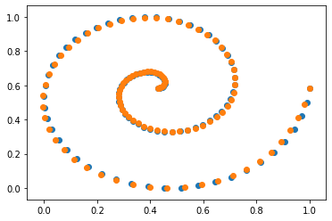

# Implementation example

### Libraries


```python
import tensorflow as tf
from tensorflow.keras import layers
from tensorflow.keras import Input
from tensorflow.keras import Model
import numpy as np
import operator as op
from functools import reduce
import numpy as np
import math
import matplotlib.pyplot as plt
```

### Some auxiliar functions


```python
def ncr(n, r):
    r = min(r, n-r)
    numer = reduce(op.mul, range(n, n-r, -1), 1)
    denom = reduce(op.mul, range(1, r+1), 1)
    return numer / denom

def normalize(xs):
    min_xs = np.min(xs)
    max_xs = np.max(xs)
    return (xs-min_xs)/(max_xs-min_xs)
```

### Rational base (different can be used)


```python
def f(t):
    return t
def g(t):
    return (1-t)
```

## Neural network implementation


```python
class first_layer(layers.Layer):
    def __init__(self, units=5,input_dim=1, activation = None):
        super(first_layer, self).__init__()
        self.units = units
        self.activation = activation
    def build(self, input_shape):
        self.w = self.add_weight(shape=(1,self.units), initializer='ones',trainable=True) 
    def call(self,inputs):
        l = len(t)
        u = [ncr(n-1,i)*self.w[0][i]*(f(inputs)**i)*(g(inputs)**(n-1-i)) for i in range(n)] 
        out= tf.reshape(u/np.sum(np.array(u)),(1,self.units))
        # out= tf.abs(tf.reshape(u/np.sum(np.array(u)),(1,self.units))) 
        # Use this last out if you want to force the weights to be positive during the
        # whole training.
        return layers.Activation(self.activation)(out)       
class second_layer(layers.Layer):
    def __init__(self, units=5,input_dim=5, activation = None):
        super(second_layer, self).__init__()
        self.units = units
        self.activation = activation
    def build(self, input_shape):
        initializer = tf.keras.initializers.GlorotNormal()
        self.p_control = self.add_weight(shape=(self.units,2), initializer=initializer,trainable=True)
        self.p0 = [train[0]]
        self.p_last = [train[-1]]
    def call(self,inputs):
        pcontrol = tf.concat([self.p0, self.p_control, self.p_last],0)
        out = tf.matmul(inputs,pcontrol)   
        return layers.Activation(self.activation)(out)    
```

### Dataset (Archimedean spiral in this case)


```python
l=100
t=[(i-1)/(l-1) for i in range(1,l+1)]
bx = normalize([4*math.pi*i*math.cos(4*math.pi*i) for i in t])
by = normalize([4*math.pi*i*math.sin(4*math.pi*i) for i in t])
train=[[bx[i],by[i]] for i in range(len(bx))]
```

### Model training and compilation


```python
inp = Input(shape=(1,))
n_units=16 # The number of units determine the number of weights and control points.
n=16
out1 = first_layer(units=n_units)(inp)
out2 = second_layer(units=n_units-2)(out1)
model = Model(inputs=inp,outputs=out2)
#opt = tf.keras.optimizers.Adam(learning_rate=0.0001)
opt = tf.keras.optimizers.Adamax(
    learning_rate=0.0001, beta_1=0.9, beta_2=0.999, epsilon=1e-07, name='Adamax')
model.compile(loss='mae', optimizer=opt) 
# The learning rate can be changed depending 
# on the needs
```

### Training algorithm


```python
history=model.fit(
    t,train,
    batch_size=1,
    epochs=2000, # The number of epochs can be changed
    verbose=1
)
```

    Train on 100 samples
    Epoch 1/2000
    100/100 [==============================] - 1s 9ms/sample - loss: 0.3561
    Epoch 2/2000
    100/100 [==============================] - 0s 1ms/sample - loss: 0.3543
    Epoch 3/2000
    100/100 [==============================] - 0s 1ms/sample - loss: 0.3524
    Epoch 4/2000
    100/100 [==============================] - 0s 1ms/sample - loss: 0.3507
    Epoch 5/2000
    100/100 [==============================] - 0s 1ms/sample - loss: 0.3489
    Epoch 6/2000
    100/100 [==============================] - 0s 1ms/sample - loss: 0.3471
    Epoch 7/2000
    100/100 [==============================] - 0s 1ms/sample - loss: 0.3455
    Epoch 8/2000
    100/100 [==============================] - 0s 1ms/sample - loss: 0.3438
    Epoch 9/2000
    100/100 [==============================] - 0s 1ms/sample - loss: 0.3422
    Epoch 10/2000
    100/100 [==============================] - 0s 2ms/sample - loss: 0.3406
    Epoch 11/2000
    100/100 [==============================] - 0s 1ms/sample - loss: 0.3391
    Epoch 12/2000
    100/100 [==============================] - 0s 2ms/sample - loss: 0.3375
    Epoch 13/2000
    100/100 [==============================] - 0s 2ms/sample - loss: 0.3360
    Epoch 14/2000
    100/100 [==============================] - 0s 1ms/sample - loss: 0.3345
    Epoch 15/2000
    100/100 [==============================] - 0s 1ms/sample - loss: 0.3329
    Epoch 16/2000
    100/100 [==============================] - 0s 2ms/sample - loss: 0.3314
    Epoch 17/2000
    100/100 [==============================] - 0s 1ms/sample - loss: 0.3300
    Epoch 18/2000
    100/100 [==============================] - 0s 1ms/sample - loss: 0.3285
    Epoch 19/2000
    100/100 [==============================] - 0s 1ms/sample - loss: 0.3270
    Epoch 20/2000
    100/100 [==============================] - 0s 1ms/sample - loss: 0.3256
    Epoch 21/2000
    100/100 [==============================] - 0s 2ms/sample - loss: 0.3241 0s - loss: 0.32
    Epoch 22/2000
    100/100 [==============================] - 0s 2ms/sample - loss: 0.3227
    Epoch 23/2000
    100/100 [==============================] - 0s 1ms/sample - loss: 0.3213
    Epoch 24/2000
    100/100 [==============================] - 0s 1ms/sample - loss: 0.3198
    Epoch 25/2000
    100/100 [==============================] - 0s 1ms/sample - loss: 0.3184
    Epoch 26/2000
    100/100 [==============================] - 0s 1ms/sample - loss: 0.3170
    Epoch 27/2000
    100/100 [==============================] - 0s 1ms/sample - loss: 0.3156
    Epoch 28/2000
    100/100 [==============================] - 0s 1ms/sample - loss: 0.3142
    Epoch 29/2000
    100/100 [==============================] - 0s 1ms/sample - loss: 0.3128
    Epoch 30/2000
    100/100 [==============================] - 0s 1ms/sample - loss: 0.3115
    Epoch 31/2000
    100/100 [==============================] - 0s 1ms/sample - loss: 0.3101
    Epoch 32/2000
    100/100 [==============================] - 0s 2ms/sample - loss: 0.3088
    Epoch 33/2000
    100/100 [==============================] - 0s 1ms/sample - loss: 0.3074
    Epoch 34/2000
    100/100 [==============================] - 0s 1ms/sample - loss: 0.3061
    Epoch 35/2000
    100/100 [==============================] - 0s 1ms/sample - loss: 0.3047
    Epoch 36/2000
    100/100 [==============================] - 0s 2ms/sample - loss: 0.3034
    Epoch 37/2000
    100/100 [==============================] - 0s 2ms/sample - loss: 0.3020
    Epoch 38/2000
    100/100 [==============================] - 0s 1ms/sample - loss: 0.3007
    Epoch 39/2000
    100/100 [==============================] - 0s 1ms/sample - loss: 0.2993
    Epoch 40/2000
    100/100 [==============================] - 0s 2ms/sample - loss: 0.2980
    Epoch 41/2000
    100/100 [==============================] - 0s 1ms/sample - loss: 0.2966
    Epoch 42/2000
    100/100 [==============================] - 0s 1ms/sample - loss: 0.2953
    Epoch 43/2000
    100/100 [==============================] - 0s 1ms/sample - loss: 0.2940
    Epoch 44/2000
    100/100 [==============================] - 0s 1ms/sample - loss: 0.2927
    Epoch 45/2000
    100/100 [==============================] - 0s 1ms/sample - loss: 0.2914
    Epoch 46/2000
    100/100 [==============================] - 0s 1ms/sample - loss: 0.2901
    Epoch 47/2000
    100/100 [==============================] - 0s 1ms/sample - loss: 0.2888
    Epoch 48/2000
    100/100 [==============================] - 0s 1ms/sample - loss: 0.2875
    Epoch 49/2000
    100/100 [==============================] - 0s 2ms/sample - loss: 0.2862
    Epoch 50/2000
    100/100 [==============================] - 0s 2ms/sample - loss: 0.2850
    Epoch 51/2000
    100/100 [==============================] - 0s 1ms/sample - loss: 0.2837
    Epoch 52/2000
    100/100 [==============================] - 0s 1ms/sample - loss: 0.2824
    Epoch 53/2000
    100/100 [==============================] - 0s 1ms/sample - loss: 0.2811
    Epoch 54/2000
    100/100 [==============================] - 0s 1ms/sample - loss: 0.2799
    Epoch 55/2000
    100/100 [==============================] - 0s 1ms/sample - loss: 0.2786
    Epoch 56/2000
    100/100 [==============================] - 0s 1ms/sample - loss: 0.2773
    Epoch 57/2000
    100/100 [==============================] - 0s 1ms/sample - loss: 0.2760
    Epoch 58/2000
    100/100 [==============================] - 0s 2ms/sample - loss: 0.2747
    Epoch 59/2000
    100/100 [==============================] - 0s 1ms/sample - loss: 0.2735
    Epoch 60/2000
    100/100 [==============================] - 0s 1ms/sample - loss: 0.2722
    Epoch 61/2000
    100/100 [==============================] - 0s 2ms/sample - loss: 0.2709
    Epoch 62/2000
    100/100 [==============================] - 0s 1ms/sample - loss: 0.2697
    Epoch 63/2000
    100/100 [==============================] - 0s 1ms/sample - loss: 0.2684
    Epoch 64/2000
    100/100 [==============================] - 0s 1ms/sample - loss: 0.2672
    Epoch 65/2000
    100/100 [==============================] - 0s 1ms/sample - loss: 0.2659
    Epoch 66/2000
    100/100 [==============================] - 0s 1ms/sample - loss: 0.2647
    Epoch 67/2000
    100/100 [==============================] - 0s 1ms/sample - loss: 0.2634
    Epoch 68/2000
    100/100 [==============================] - 0s 1ms/sample - loss: 0.2622
    Epoch 69/2000
    100/100 [==============================] - 0s 1ms/sample - loss: 0.2610
    Epoch 70/2000
    100/100 [==============================] - 0s 1ms/sample - loss: 0.2598
    Epoch 71/2000
    100/100 [==============================] - 0s 1ms/sample - loss: 0.2585
    Epoch 72/2000
    100/100 [==============================] - 0s 1ms/sample - loss: 0.2573
    Epoch 73/2000
    100/100 [==============================] - 0s 1ms/sample - loss: 0.2561
    Epoch 74/2000
    100/100 [==============================] - 0s 1ms/sample - loss: 0.2549
    Epoch 75/2000
    100/100 [==============================] - 0s 1ms/sample - loss: 0.2536
    Epoch 76/2000
    100/100 [==============================] - 0s 1ms/sample - loss: 0.2524
    Epoch 77/2000
    100/100 [==============================] - 0s 1ms/sample - loss: 0.2512
    Epoch 78/2000
    100/100 [==============================] - 0s 2ms/sample - loss: 0.2500
    Epoch 79/2000
    100/100 [==============================] - 0s 2ms/sample - loss: 0.2488
    Epoch 80/2000
    100/100 [==============================] - 0s 1ms/sample - loss: 0.2476
    Epoch 81/2000
    100/100 [==============================] - 0s 1ms/sample - loss: 0.2464
    Epoch 82/2000
    100/100 [==============================] - 0s 1ms/sample - loss: 0.2452
    Epoch 83/2000
    100/100 [==============================] - 0s 2ms/sample - loss: 0.2440
    Epoch 84/2000
    100/100 [==============================] - 0s 2ms/sample - loss: 0.2428
    Epoch 85/2000
    100/100 [==============================] - 0s 2ms/sample - loss: 0.2416
    Epoch 86/2000
    100/100 [==============================] - 0s 1ms/sample - loss: 0.2404
    Epoch 87/2000
    100/100 [==============================] - 0s 1ms/sample - loss: 0.2392
    Epoch 88/2000
    100/100 [==============================] - 0s 1ms/sample - loss: 0.2380
    Epoch 89/2000
    100/100 [==============================] - 0s 1ms/sample - loss: 0.2368
    Epoch 90/2000
    100/100 [==============================] - 0s 1ms/sample - loss: 0.2357
    Epoch 91/2000
    100/100 [==============================] - 0s 2ms/sample - loss: 0.2345
    Epoch 92/2000
    100/100 [==============================] - 0s 2ms/sample - loss: 0.2333
    Epoch 93/2000
    100/100 [==============================] - 0s 2ms/sample - loss: 0.2321
    Epoch 94/2000
    100/100 [==============================] - 0s 1ms/sample - loss: 0.2310
    Epoch 95/2000
    100/100 [==============================] - 0s 1ms/sample - loss: 0.2298
    Epoch 96/2000
    100/100 [==============================] - 0s 1ms/sample - loss: 0.2286
    Epoch 97/2000
    100/100 [==============================] - 0s 1ms/sample - loss: 0.2274
    Epoch 98/2000
    100/100 [==============================] - 0s 1ms/sample - loss: 0.2263
    Epoch 99/2000
    100/100 [==============================] - 0s 1ms/sample - loss: 0.2251
    Epoch 100/2000
    100/100 [==============================] - 0s 1ms/sample - loss: 0.2239
    Epoch 101/2000
    100/100 [==============================] - 0s 2ms/sample - loss: 0.2227
    Epoch 102/2000
    100/100 [==============================] - 0s 2ms/sample - loss: 0.2216
    Epoch 103/2000
    100/100 [==============================] - 0s 1ms/sample - loss: 0.2204
    Epoch 104/2000
    100/100 [==============================] - 0s 1ms/sample - loss: 0.2193
    Epoch 105/2000
    100/100 [==============================] - 0s 1ms/sample - loss: 0.2181
    Epoch 106/2000
    100/100 [==============================] - 0s 1ms/sample - loss: 0.2170
    Epoch 107/2000
    100/100 [==============================] - 0s 1ms/sample - loss: 0.2158
    Epoch 108/2000
    100/100 [==============================] - 0s 2ms/sample - loss: 0.2146
    Epoch 109/2000
    100/100 [==============================] - 0s 2ms/sample - loss: 0.2135
    Epoch 110/2000
    100/100 [==============================] - 0s 1ms/sample - loss: 0.2123
    Epoch 111/2000
    100/100 [==============================] - 0s 1ms/sample - loss: 0.2112
    Epoch 112/2000
    100/100 [==============================] - 0s 1ms/sample - loss: 0.2100
    Epoch 113/2000
    100/100 [==============================] - 0s 1ms/sample - loss: 0.2088
    Epoch 114/2000
    100/100 [==============================] - 0s 1ms/sample - loss: 0.2077
    Epoch 115/2000
    100/100 [==============================] - 0s 2ms/sample - loss: 0.2065
    Epoch 116/2000
    100/100 [==============================] - 0s 1ms/sample - loss: 0.2054
    Epoch 117/2000
    100/100 [==============================] - 0s 1ms/sample - loss: 0.2042
    Epoch 118/2000
    100/100 [==============================] - 0s 2ms/sample - loss: 0.2031
    Epoch 119/2000
    100/100 [==============================] - 0s 2ms/sample - loss: 0.2019
    Epoch 120/2000
    100/100 [==============================] - 0s 1ms/sample - loss: 0.2008
    Epoch 121/2000
    100/100 [==============================] - 0s 1ms/sample - loss: 0.1997
    Epoch 122/2000
    100/100 [==============================] - 0s 1ms/sample - loss: 0.1988
    Epoch 123/2000
    100/100 [==============================] - 0s 1ms/sample - loss: 0.1979
    Epoch 124/2000
    100/100 [==============================] - 0s 1ms/sample - loss: 0.1970
    Epoch 125/2000
    100/100 [==============================] - 0s 1ms/sample - loss: 0.1962
    Epoch 126/2000
    100/100 [==============================] - 0s 1ms/sample - loss: 0.1953
    Epoch 127/2000
    100/100 [==============================] - 0s 1ms/sample - loss: 0.1946
    Epoch 128/2000
    100/100 [==============================] - 0s 1ms/sample - loss: 0.1938
    Epoch 129/2000
    100/100 [==============================] - 0s 1ms/sample - loss: 0.1930
    Epoch 130/2000
    100/100 [==============================] - 0s 1ms/sample - loss: 0.1923
    Epoch 131/2000
    100/100 [==============================] - 0s 1ms/sample - loss: 0.1915
    Epoch 132/2000
    100/100 [==============================] - 0s 1ms/sample - loss: 0.1908
    Epoch 133/2000
    100/100 [==============================] - 0s 1ms/sample - loss: 0.1901
    Epoch 134/2000
    100/100 [==============================] - 0s 1ms/sample - loss: 0.1894
    Epoch 135/2000
    100/100 [==============================] - 0s 2ms/sample - loss: 0.1887
    Epoch 136/2000
    100/100 [==============================] - 0s 1ms/sample - loss: 0.1880
    Epoch 137/2000
    100/100 [==============================] - 0s 1ms/sample - loss: 0.1874
    Epoch 138/2000
    100/100 [==============================] - 0s 1ms/sample - loss: 0.1867
    Epoch 139/2000
    100/100 [==============================] - 0s 2ms/sample - loss: 0.1861
    Epoch 140/2000
    100/100 [==============================] - 0s 1ms/sample - loss: 0.1854
    Epoch 141/2000
    100/100 [==============================] - 0s 1ms/sample - loss: 0.1848
    Epoch 142/2000
    100/100 [==============================] - 0s 1ms/sample - loss: 0.1842
    Epoch 143/2000
    100/100 [==============================] - 0s 1ms/sample - loss: 0.1836
    Epoch 144/2000
    100/100 [==============================] - 0s 1ms/sample - loss: 0.1830
    Epoch 145/2000
    100/100 [==============================] - 0s 1ms/sample - loss: 0.1824
    Epoch 146/2000
    100/100 [==============================] - 0s 1ms/sample - loss: 0.1818
    Epoch 147/2000
    100/100 [==============================] - 0s 1ms/sample - loss: 0.1812
    Epoch 148/2000
    100/100 [==============================] - 0s 1ms/sample - loss: 0.1806
    Epoch 149/2000
    100/100 [==============================] - 0s 2ms/sample - loss: 0.1800
    Epoch 150/2000
    100/100 [==============================] - 0s 2ms/sample - loss: 0.1794
    Epoch 151/2000
    100/100 [==============================] - 0s 1ms/sample - loss: 0.1789
    Epoch 152/2000
    100/100 [==============================] - 0s 1ms/sample - loss: 0.1783
    Epoch 153/2000
    100/100 [==============================] - 0s 1ms/sample - loss: 0.1777
    Epoch 154/2000
    100/100 [==============================] - 0s 1ms/sample - loss: 0.1772
    Epoch 155/2000
    100/100 [==============================] - 0s 1ms/sample - loss: 0.1767
    Epoch 156/2000
    100/100 [==============================] - 0s 1ms/sample - loss: 0.1761
    Epoch 157/2000
    100/100 [==============================] - 0s 1ms/sample - loss: 0.1756
    Epoch 158/2000
    100/100 [==============================] - 0s 1ms/sample - loss: 0.1750
    Epoch 159/2000
    100/100 [==============================] - 0s 1ms/sample - loss: 0.1745
    Epoch 160/2000
    100/100 [==============================] - 0s 1ms/sample - loss: 0.1740
    Epoch 161/2000
    100/100 [==============================] - 0s 1ms/sample - loss: 0.1735
    Epoch 162/2000
    100/100 [==============================] - 0s 1ms/sample - loss: 0.1729
    Epoch 163/2000
    100/100 [==============================] - 0s 1ms/sample - loss: 0.1724
    Epoch 164/2000
    100/100 [==============================] - 0s 1ms/sample - loss: 0.1718
    Epoch 165/2000
    100/100 [==============================] - 0s 1ms/sample - loss: 0.1713
    Epoch 166/2000
    100/100 [==============================] - 0s 1ms/sample - loss: 0.1708
    Epoch 167/2000
    100/100 [==============================] - 0s 1ms/sample - loss: 0.1703
    Epoch 168/2000
    100/100 [==============================] - 0s 1ms/sample - loss: 0.1698
    Epoch 169/2000
    100/100 [==============================] - 0s 1ms/sample - loss: 0.1693
    Epoch 170/2000
    100/100 [==============================] - 0s 1ms/sample - loss: 0.1688
    Epoch 171/2000
    100/100 [==============================] - 0s 1ms/sample - loss: 0.1683
    Epoch 172/2000
    100/100 [==============================] - 0s 1ms/sample - loss: 0.1679
    Epoch 173/2000
    100/100 [==============================] - 0s 1ms/sample - loss: 0.1674
    Epoch 174/2000
    100/100 [==============================] - 0s 1ms/sample - loss: 0.1669
    Epoch 175/2000
    100/100 [==============================] - 0s 1ms/sample - loss: 0.1665
    Epoch 176/2000
    100/100 [==============================] - 0s 1ms/sample - loss: 0.1660
    Epoch 177/2000
    100/100 [==============================] - 0s 1ms/sample - loss: 0.1655
    Epoch 178/2000
    100/100 [==============================] - 0s 1ms/sample - loss: 0.1651
    Epoch 179/2000
    100/100 [==============================] - 0s 1ms/sample - loss: 0.1646
    Epoch 180/2000
    100/100 [==============================] - 0s 1ms/sample - loss: 0.1641
    Epoch 181/2000
    100/100 [==============================] - 0s 1ms/sample - loss: 0.1637
    Epoch 182/2000
    100/100 [==============================] - 0s 1ms/sample - loss: 0.1632
    Epoch 183/2000
    100/100 [==============================] - 0s 1ms/sample - loss: 0.1627
    Epoch 184/2000
    100/100 [==============================] - 0s 1ms/sample - loss: 0.1623
    Epoch 185/2000
    100/100 [==============================] - 0s 1ms/sample - loss: 0.1618
    Epoch 186/2000
    100/100 [==============================] - 0s 1ms/sample - loss: 0.1613
    Epoch 187/2000
    100/100 [==============================] - 0s 1ms/sample - loss: 0.1609
    Epoch 188/2000
    100/100 [==============================] - 0s 1ms/sample - loss: 0.1604
    Epoch 189/2000
    100/100 [==============================] - 0s 1ms/sample - loss: 0.1599
    Epoch 190/2000
    100/100 [==============================] - 0s 1ms/sample - loss: 0.1595
    Epoch 191/2000
    100/100 [==============================] - 0s 1ms/sample - loss: 0.1590
    Epoch 192/2000
    100/100 [==============================] - 0s 1ms/sample - loss: 0.1586
    Epoch 193/2000
    100/100 [==============================] - 0s 1ms/sample - loss: 0.1581
    Epoch 194/2000
    100/100 [==============================] - 0s 1ms/sample - loss: 0.1577
    Epoch 195/2000
    100/100 [==============================] - 0s 1ms/sample - loss: 0.1573
    Epoch 196/2000
    100/100 [==============================] - 0s 1ms/sample - loss: 0.1568
    Epoch 197/2000
    100/100 [==============================] - 0s 1ms/sample - loss: 0.1564
    Epoch 198/2000
    100/100 [==============================] - 0s 1ms/sample - loss: 0.1560
    Epoch 199/2000
    100/100 [==============================] - 0s 1ms/sample - loss: 0.1556
    Epoch 200/2000
    100/100 [==============================] - 0s 1ms/sample - loss: 0.1552
    Epoch 201/2000
    100/100 [==============================] - 0s 1ms/sample - loss: 0.1548
    Epoch 202/2000
    100/100 [==============================] - 0s 1ms/sample - loss: 0.1543
    Epoch 203/2000
    100/100 [==============================] - 0s 1ms/sample - loss: 0.1539
    Epoch 204/2000
    100/100 [==============================] - 0s 1ms/sample - loss: 0.1535
    Epoch 205/2000
    100/100 [==============================] - 0s 1ms/sample - loss: 0.1531
    Epoch 206/2000
    100/100 [==============================] - 0s 1ms/sample - loss: 0.1527
    Epoch 207/2000
    100/100 [==============================] - 0s 1ms/sample - loss: 0.1523
    Epoch 208/2000
    100/100 [==============================] - 0s 1ms/sample - loss: 0.1519
    Epoch 209/2000
    100/100 [==============================] - 0s 1ms/sample - loss: 0.1514
    Epoch 210/2000
    100/100 [==============================] - 0s 1ms/sample - loss: 0.1510
    Epoch 211/2000
    100/100 [==============================] - 0s 1ms/sample - loss: 0.1506
    Epoch 212/2000
    100/100 [==============================] - 0s 1ms/sample - loss: 0.1502
    Epoch 213/2000
    100/100 [==============================] - 0s 1ms/sample - loss: 0.1498
    Epoch 214/2000
    100/100 [==============================] - 0s 1ms/sample - loss: 0.1494
    Epoch 215/2000
    100/100 [==============================] - 0s 1ms/sample - loss: 0.1490
    Epoch 216/2000
    100/100 [==============================] - 0s 1ms/sample - loss: 0.1486
    Epoch 217/2000
    100/100 [==============================] - 0s 1ms/sample - loss: 0.1482
    Epoch 218/2000
    100/100 [==============================] - 0s 1ms/sample - loss: 0.1478
    Epoch 219/2000
    100/100 [==============================] - 0s 1ms/sample - loss: 0.1473
    Epoch 220/2000
    100/100 [==============================] - 0s 1ms/sample - loss: 0.1469
    Epoch 221/2000
    100/100 [==============================] - 0s 1ms/sample - loss: 0.1465
    Epoch 222/2000
    100/100 [==============================] - 0s 1ms/sample - loss: 0.1461
    Epoch 223/2000
    100/100 [==============================] - 0s 1ms/sample - loss: 0.1457
    Epoch 224/2000
    100/100 [==============================] - 0s 1ms/sample - loss: 0.1453
    Epoch 225/2000
    100/100 [==============================] - 0s 1ms/sample - loss: 0.1449
    Epoch 226/2000
    100/100 [==============================] - 0s 2ms/sample - loss: 0.1445
    Epoch 227/2000
    100/100 [==============================] - 0s 2ms/sample - loss: 0.1442
    Epoch 228/2000
    100/100 [==============================] - 0s 1ms/sample - loss: 0.1438
    Epoch 229/2000
    100/100 [==============================] - 0s 1ms/sample - loss: 0.1434
    Epoch 230/2000
    100/100 [==============================] - 0s 2ms/sample - loss: 0.1430
    Epoch 231/2000
    100/100 [==============================] - 0s 1ms/sample - loss: 0.1427
    Epoch 232/2000
    100/100 [==============================] - 0s 1ms/sample - loss: 0.1423
    Epoch 233/2000
    100/100 [==============================] - 0s 1ms/sample - loss: 0.1419
    Epoch 234/2000
    100/100 [==============================] - 0s 1ms/sample - loss: 0.1416
    Epoch 235/2000
    100/100 [==============================] - 0s 1ms/sample - loss: 0.1412
    Epoch 236/2000
    100/100 [==============================] - 0s 1ms/sample - loss: 0.1408
    Epoch 237/2000
    100/100 [==============================] - 0s 1ms/sample - loss: 0.1405
    Epoch 238/2000
    100/100 [==============================] - 0s 1ms/sample - loss: 0.1401
    Epoch 239/2000
    100/100 [==============================] - 0s 1ms/sample - loss: 0.1397
    Epoch 240/2000
    100/100 [==============================] - 0s 1ms/sample - loss: 0.1394
    Epoch 241/2000
    100/100 [==============================] - 0s 1ms/sample - loss: 0.1390
    Epoch 242/2000
    100/100 [==============================] - 0s 1ms/sample - loss: 0.1386
    Epoch 243/2000
    100/100 [==============================] - 0s 1ms/sample - loss: 0.1383
    Epoch 244/2000
    100/100 [==============================] - 0s 1ms/sample - loss: 0.1379
    Epoch 245/2000
    100/100 [==============================] - 0s 1ms/sample - loss: 0.1375
    Epoch 246/2000
    100/100 [==============================] - 0s 1ms/sample - loss: 0.1372
    Epoch 247/2000
    100/100 [==============================] - 0s 1ms/sample - loss: 0.1368
    Epoch 248/2000
    100/100 [==============================] - 0s 1ms/sample - loss: 0.1364
    Epoch 249/2000
    100/100 [==============================] - 0s 1ms/sample - loss: 0.1361
    Epoch 250/2000
    100/100 [==============================] - 0s 1ms/sample - loss: 0.1357
    Epoch 251/2000
    100/100 [==============================] - 0s 1ms/sample - loss: 0.1353
    Epoch 252/2000
    100/100 [==============================] - 0s 1ms/sample - loss: 0.1350
    Epoch 253/2000
    100/100 [==============================] - 0s 1ms/sample - loss: 0.1346
    Epoch 254/2000
    100/100 [==============================] - 0s 1ms/sample - loss: 0.1342
    Epoch 255/2000
    100/100 [==============================] - 0s 1ms/sample - loss: 0.1339
    Epoch 256/2000
    100/100 [==============================] - 0s 1ms/sample - loss: 0.1335
    Epoch 257/2000
    100/100 [==============================] - 0s 1ms/sample - loss: 0.1332
    Epoch 258/2000
    100/100 [==============================] - 0s 1ms/sample - loss: 0.1328
    Epoch 259/2000
    100/100 [==============================] - 0s 1ms/sample - loss: 0.1324
    Epoch 260/2000
    100/100 [==============================] - 0s 1ms/sample - loss: 0.1321
    Epoch 261/2000
    100/100 [==============================] - 0s 1ms/sample - loss: 0.1317
    Epoch 262/2000
    100/100 [==============================] - 0s 1ms/sample - loss: 0.1313
    Epoch 263/2000
    100/100 [==============================] - 0s 1ms/sample - loss: 0.1310
    Epoch 264/2000
    100/100 [==============================] - 0s 1ms/sample - loss: 0.1307
    Epoch 265/2000
    100/100 [==============================] - 0s 1ms/sample - loss: 0.1303
    Epoch 266/2000
    100/100 [==============================] - 0s 1ms/sample - loss: 0.1299
    Epoch 267/2000
    100/100 [==============================] - 0s 1ms/sample - loss: 0.1296
    Epoch 268/2000
    100/100 [==============================] - 0s 1ms/sample - loss: 0.1293
    Epoch 269/2000
    100/100 [==============================] - 0s 1ms/sample - loss: 0.1289
    Epoch 270/2000
    100/100 [==============================] - 0s 1ms/sample - loss: 0.1286
    Epoch 271/2000
    100/100 [==============================] - 0s 1ms/sample - loss: 0.1282
    Epoch 272/2000
    100/100 [==============================] - 0s 1ms/sample - loss: 0.1279
    Epoch 273/2000
    100/100 [==============================] - 0s 1ms/sample - loss: 0.1275
    Epoch 274/2000
    100/100 [==============================] - 0s 1ms/sample - loss: 0.1272
    Epoch 275/2000
    100/100 [==============================] - 0s 1ms/sample - loss: 0.1268
    Epoch 276/2000
    100/100 [==============================] - 0s 1ms/sample - loss: 0.1265
    Epoch 277/2000
    100/100 [==============================] - 0s 1ms/sample - loss: 0.1261
    Epoch 278/2000
    100/100 [==============================] - 0s 1ms/sample - loss: 0.1258
    Epoch 279/2000
    100/100 [==============================] - 0s 1ms/sample - loss: 0.1254
    Epoch 280/2000
    100/100 [==============================] - 0s 1ms/sample - loss: 0.1251
    Epoch 281/2000
    100/100 [==============================] - 0s 1ms/sample - loss: 0.1248
    Epoch 282/2000
    100/100 [==============================] - 0s 1ms/sample - loss: 0.1244
    Epoch 283/2000
    100/100 [==============================] - 0s 1ms/sample - loss: 0.1241
    Epoch 284/2000
    100/100 [==============================] - 0s 1ms/sample - loss: 0.1237
    Epoch 285/2000
    100/100 [==============================] - 0s 1ms/sample - loss: 0.1234
    Epoch 286/2000
    100/100 [==============================] - 0s 1ms/sample - loss: 0.1230
    Epoch 287/2000
    100/100 [==============================] - 0s 1ms/sample - loss: 0.1227
    Epoch 288/2000
    100/100 [==============================] - 0s 1ms/sample - loss: 0.1224
    Epoch 289/2000
    100/100 [==============================] - 0s 1ms/sample - loss: 0.1220
    Epoch 290/2000
    100/100 [==============================] - 0s 1ms/sample - loss: 0.1217
    Epoch 291/2000
    100/100 [==============================] - 0s 1ms/sample - loss: 0.1214
    Epoch 292/2000
    100/100 [==============================] - 0s 1ms/sample - loss: 0.1210
    Epoch 293/2000
    100/100 [==============================] - 0s 1ms/sample - loss: 0.1207
    Epoch 294/2000
    100/100 [==============================] - 0s 1ms/sample - loss: 0.1204
    Epoch 295/2000
    100/100 [==============================] - 0s 1ms/sample - loss: 0.1200
    Epoch 296/2000
    100/100 [==============================] - 0s 1ms/sample - loss: 0.1197
    Epoch 297/2000
    100/100 [==============================] - 0s 1ms/sample - loss: 0.1194
    Epoch 298/2000
    100/100 [==============================] - 0s 1ms/sample - loss: 0.1191
    Epoch 299/2000
    100/100 [==============================] - 0s 1ms/sample - loss: 0.1187
    Epoch 300/2000
    100/100 [==============================] - 0s 1ms/sample - loss: 0.1184
    Epoch 301/2000
    100/100 [==============================] - 0s 1ms/sample - loss: 0.1181
    Epoch 302/2000
    100/100 [==============================] - 0s 1ms/sample - loss: 0.1177
    Epoch 303/2000
    100/100 [==============================] - 0s 1ms/sample - loss: 0.1174
    Epoch 304/2000
    100/100 [==============================] - 0s 1ms/sample - loss: 0.1171
    Epoch 305/2000
    100/100 [==============================] - 0s 1ms/sample - loss: 0.1168
    Epoch 306/2000
    100/100 [==============================] - 0s 1ms/sample - loss: 0.1164
    Epoch 307/2000
    100/100 [==============================] - 0s 1ms/sample - loss: 0.1161
    Epoch 308/2000
    100/100 [==============================] - 0s 1ms/sample - loss: 0.1158
    Epoch 309/2000
    100/100 [==============================] - 0s 1ms/sample - loss: 0.1154
    Epoch 310/2000
    100/100 [==============================] - 0s 1ms/sample - loss: 0.1151
    Epoch 311/2000
    100/100 [==============================] - 0s 1ms/sample - loss: 0.1148
    Epoch 312/2000
    100/100 [==============================] - 0s 1ms/sample - loss: 0.1145
    Epoch 313/2000
    100/100 [==============================] - 0s 1ms/sample - loss: 0.1142
    Epoch 314/2000
    100/100 [==============================] - 0s 1ms/sample - loss: 0.1138
    Epoch 315/2000
    100/100 [==============================] - 0s 1ms/sample - loss: 0.1135
    Epoch 316/2000
    100/100 [==============================] - 0s 1ms/sample - loss: 0.1132
    Epoch 317/2000
    100/100 [==============================] - 0s 1ms/sample - loss: 0.1128
    Epoch 318/2000
    100/100 [==============================] - 0s 1ms/sample - loss: 0.1125
    Epoch 319/2000
    100/100 [==============================] - 0s 1ms/sample - loss: 0.1122
    Epoch 320/2000
    100/100 [==============================] - 0s 1ms/sample - loss: 0.1119
    Epoch 321/2000
    100/100 [==============================] - 0s 1ms/sample - loss: 0.1116
    Epoch 322/2000
    100/100 [==============================] - 0s 1ms/sample - loss: 0.1112
    Epoch 323/2000
    100/100 [==============================] - 0s 1ms/sample - loss: 0.1109
    Epoch 324/2000
    100/100 [==============================] - 0s 1ms/sample - loss: 0.1106
    Epoch 325/2000
    100/100 [==============================] - 0s 1ms/sample - loss: 0.1103
    Epoch 326/2000
    100/100 [==============================] - 0s 1ms/sample - loss: 0.1100
    Epoch 327/2000
    100/100 [==============================] - 0s 1ms/sample - loss: 0.1097
    Epoch 328/2000
    100/100 [==============================] - 0s 1ms/sample - loss: 0.1094
    Epoch 329/2000
    100/100 [==============================] - 0s 1ms/sample - loss: 0.1090
    Epoch 330/2000
    100/100 [==============================] - 0s 1ms/sample - loss: 0.1087
    Epoch 331/2000
    100/100 [==============================] - 0s 1ms/sample - loss: 0.1084
    Epoch 332/2000
    100/100 [==============================] - 0s 1ms/sample - loss: 0.1081
    Epoch 333/2000
    100/100 [==============================] - 0s 1ms/sample - loss: 0.1078
    Epoch 334/2000
    100/100 [==============================] - 0s 1ms/sample - loss: 0.1075
    Epoch 335/2000
    100/100 [==============================] - 0s 1ms/sample - loss: 0.1072
    Epoch 336/2000
    100/100 [==============================] - 0s 1ms/sample - loss: 0.1069
    Epoch 337/2000
    100/100 [==============================] - 0s 1ms/sample - loss: 0.1065
    Epoch 338/2000
    100/100 [==============================] - 0s 1ms/sample - loss: 0.1062
    Epoch 339/2000
    100/100 [==============================] - 0s 1ms/sample - loss: 0.1059
    Epoch 340/2000
    100/100 [==============================] - 0s 1ms/sample - loss: 0.1056
    Epoch 341/2000
    100/100 [==============================] - 0s 1ms/sample - loss: 0.1053
    Epoch 342/2000
    100/100 [==============================] - 0s 1ms/sample - loss: 0.1050
    Epoch 343/2000
    100/100 [==============================] - 0s 1ms/sample - loss: 0.1047
    Epoch 344/2000
    100/100 [==============================] - 0s 1ms/sample - loss: 0.1044
    Epoch 345/2000
    100/100 [==============================] - 0s 1ms/sample - loss: 0.1040
    Epoch 346/2000
    100/100 [==============================] - 0s 1ms/sample - loss: 0.1037
    Epoch 347/2000
    100/100 [==============================] - 0s 1ms/sample - loss: 0.1034
    Epoch 348/2000
    100/100 [==============================] - 0s 1ms/sample - loss: 0.1031
    Epoch 349/2000
    100/100 [==============================] - 0s 1ms/sample - loss: 0.1028
    Epoch 350/2000
    100/100 [==============================] - 0s 1ms/sample - loss: 0.1025
    Epoch 351/2000
    100/100 [==============================] - 0s 1ms/sample - loss: 0.1022
    Epoch 352/2000
    100/100 [==============================] - 0s 1ms/sample - loss: 0.1019
    Epoch 353/2000
    100/100 [==============================] - 0s 1ms/sample - loss: 0.1016
    Epoch 354/2000
    100/100 [==============================] - 0s 1ms/sample - loss: 0.1013
    Epoch 355/2000
    100/100 [==============================] - 0s 1ms/sample - loss: 0.1010
    Epoch 356/2000
    100/100 [==============================] - 0s 1ms/sample - loss: 0.1007
    Epoch 357/2000
    100/100 [==============================] - 0s 1ms/sample - loss: 0.1004
    Epoch 358/2000
    100/100 [==============================] - 0s 1ms/sample - loss: 0.1001
    Epoch 359/2000
    100/100 [==============================] - 0s 1ms/sample - loss: 0.0998
    Epoch 360/2000
    100/100 [==============================] - 0s 1ms/sample - loss: 0.0995
    Epoch 361/2000
    100/100 [==============================] - 0s 1ms/sample - loss: 0.0992
    Epoch 362/2000
    100/100 [==============================] - 0s 1ms/sample - loss: 0.0989
    Epoch 363/2000
    100/100 [==============================] - 0s 1ms/sample - loss: 0.0986
    Epoch 364/2000
    100/100 [==============================] - 0s 1ms/sample - loss: 0.0982
    Epoch 365/2000
    100/100 [==============================] - 0s 1ms/sample - loss: 0.0980
    Epoch 366/2000
    100/100 [==============================] - 0s 1ms/sample - loss: 0.0977
    Epoch 367/2000
    100/100 [==============================] - 0s 1ms/sample - loss: 0.0974
    Epoch 368/2000
    100/100 [==============================] - 0s 1ms/sample - loss: 0.0971
    Epoch 369/2000
    100/100 [==============================] - 0s 1ms/sample - loss: 0.0968
    Epoch 370/2000
    100/100 [==============================] - 0s 1ms/sample - loss: 0.0965
    Epoch 371/2000
    100/100 [==============================] - 0s 1ms/sample - loss: 0.0962
    Epoch 372/2000
    100/100 [==============================] - 0s 1ms/sample - loss: 0.0959
    Epoch 373/2000
    100/100 [==============================] - 0s 1ms/sample - loss: 0.0956
    Epoch 374/2000
    100/100 [==============================] - 0s 1ms/sample - loss: 0.0953
    Epoch 375/2000
    100/100 [==============================] - 0s 1ms/sample - loss: 0.0950
    Epoch 376/2000
    100/100 [==============================] - 0s 1ms/sample - loss: 0.0947
    Epoch 377/2000
    100/100 [==============================] - 0s 1ms/sample - loss: 0.0944
    Epoch 378/2000
    100/100 [==============================] - 0s 1ms/sample - loss: 0.0942
    Epoch 379/2000
    100/100 [==============================] - 0s 1ms/sample - loss: 0.0939
    Epoch 380/2000
    100/100 [==============================] - 0s 1ms/sample - loss: 0.0936
    Epoch 381/2000
    100/100 [==============================] - 0s 1ms/sample - loss: 0.0933
    Epoch 382/2000
    100/100 [==============================] - 0s 1ms/sample - loss: 0.0930
    Epoch 383/2000
    100/100 [==============================] - 0s 1ms/sample - loss: 0.0927
    Epoch 384/2000
    100/100 [==============================] - 0s 1ms/sample - loss: 0.0925
    Epoch 385/2000
    100/100 [==============================] - 0s 1ms/sample - loss: 0.0922
    Epoch 386/2000
    100/100 [==============================] - 0s 1ms/sample - loss: 0.0919
    Epoch 387/2000
    100/100 [==============================] - 0s 1ms/sample - loss: 0.0916
    Epoch 388/2000
    100/100 [==============================] - 0s 1ms/sample - loss: 0.0914
    Epoch 389/2000
    100/100 [==============================] - 0s 1ms/sample - loss: 0.0911
    Epoch 390/2000
    100/100 [==============================] - 0s 2ms/sample - loss: 0.0909
    Epoch 391/2000
    100/100 [==============================] - 0s 2ms/sample - loss: 0.0906
    Epoch 392/2000
    100/100 [==============================] - 0s 1ms/sample - loss: 0.0904
    Epoch 393/2000
    100/100 [==============================] - 0s 1ms/sample - loss: 0.0901
    Epoch 394/2000
    100/100 [==============================] - 0s 2ms/sample - loss: 0.0899
    Epoch 395/2000
    100/100 [==============================] - 0s 2ms/sample - loss: 0.0896
    Epoch 396/2000
    100/100 [==============================] - 0s 2ms/sample - loss: 0.0894
    Epoch 397/2000
    100/100 [==============================] - 0s 2ms/sample - loss: 0.0892
    Epoch 398/2000
    100/100 [==============================] - 0s 2ms/sample - loss: 0.0889
    Epoch 399/2000
    100/100 [==============================] - 0s 1ms/sample - loss: 0.0887
    Epoch 400/2000
    100/100 [==============================] - 0s 1ms/sample - loss: 0.0885
    Epoch 401/2000
    100/100 [==============================] - 0s 1ms/sample - loss: 0.0883
    Epoch 402/2000
    100/100 [==============================] - 0s 1ms/sample - loss: 0.0880
    Epoch 403/2000
    100/100 [==============================] - 0s 1ms/sample - loss: 0.0878
    Epoch 404/2000
    100/100 [==============================] - 0s 1ms/sample - loss: 0.0876
    Epoch 405/2000
    100/100 [==============================] - 0s 1ms/sample - loss: 0.0874
    Epoch 406/2000
    100/100 [==============================] - 0s 1ms/sample - loss: 0.0871
    Epoch 407/2000
    100/100 [==============================] - 0s 1ms/sample - loss: 0.0869
    Epoch 408/2000
    100/100 [==============================] - 0s 1ms/sample - loss: 0.0867
    Epoch 409/2000
    100/100 [==============================] - 0s 1ms/sample - loss: 0.0864
    Epoch 410/2000
    100/100 [==============================] - 0s 1ms/sample - loss: 0.0862
    Epoch 411/2000
    100/100 [==============================] - 0s 1ms/sample - loss: 0.0860
    Epoch 412/2000
    100/100 [==============================] - 0s 1ms/sample - loss: 0.0858
    Epoch 413/2000
    100/100 [==============================] - 0s 1ms/sample - loss: 0.0856
    Epoch 414/2000
    100/100 [==============================] - 0s 1ms/sample - loss: 0.0854
    Epoch 415/2000
    100/100 [==============================] - 0s 1ms/sample - loss: 0.0852
    Epoch 416/2000
    100/100 [==============================] - 0s 1ms/sample - loss: 0.0849
    Epoch 417/2000
    100/100 [==============================] - 0s 1ms/sample - loss: 0.0847
    Epoch 418/2000
    100/100 [==============================] - 0s 2ms/sample - loss: 0.0845
    Epoch 419/2000
    100/100 [==============================] - 0s 1ms/sample - loss: 0.0843
    Epoch 420/2000
    100/100 [==============================] - 0s 1ms/sample - loss: 0.0841
    Epoch 421/2000
    100/100 [==============================] - 0s 1ms/sample - loss: 0.0839
    Epoch 422/2000
    100/100 [==============================] - 0s 1ms/sample - loss: 0.0837
    Epoch 423/2000
    100/100 [==============================] - 0s 1ms/sample - loss: 0.0835
    Epoch 424/2000
    100/100 [==============================] - 0s 2ms/sample - loss: 0.0833
    Epoch 425/2000
    100/100 [==============================] - 0s 2ms/sample - loss: 0.0831
    Epoch 426/2000
    100/100 [==============================] - 0s 1ms/sample - loss: 0.0828
    Epoch 427/2000
    100/100 [==============================] - 0s 1ms/sample - loss: 0.0826
    Epoch 428/2000
    100/100 [==============================] - 0s 1ms/sample - loss: 0.0824
    Epoch 429/2000
    100/100 [==============================] - 0s 1ms/sample - loss: 0.0822
    Epoch 430/2000
    100/100 [==============================] - 0s 1ms/sample - loss: 0.0820
    Epoch 431/2000
    100/100 [==============================] - 0s 1ms/sample - loss: 0.0819
    Epoch 432/2000
    100/100 [==============================] - 0s 1ms/sample - loss: 0.0817
    Epoch 433/2000
    100/100 [==============================] - 0s 1ms/sample - loss: 0.0815
    Epoch 434/2000
    100/100 [==============================] - 0s 1ms/sample - loss: 0.0813
    Epoch 435/2000
    100/100 [==============================] - 0s 1ms/sample - loss: 0.0811
    Epoch 436/2000
    100/100 [==============================] - 0s 1ms/sample - loss: 0.0809
    Epoch 437/2000
    100/100 [==============================] - 0s 1ms/sample - loss: 0.0807
    Epoch 438/2000
    100/100 [==============================] - 0s 1ms/sample - loss: 0.0805
    Epoch 439/2000
    100/100 [==============================] - 0s 1ms/sample - loss: 0.0803
    Epoch 440/2000
    100/100 [==============================] - 0s 1ms/sample - loss: 0.0801
    Epoch 441/2000
    100/100 [==============================] - 0s 1ms/sample - loss: 0.0799
    Epoch 442/2000
    100/100 [==============================] - 0s 1ms/sample - loss: 0.0797
    Epoch 443/2000
    100/100 [==============================] - 0s 1ms/sample - loss: 0.0795
    Epoch 444/2000
    100/100 [==============================] - 0s 1ms/sample - loss: 0.0794
    Epoch 445/2000
    100/100 [==============================] - 0s 1ms/sample - loss: 0.0791
    Epoch 446/2000
    100/100 [==============================] - 0s 1ms/sample - loss: 0.0789
    Epoch 447/2000
    100/100 [==============================] - 0s 1ms/sample - loss: 0.0788
    Epoch 448/2000
    100/100 [==============================] - 0s 1ms/sample - loss: 0.0786
    Epoch 449/2000
    100/100 [==============================] - 0s 1ms/sample - loss: 0.0784
    Epoch 450/2000
    100/100 [==============================] - 0s 1ms/sample - loss: 0.0782
    Epoch 451/2000
    100/100 [==============================] - 0s 1ms/sample - loss: 0.0780
    Epoch 452/2000
    100/100 [==============================] - 0s 1ms/sample - loss: 0.0778
    Epoch 453/2000
    100/100 [==============================] - 0s 1ms/sample - loss: 0.0776
    Epoch 454/2000
    100/100 [==============================] - 0s 1ms/sample - loss: 0.0775
    Epoch 455/2000
    100/100 [==============================] - 0s 1ms/sample - loss: 0.0773
    Epoch 456/2000
    100/100 [==============================] - 0s 1ms/sample - loss: 0.0771
    Epoch 457/2000
    100/100 [==============================] - 0s 1ms/sample - loss: 0.0769
    Epoch 458/2000
    100/100 [==============================] - 0s 1ms/sample - loss: 0.0767
    Epoch 459/2000
    100/100 [==============================] - 0s 2ms/sample - loss: 0.0765
    Epoch 460/2000
    100/100 [==============================] - 0s 1ms/sample - loss: 0.0764
    Epoch 461/2000
    100/100 [==============================] - 0s 1ms/sample - loss: 0.0762
    Epoch 462/2000
    100/100 [==============================] - 0s 1ms/sample - loss: 0.0760
    Epoch 463/2000
    100/100 [==============================] - 0s 1ms/sample - loss: 0.0758
    Epoch 464/2000
    100/100 [==============================] - 0s 1ms/sample - loss: 0.0757
    Epoch 465/2000
    100/100 [==============================] - 0s 1ms/sample - loss: 0.0755
    Epoch 466/2000
    100/100 [==============================] - 0s 1ms/sample - loss: 0.0753
    Epoch 467/2000
    100/100 [==============================] - 0s 1ms/sample - loss: 0.0751
    Epoch 468/2000
    100/100 [==============================] - 0s 1ms/sample - loss: 0.0750
    Epoch 469/2000
    100/100 [==============================] - 0s 1ms/sample - loss: 0.0748
    Epoch 470/2000
    100/100 [==============================] - 0s 1ms/sample - loss: 0.0746
    Epoch 471/2000
    100/100 [==============================] - 0s 1ms/sample - loss: 0.0745
    Epoch 472/2000
    100/100 [==============================] - 0s 1ms/sample - loss: 0.0743
    Epoch 473/2000
    100/100 [==============================] - 0s 1ms/sample - loss: 0.0741
    Epoch 474/2000
    100/100 [==============================] - 0s 1ms/sample - loss: 0.0739
    Epoch 475/2000
    100/100 [==============================] - 0s 1ms/sample - loss: 0.0738
    Epoch 476/2000
    100/100 [==============================] - 0s 1ms/sample - loss: 0.0736
    Epoch 477/2000
    100/100 [==============================] - 0s 1ms/sample - loss: 0.0734
    Epoch 478/2000
    100/100 [==============================] - 0s 1ms/sample - loss: 0.0733
    Epoch 479/2000
    100/100 [==============================] - 0s 1ms/sample - loss: 0.0731
    Epoch 480/2000
    100/100 [==============================] - 0s 1ms/sample - loss: 0.0729
    Epoch 481/2000
    100/100 [==============================] - 0s 1ms/sample - loss: 0.0728
    Epoch 482/2000
    100/100 [==============================] - 0s 1ms/sample - loss: 0.0726
    Epoch 483/2000
    100/100 [==============================] - 0s 1ms/sample - loss: 0.0724
    Epoch 484/2000
    100/100 [==============================] - 0s 1ms/sample - loss: 0.0723
    Epoch 485/2000
    100/100 [==============================] - 0s 1ms/sample - loss: 0.0721
    Epoch 486/2000
    100/100 [==============================] - 0s 1ms/sample - loss: 0.0719
    Epoch 487/2000
    100/100 [==============================] - 0s 1ms/sample - loss: 0.0717
    Epoch 488/2000
    100/100 [==============================] - 0s 1ms/sample - loss: 0.0716
    Epoch 489/2000
    100/100 [==============================] - 0s 1ms/sample - loss: 0.0714
    Epoch 490/2000
    100/100 [==============================] - 0s 1ms/sample - loss: 0.0712
    Epoch 491/2000
    100/100 [==============================] - 0s 1ms/sample - loss: 0.0711
    Epoch 492/2000
    100/100 [==============================] - 0s 1ms/sample - loss: 0.0709
    Epoch 493/2000
    100/100 [==============================] - 0s 1ms/sample - loss: 0.0707
    Epoch 494/2000
    100/100 [==============================] - 0s 1ms/sample - loss: 0.0706
    Epoch 495/2000
    100/100 [==============================] - 0s 1ms/sample - loss: 0.0704
    Epoch 496/2000
    100/100 [==============================] - 0s 1ms/sample - loss: 0.0702
    Epoch 497/2000
    100/100 [==============================] - 0s 1ms/sample - loss: 0.0701
    Epoch 498/2000
    100/100 [==============================] - 0s 1ms/sample - loss: 0.0699
    Epoch 499/2000
    100/100 [==============================] - 0s 1ms/sample - loss: 0.0697
    Epoch 500/2000
    100/100 [==============================] - 0s 1ms/sample - loss: 0.0696
    Epoch 501/2000
    100/100 [==============================] - 0s 1ms/sample - loss: 0.0694
    Epoch 502/2000
    100/100 [==============================] - 0s 1ms/sample - loss: 0.0693
    Epoch 503/2000
    100/100 [==============================] - 0s 1ms/sample - loss: 0.0691
    Epoch 504/2000
    100/100 [==============================] - 0s 1ms/sample - loss: 0.0690
    Epoch 505/2000
    100/100 [==============================] - 0s 1ms/sample - loss: 0.0688
    Epoch 506/2000
    100/100 [==============================] - 0s 2ms/sample - loss: 0.0686
    Epoch 507/2000
    100/100 [==============================] - 0s 2ms/sample - loss: 0.0685
    Epoch 508/2000
    100/100 [==============================] - 0s 2ms/sample - loss: 0.0683
    Epoch 509/2000
    100/100 [==============================] - 0s 2ms/sample - loss: 0.0682
    Epoch 510/2000
    100/100 [==============================] - 0s 1ms/sample - loss: 0.0680
    Epoch 511/2000
    100/100 [==============================] - 0s 1ms/sample - loss: 0.0679
    Epoch 512/2000
    100/100 [==============================] - 0s 1ms/sample - loss: 0.0677
    Epoch 513/2000
    100/100 [==============================] - 0s 1ms/sample - loss: 0.0676
    Epoch 514/2000
    100/100 [==============================] - 0s 1ms/sample - loss: 0.0674
    Epoch 515/2000
    100/100 [==============================] - 0s 1ms/sample - loss: 0.0673
    Epoch 516/2000
    100/100 [==============================] - 0s 1ms/sample - loss: 0.0671
    Epoch 517/2000
    100/100 [==============================] - 0s 1ms/sample - loss: 0.0670
    Epoch 518/2000
    100/100 [==============================] - 0s 1ms/sample - loss: 0.0668
    Epoch 519/2000
    100/100 [==============================] - 0s 1ms/sample - loss: 0.0667
    Epoch 520/2000
    100/100 [==============================] - 0s 1ms/sample - loss: 0.0665
    Epoch 521/2000
    100/100 [==============================] - 0s 1ms/sample - loss: 0.0664
    Epoch 522/2000
    100/100 [==============================] - 0s 1ms/sample - loss: 0.0662
    Epoch 523/2000
    100/100 [==============================] - 0s 1ms/sample - loss: 0.0661
    Epoch 524/2000
    100/100 [==============================] - 0s 1ms/sample - loss: 0.0659
    Epoch 525/2000
    100/100 [==============================] - 0s 1ms/sample - loss: 0.0658
    Epoch 526/2000
    100/100 [==============================] - 0s 1ms/sample - loss: 0.0656
    Epoch 527/2000
    100/100 [==============================] - 0s 1ms/sample - loss: 0.0655
    Epoch 528/2000
    100/100 [==============================] - 0s 1ms/sample - loss: 0.0653
    Epoch 529/2000
    100/100 [==============================] - 0s 1ms/sample - loss: 0.0652
    Epoch 530/2000
    100/100 [==============================] - 0s 1ms/sample - loss: 0.0650
    Epoch 531/2000
    100/100 [==============================] - 0s 1ms/sample - loss: 0.0649
    Epoch 532/2000
    100/100 [==============================] - 0s 1ms/sample - loss: 0.0647
    Epoch 533/2000
    100/100 [==============================] - 0s 1ms/sample - loss: 0.0646
    Epoch 534/2000
    100/100 [==============================] - 0s 1ms/sample - loss: 0.0644
    Epoch 535/2000
    100/100 [==============================] - 0s 1ms/sample - loss: 0.0643
    Epoch 536/2000
    100/100 [==============================] - 0s 1ms/sample - loss: 0.0641
    Epoch 537/2000
    100/100 [==============================] - 0s 1ms/sample - loss: 0.0640
    Epoch 538/2000
    100/100 [==============================] - 0s 1ms/sample - loss: 0.0638
    Epoch 539/2000
    100/100 [==============================] - 0s 1ms/sample - loss: 0.0637
    Epoch 540/2000
    100/100 [==============================] - 0s 1ms/sample - loss: 0.0636
    Epoch 541/2000
    100/100 [==============================] - 0s 1ms/sample - loss: 0.0634
    Epoch 542/2000
    100/100 [==============================] - 0s 1ms/sample - loss: 0.0633
    Epoch 543/2000
    100/100 [==============================] - 0s 1ms/sample - loss: 0.0631
    Epoch 544/2000
    100/100 [==============================] - 0s 1ms/sample - loss: 0.0630
    Epoch 545/2000
    100/100 [==============================] - 0s 1ms/sample - loss: 0.0629
    Epoch 546/2000
    100/100 [==============================] - 0s 1ms/sample - loss: 0.0627
    Epoch 547/2000
    100/100 [==============================] - 0s 1ms/sample - loss: 0.0626
    Epoch 548/2000
    100/100 [==============================] - 0s 1ms/sample - loss: 0.0625
    Epoch 549/2000
    100/100 [==============================] - 0s 1ms/sample - loss: 0.0623
    Epoch 550/2000
    100/100 [==============================] - 0s 1ms/sample - loss: 0.0622
    Epoch 551/2000
    100/100 [==============================] - 0s 1ms/sample - loss: 0.0620
    Epoch 552/2000
    100/100 [==============================] - 0s 1ms/sample - loss: 0.0619
    Epoch 553/2000
    100/100 [==============================] - 0s 1ms/sample - loss: 0.0618
    Epoch 554/2000
    100/100 [==============================] - 0s 1ms/sample - loss: 0.0616
    Epoch 555/2000
    100/100 [==============================] - 0s 1ms/sample - loss: 0.0615
    Epoch 556/2000
    100/100 [==============================] - 0s 1ms/sample - loss: 0.0614
    Epoch 557/2000
    100/100 [==============================] - 0s 1ms/sample - loss: 0.0612
    Epoch 558/2000
    100/100 [==============================] - 0s 1ms/sample - loss: 0.0611
    Epoch 559/2000
    100/100 [==============================] - 0s 1ms/sample - loss: 0.0610
    Epoch 560/2000
    100/100 [==============================] - 0s 1ms/sample - loss: 0.0608
    Epoch 561/2000
    100/100 [==============================] - 0s 1ms/sample - loss: 0.0607
    Epoch 562/2000
    100/100 [==============================] - 0s 1ms/sample - loss: 0.0606
    Epoch 563/2000
    100/100 [==============================] - 0s 1ms/sample - loss: 0.0604
    Epoch 564/2000
    100/100 [==============================] - 0s 1ms/sample - loss: 0.0603
    Epoch 565/2000
    100/100 [==============================] - 0s 1ms/sample - loss: 0.0602
    Epoch 566/2000
    100/100 [==============================] - 0s 1ms/sample - loss: 0.0600
    Epoch 567/2000
    100/100 [==============================] - 0s 1ms/sample - loss: 0.0599
    Epoch 568/2000
    100/100 [==============================] - 0s 1ms/sample - loss: 0.0598
    Epoch 569/2000
    100/100 [==============================] - 0s 1ms/sample - loss: 0.0596
    Epoch 570/2000
    100/100 [==============================] - 0s 1ms/sample - loss: 0.0595
    Epoch 571/2000
    100/100 [==============================] - 0s 1ms/sample - loss: 0.0593
    Epoch 572/2000
    100/100 [==============================] - 0s 1ms/sample - loss: 0.0592
    Epoch 573/2000
    100/100 [==============================] - 0s 1ms/sample - loss: 0.0591
    Epoch 574/2000
    100/100 [==============================] - 0s 1ms/sample - loss: 0.0589
    Epoch 575/2000
    100/100 [==============================] - 0s 1ms/sample - loss: 0.0588
    Epoch 576/2000
    100/100 [==============================] - 0s 1ms/sample - loss: 0.0587
    Epoch 577/2000
    100/100 [==============================] - 0s 1ms/sample - loss: 0.0585
    Epoch 578/2000
    100/100 [==============================] - 0s 1ms/sample - loss: 0.0584
    Epoch 579/2000
    100/100 [==============================] - 0s 1ms/sample - loss: 0.0583
    Epoch 580/2000
    100/100 [==============================] - 0s 1ms/sample - loss: 0.0582
    Epoch 581/2000
    100/100 [==============================] - 0s 2ms/sample - loss: 0.0580
    Epoch 582/2000
    100/100 [==============================] - 0s 2ms/sample - loss: 0.0579
    Epoch 583/2000
    100/100 [==============================] - 0s 1ms/sample - loss: 0.0578
    Epoch 584/2000
    100/100 [==============================] - 0s 1ms/sample - loss: 0.0577
    Epoch 585/2000
    100/100 [==============================] - 0s 1ms/sample - loss: 0.0575
    Epoch 586/2000
    100/100 [==============================] - 0s 1ms/sample - loss: 0.0574
    Epoch 587/2000
    100/100 [==============================] - 0s 1ms/sample - loss: 0.0573
    Epoch 588/2000
    100/100 [==============================] - 0s 1ms/sample - loss: 0.0572
    Epoch 589/2000
    100/100 [==============================] - 0s 1ms/sample - loss: 0.0570
    Epoch 590/2000
    100/100 [==============================] - 0s 1ms/sample - loss: 0.0569
    Epoch 591/2000
    100/100 [==============================] - 0s 1ms/sample - loss: 0.0568
    Epoch 592/2000
    100/100 [==============================] - 0s 1ms/sample - loss: 0.0567
    Epoch 593/2000
    100/100 [==============================] - 0s 1ms/sample - loss: 0.0565
    Epoch 594/2000
    100/100 [==============================] - 0s 1ms/sample - loss: 0.0564
    Epoch 595/2000
    100/100 [==============================] - 0s 1ms/sample - loss: 0.0563
    Epoch 596/2000
    100/100 [==============================] - 0s 1ms/sample - loss: 0.0562
    Epoch 597/2000
    100/100 [==============================] - 0s 1ms/sample - loss: 0.0560
    Epoch 598/2000
    100/100 [==============================] - 0s 1ms/sample - loss: 0.0559
    Epoch 599/2000
    100/100 [==============================] - 0s 1ms/sample - loss: 0.0558
    Epoch 600/2000
    100/100 [==============================] - 0s 1ms/sample - loss: 0.0557
    Epoch 601/2000
    100/100 [==============================] - 0s 1ms/sample - loss: 0.0556
    Epoch 602/2000
    100/100 [==============================] - 0s 1ms/sample - loss: 0.0554
    Epoch 603/2000
    100/100 [==============================] - 0s 1ms/sample - loss: 0.0553
    Epoch 604/2000
    100/100 [==============================] - 0s 1ms/sample - loss: 0.0552
    Epoch 605/2000
    100/100 [==============================] - 0s 1ms/sample - loss: 0.0551
    Epoch 606/2000
    100/100 [==============================] - 0s 1ms/sample - loss: 0.0549
    Epoch 607/2000
    100/100 [==============================] - 0s 1ms/sample - loss: 0.0548
    Epoch 608/2000
    100/100 [==============================] - 0s 1ms/sample - loss: 0.0547
    Epoch 609/2000
    100/100 [==============================] - 0s 1ms/sample - loss: 0.0546
    Epoch 610/2000
    100/100 [==============================] - 0s 1ms/sample - loss: 0.0545
    Epoch 611/2000
    100/100 [==============================] - 0s 1ms/sample - loss: 0.0543
    Epoch 612/2000
    100/100 [==============================] - 0s 1ms/sample - loss: 0.0542
    Epoch 613/2000
    100/100 [==============================] - 0s 1ms/sample - loss: 0.0541
    Epoch 614/2000
    100/100 [==============================] - 0s 1ms/sample - loss: 0.0540
    Epoch 615/2000
    100/100 [==============================] - 0s 1ms/sample - loss: 0.0539
    Epoch 616/2000
    100/100 [==============================] - 0s 1ms/sample - loss: 0.0537
    Epoch 617/2000
    100/100 [==============================] - 0s 1ms/sample - loss: 0.0536
    Epoch 618/2000
    100/100 [==============================] - 0s 1ms/sample - loss: 0.0535
    Epoch 619/2000
    100/100 [==============================] - 0s 1ms/sample - loss: 0.0534
    Epoch 620/2000
    100/100 [==============================] - 0s 1ms/sample - loss: 0.0532
    Epoch 621/2000
    100/100 [==============================] - 0s 1ms/sample - loss: 0.0531
    Epoch 622/2000
    100/100 [==============================] - 0s 1ms/sample - loss: 0.0530
    Epoch 623/2000
    100/100 [==============================] - 0s 1ms/sample - loss: 0.0529
    Epoch 624/2000
    100/100 [==============================] - 0s 1ms/sample - loss: 0.0528
    Epoch 625/2000
    100/100 [==============================] - 0s 1ms/sample - loss: 0.0526
    Epoch 626/2000
    100/100 [==============================] - 0s 1ms/sample - loss: 0.0525
    Epoch 627/2000
    100/100 [==============================] - 0s 1ms/sample - loss: 0.0524
    Epoch 628/2000
    100/100 [==============================] - 0s 1ms/sample - loss: 0.0523
    Epoch 629/2000
    100/100 [==============================] - 0s 1ms/sample - loss: 0.0521
    Epoch 630/2000
    100/100 [==============================] - 0s 1ms/sample - loss: 0.0520
    Epoch 631/2000
    100/100 [==============================] - 0s 1ms/sample - loss: 0.0519
    Epoch 632/2000
    100/100 [==============================] - 0s 1ms/sample - loss: 0.0518
    Epoch 633/2000
    100/100 [==============================] - 0s 1ms/sample - loss: 0.0517
    Epoch 634/2000
    100/100 [==============================] - 0s 1ms/sample - loss: 0.0516
    Epoch 635/2000
    100/100 [==============================] - 0s 1ms/sample - loss: 0.0514
    Epoch 636/2000
    100/100 [==============================] - 0s 1ms/sample - loss: 0.0513
    Epoch 637/2000
    100/100 [==============================] - 0s 1ms/sample - loss: 0.0512
    Epoch 638/2000
    100/100 [==============================] - 0s 1ms/sample - loss: 0.0511
    Epoch 639/2000
    100/100 [==============================] - 0s 1ms/sample - loss: 0.0510
    Epoch 640/2000
    100/100 [==============================] - 0s 1ms/sample - loss: 0.0509
    Epoch 641/2000
    100/100 [==============================] - 0s 1ms/sample - loss: 0.0508
    Epoch 642/2000
    100/100 [==============================] - 0s 1ms/sample - loss: 0.0506
    Epoch 643/2000
    100/100 [==============================] - 0s 1ms/sample - loss: 0.0505
    Epoch 644/2000
    100/100 [==============================] - 0s 1ms/sample - loss: 0.0504
    Epoch 645/2000
    100/100 [==============================] - 0s 1ms/sample - loss: 0.0503
    Epoch 646/2000
    100/100 [==============================] - 0s 1ms/sample - loss: 0.0502
    Epoch 647/2000
    100/100 [==============================] - 0s 1ms/sample - loss: 0.0501
    Epoch 648/2000
    100/100 [==============================] - 0s 1ms/sample - loss: 0.0500
    Epoch 649/2000
    100/100 [==============================] - 0s 1ms/sample - loss: 0.0499
    Epoch 650/2000
    100/100 [==============================] - 0s 1ms/sample - loss: 0.0497
    Epoch 651/2000
    100/100 [==============================] - 0s 1ms/sample - loss: 0.0496
    Epoch 652/2000
    100/100 [==============================] - 0s 1ms/sample - loss: 0.0495
    Epoch 653/2000
    100/100 [==============================] - 0s 1ms/sample - loss: 0.0494
    Epoch 654/2000
    100/100 [==============================] - 0s 1ms/sample - loss: 0.0493
    Epoch 655/2000
    100/100 [==============================] - 0s 1ms/sample - loss: 0.0492
    Epoch 656/2000
    100/100 [==============================] - 0s 1ms/sample - loss: 0.0491
    Epoch 657/2000
    100/100 [==============================] - 0s 1ms/sample - loss: 0.0490
    Epoch 658/2000
    100/100 [==============================] - 0s 1ms/sample - loss: 0.0489
    Epoch 659/2000
    100/100 [==============================] - 0s 1ms/sample - loss: 0.0488
    Epoch 660/2000
    100/100 [==============================] - 0s 1ms/sample - loss: 0.0487
    Epoch 661/2000
    100/100 [==============================] - 0s 1ms/sample - loss: 0.0486
    Epoch 662/2000
    100/100 [==============================] - 0s 1ms/sample - loss: 0.0485
    Epoch 663/2000
    100/100 [==============================] - 0s 1ms/sample - loss: 0.0483
    Epoch 664/2000
    100/100 [==============================] - 0s 1ms/sample - loss: 0.0482
    Epoch 665/2000
    100/100 [==============================] - 0s 1ms/sample - loss: 0.0481
    Epoch 666/2000
    100/100 [==============================] - 0s 1ms/sample - loss: 0.0480
    Epoch 667/2000
    100/100 [==============================] - 0s 1ms/sample - loss: 0.0479
    Epoch 668/2000
    100/100 [==============================] - 0s 1ms/sample - loss: 0.0478
    Epoch 669/2000
    100/100 [==============================] - 0s 1ms/sample - loss: 0.0477
    Epoch 670/2000
    100/100 [==============================] - 0s 1ms/sample - loss: 0.0476
    Epoch 671/2000
    100/100 [==============================] - 0s 1ms/sample - loss: 0.0475
    Epoch 672/2000
    100/100 [==============================] - 0s 1ms/sample - loss: 0.0474
    Epoch 673/2000
    100/100 [==============================] - 0s 1ms/sample - loss: 0.0473
    Epoch 674/2000
    100/100 [==============================] - 0s 1ms/sample - loss: 0.0472
    Epoch 675/2000
    100/100 [==============================] - 0s 1ms/sample - loss: 0.0471
    Epoch 676/2000
    100/100 [==============================] - 0s 1ms/sample - loss: 0.0470
    Epoch 677/2000
    100/100 [==============================] - 0s 1ms/sample - loss: 0.0469
    Epoch 678/2000
    100/100 [==============================] - 0s 1ms/sample - loss: 0.0468
    Epoch 679/2000
    100/100 [==============================] - 0s 1ms/sample - loss: 0.0467
    Epoch 680/2000
    100/100 [==============================] - 0s 1ms/sample - loss: 0.0466
    Epoch 681/2000
    100/100 [==============================] - 0s 1ms/sample - loss: 0.0465
    Epoch 682/2000
    100/100 [==============================] - 0s 1ms/sample - loss: 0.0463
    Epoch 683/2000
    100/100 [==============================] - 0s 1ms/sample - loss: 0.0462
    Epoch 684/2000
    100/100 [==============================] - 0s 1ms/sample - loss: 0.0461
    Epoch 685/2000
    100/100 [==============================] - 0s 1ms/sample - loss: 0.0460
    Epoch 686/2000
    100/100 [==============================] - 0s 1ms/sample - loss: 0.0459
    Epoch 687/2000
    100/100 [==============================] - 0s 1ms/sample - loss: 0.0458
    Epoch 688/2000
    100/100 [==============================] - 0s 1ms/sample - loss: 0.0458
    Epoch 689/2000
    100/100 [==============================] - 0s 1ms/sample - loss: 0.0456
    Epoch 690/2000
    100/100 [==============================] - 0s 1ms/sample - loss: 0.0455
    Epoch 691/2000
    100/100 [==============================] - 0s 1ms/sample - loss: 0.0454
    Epoch 692/2000
    100/100 [==============================] - 0s 1ms/sample - loss: 0.0453
    Epoch 693/2000
    100/100 [==============================] - 0s 1ms/sample - loss: 0.0452
    Epoch 694/2000
    100/100 [==============================] - 0s 1ms/sample - loss: 0.0451
    Epoch 695/2000
    100/100 [==============================] - 0s 1ms/sample - loss: 0.0450
    Epoch 696/2000
    100/100 [==============================] - 0s 1ms/sample - loss: 0.0449
    Epoch 697/2000
    100/100 [==============================] - 0s 1ms/sample - loss: 0.0448
    Epoch 698/2000
    100/100 [==============================] - 0s 1ms/sample - loss: 0.0447
    Epoch 699/2000
    100/100 [==============================] - 0s 1ms/sample - loss: 0.0446
    Epoch 700/2000
    100/100 [==============================] - 0s 1ms/sample - loss: 0.0445
    Epoch 701/2000
    100/100 [==============================] - 0s 1ms/sample - loss: 0.0445
    Epoch 702/2000
    100/100 [==============================] - 0s 1ms/sample - loss: 0.0443
    Epoch 703/2000
    100/100 [==============================] - 0s 1ms/sample - loss: 0.0442
    Epoch 704/2000
    100/100 [==============================] - 0s 1ms/sample - loss: 0.0441
    Epoch 705/2000
    100/100 [==============================] - 0s 1ms/sample - loss: 0.0441
    Epoch 706/2000
    100/100 [==============================] - 0s 1ms/sample - loss: 0.0440
    Epoch 707/2000
    100/100 [==============================] - 0s 1ms/sample - loss: 0.0439
    Epoch 708/2000
    100/100 [==============================] - 0s 1ms/sample - loss: 0.0438
    Epoch 709/2000
    100/100 [==============================] - 0s 1ms/sample - loss: 0.0437
    Epoch 710/2000
    100/100 [==============================] - 0s 1ms/sample - loss: 0.0436
    Epoch 711/2000
    100/100 [==============================] - 0s 1ms/sample - loss: 0.0435
    Epoch 712/2000
    100/100 [==============================] - 0s 1ms/sample - loss: 0.0434
    Epoch 713/2000
    100/100 [==============================] - 0s 1ms/sample - loss: 0.0433
    Epoch 714/2000
    100/100 [==============================] - 0s 1ms/sample - loss: 0.0432
    Epoch 715/2000
    100/100 [==============================] - 0s 1ms/sample - loss: 0.0431
    Epoch 716/2000
    100/100 [==============================] - 0s 1ms/sample - loss: 0.0430
    Epoch 717/2000
    100/100 [==============================] - 0s 1ms/sample - loss: 0.0429
    Epoch 718/2000
    100/100 [==============================] - 0s 1ms/sample - loss: 0.0428
    Epoch 719/2000
    100/100 [==============================] - 0s 1ms/sample - loss: 0.0427
    Epoch 720/2000
    100/100 [==============================] - 0s 1ms/sample - loss: 0.0426
    Epoch 721/2000
    100/100 [==============================] - 0s 1ms/sample - loss: 0.0425
    Epoch 722/2000
    100/100 [==============================] - 0s 1ms/sample - loss: 0.0424
    Epoch 723/2000
    100/100 [==============================] - 0s 1ms/sample - loss: 0.0423
    Epoch 724/2000
    100/100 [==============================] - 0s 1ms/sample - loss: 0.0422
    Epoch 725/2000
    100/100 [==============================] - 0s 1ms/sample - loss: 0.0421
    Epoch 726/2000
    100/100 [==============================] - 0s 1ms/sample - loss: 0.0420
    Epoch 727/2000
    100/100 [==============================] - 0s 1ms/sample - loss: 0.0419
    Epoch 728/2000
    100/100 [==============================] - 0s 1ms/sample - loss: 0.0418
    Epoch 729/2000
    100/100 [==============================] - 0s 1ms/sample - loss: 0.0417
    Epoch 730/2000
    100/100 [==============================] - 0s 1ms/sample - loss: 0.0416
    Epoch 731/2000
    100/100 [==============================] - 0s 1ms/sample - loss: 0.0415
    Epoch 732/2000
    100/100 [==============================] - 0s 1ms/sample - loss: 0.0414
    Epoch 733/2000
    100/100 [==============================] - 0s 1ms/sample - loss: 0.0413
    Epoch 734/2000
    100/100 [==============================] - 0s 1ms/sample - loss: 0.0412
    Epoch 735/2000
    100/100 [==============================] - 0s 1ms/sample - loss: 0.0412
    Epoch 736/2000
    100/100 [==============================] - 0s 1ms/sample - loss: 0.0410
    Epoch 737/2000
    100/100 [==============================] - 0s 1ms/sample - loss: 0.0410
    Epoch 738/2000
    100/100 [==============================] - 0s 1ms/sample - loss: 0.0409
    Epoch 739/2000
    100/100 [==============================] - 0s 1ms/sample - loss: 0.0408
    Epoch 740/2000
    100/100 [==============================] - 0s 1ms/sample - loss: 0.0407
    Epoch 741/2000
    100/100 [==============================] - 0s 1ms/sample - loss: 0.0406
    Epoch 742/2000
    100/100 [==============================] - 0s 1ms/sample - loss: 0.0405
    Epoch 743/2000
    100/100 [==============================] - 0s 1ms/sample - loss: 0.0404
    Epoch 744/2000
    100/100 [==============================] - 0s 1ms/sample - loss: 0.0403
    Epoch 745/2000
    100/100 [==============================] - 0s 1ms/sample - loss: 0.0402
    Epoch 746/2000
    100/100 [==============================] - 0s 1ms/sample - loss: 0.0401
    Epoch 747/2000
    100/100 [==============================] - 0s 1ms/sample - loss: 0.0400
    Epoch 748/2000
    100/100 [==============================] - 0s 1ms/sample - loss: 0.0399
    Epoch 749/2000
    100/100 [==============================] - 0s 1ms/sample - loss: 0.0398
    Epoch 750/2000
    100/100 [==============================] - 0s 1ms/sample - loss: 0.0397
    Epoch 751/2000
    100/100 [==============================] - 0s 2ms/sample - loss: 0.0396
    Epoch 752/2000
    100/100 [==============================] - 0s 1ms/sample - loss: 0.0395
    Epoch 753/2000
    100/100 [==============================] - 0s 1ms/sample - loss: 0.0394
    Epoch 754/2000
    100/100 [==============================] - 0s 1ms/sample - loss: 0.0393
    Epoch 755/2000
    100/100 [==============================] - 0s 1ms/sample - loss: 0.0392
    Epoch 756/2000
    100/100 [==============================] - 0s 1ms/sample - loss: 0.0391
    Epoch 757/2000
    100/100 [==============================] - 0s 2ms/sample - loss: 0.0390
    Epoch 758/2000
    100/100 [==============================] - 0s 1ms/sample - loss: 0.0390
    Epoch 759/2000
    100/100 [==============================] - 0s 1ms/sample - loss: 0.0389
    Epoch 760/2000
    100/100 [==============================] - 0s 1ms/sample - loss: 0.0388
    Epoch 761/2000
    100/100 [==============================] - 0s 1ms/sample - loss: 0.0387
    Epoch 762/2000
    100/100 [==============================] - 0s 1ms/sample - loss: 0.0386
    Epoch 763/2000
    100/100 [==============================] - 0s 1ms/sample - loss: 0.0385
    Epoch 764/2000
    100/100 [==============================] - 0s 1ms/sample - loss: 0.0384
    Epoch 765/2000
    100/100 [==============================] - 0s 1ms/sample - loss: 0.0383
    Epoch 766/2000
    100/100 [==============================] - 0s 1ms/sample - loss: 0.0382
    Epoch 767/2000
    100/100 [==============================] - 0s 2ms/sample - loss: 0.0381
    Epoch 768/2000
    100/100 [==============================] - 0s 2ms/sample - loss: 0.0380
    Epoch 769/2000
    100/100 [==============================] - 0s 2ms/sample - loss: 0.0379
    Epoch 770/2000
    100/100 [==============================] - 0s 1ms/sample - loss: 0.0378
    Epoch 771/2000
    100/100 [==============================] - 0s 1ms/sample - loss: 0.0377
    Epoch 772/2000
    100/100 [==============================] - 0s 1ms/sample - loss: 0.0377
    Epoch 773/2000
    100/100 [==============================] - 0s 1ms/sample - loss: 0.0376
    Epoch 774/2000
    100/100 [==============================] - 0s 1ms/sample - loss: 0.0375
    Epoch 775/2000
    100/100 [==============================] - 0s 1ms/sample - loss: 0.0374
    Epoch 776/2000
    100/100 [==============================] - 0s 1ms/sample - loss: 0.0373
    Epoch 777/2000
    100/100 [==============================] - 0s 1ms/sample - loss: 0.0372
    Epoch 778/2000
    100/100 [==============================] - 0s 1ms/sample - loss: 0.0371
    Epoch 779/2000
    100/100 [==============================] - 0s 2ms/sample - loss: 0.0370
    Epoch 780/2000
    100/100 [==============================] - 0s 1ms/sample - loss: 0.0369
    Epoch 781/2000
    100/100 [==============================] - 0s 1ms/sample - loss: 0.0368
    Epoch 782/2000
    100/100 [==============================] - 0s 1ms/sample - loss: 0.0367
    Epoch 783/2000
    100/100 [==============================] - 0s 1ms/sample - loss: 0.0366
    Epoch 784/2000
    100/100 [==============================] - 0s 1ms/sample - loss: 0.0366
    Epoch 785/2000
    100/100 [==============================] - 0s 2ms/sample - loss: 0.0365
    Epoch 786/2000
    100/100 [==============================] - 0s 2ms/sample - loss: 0.0364
    Epoch 787/2000
    100/100 [==============================] - 0s 1ms/sample - loss: 0.0363
    Epoch 788/2000
    100/100 [==============================] - 0s 1ms/sample - loss: 0.0362
    Epoch 789/2000
    100/100 [==============================] - 0s 1ms/sample - loss: 0.0361
    Epoch 790/2000
    100/100 [==============================] - 0s 2ms/sample - loss: 0.0360
    Epoch 791/2000
    100/100 [==============================] - 0s 1ms/sample - loss: 0.0359
    Epoch 792/2000
    100/100 [==============================] - 0s 1ms/sample - loss: 0.0359
    Epoch 793/2000
    100/100 [==============================] - 0s 1ms/sample - loss: 0.0358
    Epoch 794/2000
    100/100 [==============================] - 0s 1ms/sample - loss: 0.0357
    Epoch 795/2000
    100/100 [==============================] - 0s 1ms/sample - loss: 0.0356
    Epoch 796/2000
    100/100 [==============================] - 0s 1ms/sample - loss: 0.0355
    Epoch 797/2000
    100/100 [==============================] - 0s 1ms/sample - loss: 0.0354
    Epoch 798/2000
    100/100 [==============================] - 0s 1ms/sample - loss: 0.0353
    Epoch 799/2000
    100/100 [==============================] - 0s 1ms/sample - loss: 0.0352
    Epoch 800/2000
    100/100 [==============================] - 0s 1ms/sample - loss: 0.0351
    Epoch 801/2000
    100/100 [==============================] - 0s 1ms/sample - loss: 0.0351
    Epoch 802/2000
    100/100 [==============================] - 0s 1ms/sample - loss: 0.0350
    Epoch 803/2000
    100/100 [==============================] - 0s 1ms/sample - loss: 0.0349
    Epoch 804/2000
    100/100 [==============================] - 0s 1ms/sample - loss: 0.0348
    Epoch 805/2000
    100/100 [==============================] - 0s 1ms/sample - loss: 0.0347
    Epoch 806/2000
    100/100 [==============================] - 0s 1ms/sample - loss: 0.0346
    Epoch 807/2000
    100/100 [==============================] - 0s 1ms/sample - loss: 0.0345
    Epoch 808/2000
    100/100 [==============================] - 0s 1ms/sample - loss: 0.0344
    Epoch 809/2000
    100/100 [==============================] - 0s 1ms/sample - loss: 0.0343
    Epoch 810/2000
    100/100 [==============================] - 0s 1ms/sample - loss: 0.0343
    Epoch 811/2000
    100/100 [==============================] - 0s 1ms/sample - loss: 0.0342
    Epoch 812/2000
    100/100 [==============================] - 0s 1ms/sample - loss: 0.0341
    Epoch 813/2000
    100/100 [==============================] - 0s 1ms/sample - loss: 0.0340
    Epoch 814/2000
    100/100 [==============================] - 0s 1ms/sample - loss: 0.0339
    Epoch 815/2000
    100/100 [==============================] - 0s 1ms/sample - loss: 0.0338
    Epoch 816/2000
    100/100 [==============================] - 0s 1ms/sample - loss: 0.0338
    Epoch 817/2000
    100/100 [==============================] - 0s 1ms/sample - loss: 0.0337
    Epoch 818/2000
    100/100 [==============================] - 0s 1ms/sample - loss: 0.0336
    Epoch 819/2000
    100/100 [==============================] - 0s 1ms/sample - loss: 0.0335
    Epoch 820/2000
    100/100 [==============================] - 0s 1ms/sample - loss: 0.0334
    Epoch 821/2000
    100/100 [==============================] - 0s 1ms/sample - loss: 0.0333
    Epoch 822/2000
    100/100 [==============================] - 0s 1ms/sample - loss: 0.0332
    Epoch 823/2000
    100/100 [==============================] - 0s 1ms/sample - loss: 0.0332
    Epoch 824/2000
    100/100 [==============================] - 0s 1ms/sample - loss: 0.0331
    Epoch 825/2000
    100/100 [==============================] - 0s 1ms/sample - loss: 0.0330
    Epoch 826/2000
    100/100 [==============================] - 0s 1ms/sample - loss: 0.0329
    Epoch 827/2000
    100/100 [==============================] - 0s 1ms/sample - loss: 0.0328
    Epoch 828/2000
    100/100 [==============================] - 0s 1ms/sample - loss: 0.0327
    Epoch 829/2000
    100/100 [==============================] - 0s 1ms/sample - loss: 0.0327
    Epoch 830/2000
    100/100 [==============================] - 0s 1ms/sample - loss: 0.0326
    Epoch 831/2000
    100/100 [==============================] - 0s 1ms/sample - loss: 0.0325
    Epoch 832/2000
    100/100 [==============================] - 0s 1ms/sample - loss: 0.0324
    Epoch 833/2000
    100/100 [==============================] - 0s 1ms/sample - loss: 0.0323
    Epoch 834/2000
    100/100 [==============================] - 0s 1ms/sample - loss: 0.0323
    Epoch 835/2000
    100/100 [==============================] - 0s 1ms/sample - loss: 0.0322
    Epoch 836/2000
    100/100 [==============================] - 0s 1ms/sample - loss: 0.0321
    Epoch 837/2000
    100/100 [==============================] - 0s 1ms/sample - loss: 0.0320
    Epoch 838/2000
    100/100 [==============================] - 0s 1ms/sample - loss: 0.0319
    Epoch 839/2000
    100/100 [==============================] - 0s 1ms/sample - loss: 0.0319
    Epoch 840/2000
    100/100 [==============================] - 0s 1ms/sample - loss: 0.0318
    Epoch 841/2000
    100/100 [==============================] - 0s 1ms/sample - loss: 0.0317
    Epoch 842/2000
    100/100 [==============================] - 0s 1ms/sample - loss: 0.0316
    Epoch 843/2000
    100/100 [==============================] - 0s 1ms/sample - loss: 0.0316
    Epoch 844/2000
    100/100 [==============================] - 0s 1ms/sample - loss: 0.0315
    Epoch 845/2000
    100/100 [==============================] - 0s 1ms/sample - loss: 0.0314
    Epoch 846/2000
    100/100 [==============================] - 0s 1ms/sample - loss: 0.0313
    Epoch 847/2000
    100/100 [==============================] - 0s 1ms/sample - loss: 0.0312
    Epoch 848/2000
    100/100 [==============================] - 0s 1ms/sample - loss: 0.0312
    Epoch 849/2000
    100/100 [==============================] - 0s 1ms/sample - loss: 0.0311
    Epoch 850/2000
    100/100 [==============================] - 0s 1ms/sample - loss: 0.0310
    Epoch 851/2000
    100/100 [==============================] - 0s 1ms/sample - loss: 0.0309
    Epoch 852/2000
    100/100 [==============================] - 0s 1ms/sample - loss: 0.0308
    Epoch 853/2000
    100/100 [==============================] - 0s 2ms/sample - loss: 0.0307
    Epoch 854/2000
    100/100 [==============================] - 0s 2ms/sample - loss: 0.0307
    Epoch 855/2000
    100/100 [==============================] - 0s 2ms/sample - loss: 0.0306
    Epoch 856/2000
    100/100 [==============================] - 0s 2ms/sample - loss: 0.0305
    Epoch 857/2000
    100/100 [==============================] - 0s 2ms/sample - loss: 0.0305
    Epoch 858/2000
    100/100 [==============================] - 0s 1ms/sample - loss: 0.0304
    Epoch 859/2000
    100/100 [==============================] - 0s 1ms/sample - loss: 0.0303
    Epoch 860/2000
    100/100 [==============================] - 0s 1ms/sample - loss: 0.0302
    Epoch 861/2000
    100/100 [==============================] - 0s 1ms/sample - loss: 0.0301
    Epoch 862/2000
    100/100 [==============================] - 0s 1ms/sample - loss: 0.0301
    Epoch 863/2000
    100/100 [==============================] - 0s 1ms/sample - loss: 0.0300
    Epoch 864/2000
    100/100 [==============================] - 0s 1ms/sample - loss: 0.0299
    Epoch 865/2000
    100/100 [==============================] - 0s 1ms/sample - loss: 0.0298
    Epoch 866/2000
    100/100 [==============================] - 0s 1ms/sample - loss: 0.0298
    Epoch 867/2000
    100/100 [==============================] - 0s 1ms/sample - loss: 0.0297
    Epoch 868/2000
    100/100 [==============================] - 0s 1ms/sample - loss: 0.0296
    Epoch 869/2000
    100/100 [==============================] - 0s 1ms/sample - loss: 0.0296
    Epoch 870/2000
    100/100 [==============================] - 0s 1ms/sample - loss: 0.0295
    Epoch 871/2000
    100/100 [==============================] - 0s 1ms/sample - loss: 0.0294
    Epoch 872/2000
    100/100 [==============================] - 0s 1ms/sample - loss: 0.0293
    Epoch 873/2000
    100/100 [==============================] - 0s 1ms/sample - loss: 0.0293
    Epoch 874/2000
    100/100 [==============================] - 0s 1ms/sample - loss: 0.0292
    Epoch 875/2000
    100/100 [==============================] - 0s 1ms/sample - loss: 0.0291
    Epoch 876/2000
    100/100 [==============================] - 0s 1ms/sample - loss: 0.0291
    Epoch 877/2000
    100/100 [==============================] - 0s 1ms/sample - loss: 0.0290
    Epoch 878/2000
    100/100 [==============================] - 0s 1ms/sample - loss: 0.0289
    Epoch 879/2000
    100/100 [==============================] - 0s 1ms/sample - loss: 0.0288
    Epoch 880/2000
    100/100 [==============================] - 0s 1ms/sample - loss: 0.0288
    Epoch 881/2000
    100/100 [==============================] - 0s 1ms/sample - loss: 0.0287
    Epoch 882/2000
    100/100 [==============================] - 0s 1ms/sample - loss: 0.0286
    Epoch 883/2000
    100/100 [==============================] - 0s 1ms/sample - loss: 0.0286
    Epoch 884/2000
    100/100 [==============================] - 0s 1ms/sample - loss: 0.0285
    Epoch 885/2000
    100/100 [==============================] - 0s 1ms/sample - loss: 0.0284
    Epoch 886/2000
    100/100 [==============================] - 0s 1ms/sample - loss: 0.0284
    Epoch 887/2000
    100/100 [==============================] - 0s 1ms/sample - loss: 0.0283
    Epoch 888/2000
    100/100 [==============================] - 0s 1ms/sample - loss: 0.0282
    Epoch 889/2000
    100/100 [==============================] - 0s 1ms/sample - loss: 0.0281
    Epoch 890/2000
    100/100 [==============================] - 0s 1ms/sample - loss: 0.0281
    Epoch 891/2000
    100/100 [==============================] - 0s 1ms/sample - loss: 0.0280
    Epoch 892/2000
    100/100 [==============================] - 0s 1ms/sample - loss: 0.0279
    Epoch 893/2000
    100/100 [==============================] - 0s 1ms/sample - loss: 0.0279
    Epoch 894/2000
    100/100 [==============================] - 0s 1ms/sample - loss: 0.0278
    Epoch 895/2000
    100/100 [==============================] - 0s 1ms/sample - loss: 0.0277
    Epoch 896/2000
    100/100 [==============================] - 0s 1ms/sample - loss: 0.0277
    Epoch 897/2000
    100/100 [==============================] - 0s 1ms/sample - loss: 0.0276
    Epoch 898/2000
    100/100 [==============================] - 0s 1ms/sample - loss: 0.0275
    Epoch 899/2000
    100/100 [==============================] - 0s 1ms/sample - loss: 0.0275
    Epoch 900/2000
    100/100 [==============================] - 0s 1ms/sample - loss: 0.0274
    Epoch 901/2000
    100/100 [==============================] - 0s 1ms/sample - loss: 0.0273
    Epoch 902/2000
    100/100 [==============================] - 0s 1ms/sample - loss: 0.0273
    Epoch 903/2000
    100/100 [==============================] - 0s 1ms/sample - loss: 0.0272
    Epoch 904/2000
    100/100 [==============================] - 0s 1ms/sample - loss: 0.0271
    Epoch 905/2000
    100/100 [==============================] - 0s 1ms/sample - loss: 0.0271
    Epoch 906/2000
    100/100 [==============================] - 0s 1ms/sample - loss: 0.0270
    Epoch 907/2000
    100/100 [==============================] - 0s 1ms/sample - loss: 0.0269
    Epoch 908/2000
    100/100 [==============================] - 0s 1ms/sample - loss: 0.0269
    Epoch 909/2000
    100/100 [==============================] - 0s 1ms/sample - loss: 0.0268
    Epoch 910/2000
    100/100 [==============================] - 0s 1ms/sample - loss: 0.0267
    Epoch 911/2000
    100/100 [==============================] - 0s 1ms/sample - loss: 0.0267
    Epoch 912/2000
    100/100 [==============================] - 0s 1ms/sample - loss: 0.0266
    Epoch 913/2000
    100/100 [==============================] - 0s 1ms/sample - loss: 0.0265
    Epoch 914/2000
    100/100 [==============================] - 0s 1ms/sample - loss: 0.0265
    Epoch 915/2000
    100/100 [==============================] - 0s 1ms/sample - loss: 0.0264
    Epoch 916/2000
    100/100 [==============================] - 0s 1ms/sample - loss: 0.0263
    Epoch 917/2000
    100/100 [==============================] - 0s 1ms/sample - loss: 0.0263
    Epoch 918/2000
    100/100 [==============================] - 0s 1ms/sample - loss: 0.0262
    Epoch 919/2000
    100/100 [==============================] - 0s 1ms/sample - loss: 0.0262
    Epoch 920/2000
    100/100 [==============================] - 0s 1ms/sample - loss: 0.0261
    Epoch 921/2000
    100/100 [==============================] - 0s 1ms/sample - loss: 0.0260
    Epoch 922/2000
    100/100 [==============================] - 0s 1ms/sample - loss: 0.0260
    Epoch 923/2000
    100/100 [==============================] - 0s 1ms/sample - loss: 0.0259
    Epoch 924/2000
    100/100 [==============================] - 0s 1ms/sample - loss: 0.0258
    Epoch 925/2000
    100/100 [==============================] - 0s 1ms/sample - loss: 0.0258
    Epoch 926/2000
    100/100 [==============================] - 0s 1ms/sample - loss: 0.0257
    Epoch 927/2000
    100/100 [==============================] - 0s 1ms/sample - loss: 0.0256
    Epoch 928/2000
    100/100 [==============================] - 0s 1ms/sample - loss: 0.0256
    Epoch 929/2000
    100/100 [==============================] - 0s 1ms/sample - loss: 0.0255
    Epoch 930/2000
    100/100 [==============================] - 0s 1ms/sample - loss: 0.0255
    Epoch 931/2000
    100/100 [==============================] - 0s 1ms/sample - loss: 0.0254
    Epoch 932/2000
    100/100 [==============================] - 0s 1ms/sample - loss: 0.0253
    Epoch 933/2000
    100/100 [==============================] - 0s 1ms/sample - loss: 0.0253
    Epoch 934/2000
    100/100 [==============================] - 0s 1ms/sample - loss: 0.0252
    Epoch 935/2000
    100/100 [==============================] - 0s 1ms/sample - loss: 0.0251
    Epoch 936/2000
    100/100 [==============================] - 0s 1ms/sample - loss: 0.0251
    Epoch 937/2000
    100/100 [==============================] - 0s 1ms/sample - loss: 0.0250
    Epoch 938/2000
    100/100 [==============================] - 0s 1ms/sample - loss: 0.0250
    Epoch 939/2000
    100/100 [==============================] - 0s 1ms/sample - loss: 0.0249
    Epoch 940/2000
    100/100 [==============================] - 0s 1ms/sample - loss: 0.0248
    Epoch 941/2000
    100/100 [==============================] - 0s 1ms/sample - loss: 0.0248
    Epoch 942/2000
    100/100 [==============================] - 0s 1ms/sample - loss: 0.0247
    Epoch 943/2000
    100/100 [==============================] - 0s 1ms/sample - loss: 0.0247
    Epoch 944/2000
    100/100 [==============================] - 0s 1ms/sample - loss: 0.0246
    Epoch 945/2000
    100/100 [==============================] - 0s 1ms/sample - loss: 0.0245
    Epoch 946/2000
    100/100 [==============================] - 0s 1ms/sample - loss: 0.0245
    Epoch 947/2000
    100/100 [==============================] - 0s 1ms/sample - loss: 0.0244
    Epoch 948/2000
    100/100 [==============================] - 0s 1ms/sample - loss: 0.0244
    Epoch 949/2000
    100/100 [==============================] - 0s 1ms/sample - loss: 0.0243
    Epoch 950/2000
    100/100 [==============================] - 0s 1ms/sample - loss: 0.0242
    Epoch 951/2000
    100/100 [==============================] - 0s 1ms/sample - loss: 0.0242
    Epoch 952/2000
    100/100 [==============================] - 0s 1ms/sample - loss: 0.0241
    Epoch 953/2000
    100/100 [==============================] - 0s 1ms/sample - loss: 0.0241
    Epoch 954/2000
    100/100 [==============================] - 0s 1ms/sample - loss: 0.0240
    Epoch 955/2000
    100/100 [==============================] - 0s 1ms/sample - loss: 0.0239
    Epoch 956/2000
    100/100 [==============================] - 0s 1ms/sample - loss: 0.0239
    Epoch 957/2000
    100/100 [==============================] - 0s 1ms/sample - loss: 0.0238
    Epoch 958/2000
    100/100 [==============================] - 0s 1ms/sample - loss: 0.0238
    Epoch 959/2000
    100/100 [==============================] - 0s 1ms/sample - loss: 0.0237
    Epoch 960/2000
    100/100 [==============================] - 0s 1ms/sample - loss: 0.0236
    Epoch 961/2000
    100/100 [==============================] - 0s 1ms/sample - loss: 0.0236
    Epoch 962/2000
    100/100 [==============================] - 0s 1ms/sample - loss: 0.0235
    Epoch 963/2000
    100/100 [==============================] - 0s 1ms/sample - loss: 0.0235
    Epoch 964/2000
    100/100 [==============================] - 0s 1ms/sample - loss: 0.0234
    Epoch 965/2000
    100/100 [==============================] - 0s 1ms/sample - loss: 0.0234
    Epoch 966/2000
    100/100 [==============================] - 0s 1ms/sample - loss: 0.0233
    Epoch 967/2000
    100/100 [==============================] - 0s 1ms/sample - loss: 0.0232
    Epoch 968/2000
    100/100 [==============================] - 0s 1ms/sample - loss: 0.0232
    Epoch 969/2000
    100/100 [==============================] - 0s 1ms/sample - loss: 0.0231
    Epoch 970/2000
    100/100 [==============================] - 0s 1ms/sample - loss: 0.0231
    Epoch 971/2000
    100/100 [==============================] - 0s 1ms/sample - loss: 0.0230
    Epoch 972/2000
    100/100 [==============================] - 0s 1ms/sample - loss: 0.0229
    Epoch 973/2000
    100/100 [==============================] - 0s 1ms/sample - loss: 0.0229
    Epoch 974/2000
    100/100 [==============================] - 0s 1ms/sample - loss: 0.0228
    Epoch 975/2000
    100/100 [==============================] - 0s 1ms/sample - loss: 0.0228
    Epoch 976/2000
    100/100 [==============================] - 0s 1ms/sample - loss: 0.0227
    Epoch 977/2000
    100/100 [==============================] - 0s 1ms/sample - loss: 0.0226
    Epoch 978/2000
    100/100 [==============================] - 0s 1ms/sample - loss: 0.0226
    Epoch 979/2000
    100/100 [==============================] - 0s 1ms/sample - loss: 0.0225
    Epoch 980/2000
    100/100 [==============================] - 0s 1ms/sample - loss: 0.0225
    Epoch 981/2000
    100/100 [==============================] - 0s 1ms/sample - loss: 0.0224
    Epoch 982/2000
    100/100 [==============================] - 0s 1ms/sample - loss: 0.0224
    Epoch 983/2000
    100/100 [==============================] - 0s 1ms/sample - loss: 0.0223
    Epoch 984/2000
    100/100 [==============================] - 0s 1ms/sample - loss: 0.0222
    Epoch 985/2000
    100/100 [==============================] - 0s 1ms/sample - loss: 0.0222
    Epoch 986/2000
    100/100 [==============================] - 0s 1ms/sample - loss: 0.0221
    Epoch 987/2000
    100/100 [==============================] - 0s 1ms/sample - loss: 0.0221
    Epoch 988/2000
    100/100 [==============================] - 0s 1ms/sample - loss: 0.0220
    Epoch 989/2000
    100/100 [==============================] - 0s 1ms/sample - loss: 0.0220
    Epoch 990/2000
    100/100 [==============================] - 0s 1ms/sample - loss: 0.0219
    Epoch 991/2000
    100/100 [==============================] - 0s 1ms/sample - loss: 0.0218
    Epoch 992/2000
    100/100 [==============================] - 0s 1ms/sample - loss: 0.0218
    Epoch 993/2000
    100/100 [==============================] - 0s 1ms/sample - loss: 0.0217
    Epoch 994/2000
    100/100 [==============================] - 0s 1ms/sample - loss: 0.0217
    Epoch 995/2000
    100/100 [==============================] - 0s 1ms/sample - loss: 0.0216
    Epoch 996/2000
    100/100 [==============================] - 0s 1ms/sample - loss: 0.0216
    Epoch 997/2000
    100/100 [==============================] - 0s 1ms/sample - loss: 0.0215
    Epoch 998/2000
    100/100 [==============================] - 0s 1ms/sample - loss: 0.0215
    Epoch 999/2000
    100/100 [==============================] - 0s 1ms/sample - loss: 0.0214
    Epoch 1000/2000
    100/100 [==============================] - 0s 1ms/sample - loss: 0.0213
    Epoch 1001/2000
    100/100 [==============================] - 0s 1ms/sample - loss: 0.0213
    Epoch 1002/2000
    100/100 [==============================] - 0s 1ms/sample - loss: 0.0212
    Epoch 1003/2000
    100/100 [==============================] - 0s 1ms/sample - loss: 0.0212
    Epoch 1004/2000
    100/100 [==============================] - 0s 1ms/sample - loss: 0.0211
    Epoch 1005/2000
    100/100 [==============================] - 0s 1ms/sample - loss: 0.0211
    Epoch 1006/2000
    100/100 [==============================] - 0s 1ms/sample - loss: 0.0210
    Epoch 1007/2000
    100/100 [==============================] - 0s 1ms/sample - loss: 0.0209
    Epoch 1008/2000
    100/100 [==============================] - 0s 1ms/sample - loss: 0.0209
    Epoch 1009/2000
    100/100 [==============================] - 0s 1ms/sample - loss: 0.0208
    Epoch 1010/2000
    100/100 [==============================] - 0s 1ms/sample - loss: 0.0208
    Epoch 1011/2000
    100/100 [==============================] - 0s 1ms/sample - loss: 0.0207
    Epoch 1012/2000
    100/100 [==============================] - 0s 1ms/sample - loss: 0.0207
    Epoch 1013/2000
    100/100 [==============================] - 0s 1ms/sample - loss: 0.0206
    Epoch 1014/2000
    100/100 [==============================] - 0s 1ms/sample - loss: 0.0206
    Epoch 1015/2000
    100/100 [==============================] - 0s 1ms/sample - loss: 0.0205
    Epoch 1016/2000
    100/100 [==============================] - 0s 1ms/sample - loss: 0.0205
    Epoch 1017/2000
    100/100 [==============================] - 0s 1ms/sample - loss: 0.0204
    Epoch 1018/2000
    100/100 [==============================] - 0s 1ms/sample - loss: 0.0204
    Epoch 1019/2000
    100/100 [==============================] - 0s 1ms/sample - loss: 0.0203
    Epoch 1020/2000
    100/100 [==============================] - 0s 1ms/sample - loss: 0.0203
    Epoch 1021/2000
    100/100 [==============================] - 0s 1ms/sample - loss: 0.0202
    Epoch 1022/2000
    100/100 [==============================] - 0s 1ms/sample - loss: 0.0201
    Epoch 1023/2000
    100/100 [==============================] - 0s 1ms/sample - loss: 0.0201
    Epoch 1024/2000
    100/100 [==============================] - 0s 1ms/sample - loss: 0.0200
    Epoch 1025/2000
    100/100 [==============================] - 0s 1ms/sample - loss: 0.0200
    Epoch 1026/2000
    100/100 [==============================] - 0s 1ms/sample - loss: 0.0199
    Epoch 1027/2000
    100/100 [==============================] - 0s 1ms/sample - loss: 0.0199
    Epoch 1028/2000
    100/100 [==============================] - 0s 1ms/sample - loss: 0.0198
    Epoch 1029/2000
    100/100 [==============================] - 0s 1ms/sample - loss: 0.0198
    Epoch 1030/2000
    100/100 [==============================] - 0s 1ms/sample - loss: 0.0197
    Epoch 1031/2000
    100/100 [==============================] - 0s 1ms/sample - loss: 0.0197
    Epoch 1032/2000
    100/100 [==============================] - 0s 1ms/sample - loss: 0.0196
    Epoch 1033/2000
    100/100 [==============================] - 0s 1ms/sample - loss: 0.0196
    Epoch 1034/2000
    100/100 [==============================] - 0s 1ms/sample - loss: 0.0195
    Epoch 1035/2000
    100/100 [==============================] - 0s 1ms/sample - loss: 0.0195
    Epoch 1036/2000
    100/100 [==============================] - 0s 1ms/sample - loss: 0.0194
    Epoch 1037/2000
    100/100 [==============================] - 0s 1ms/sample - loss: 0.0194
    Epoch 1038/2000
    100/100 [==============================] - 0s 1ms/sample - loss: 0.0193
    Epoch 1039/2000
    100/100 [==============================] - 0s 1ms/sample - loss: 0.0193
    Epoch 1040/2000
    100/100 [==============================] - 0s 1ms/sample - loss: 0.0192
    Epoch 1041/2000
    100/100 [==============================] - 0s 1ms/sample - loss: 0.0192
    Epoch 1042/2000
    100/100 [==============================] - 0s 1ms/sample - loss: 0.0191
    Epoch 1043/2000
    100/100 [==============================] - 0s 1ms/sample - loss: 0.0191
    Epoch 1044/2000
    100/100 [==============================] - 0s 1ms/sample - loss: 0.0190
    Epoch 1045/2000
    100/100 [==============================] - 0s 1ms/sample - loss: 0.0190
    Epoch 1046/2000
    100/100 [==============================] - 0s 1ms/sample - loss: 0.0189
    Epoch 1047/2000
    100/100 [==============================] - 0s 1ms/sample - loss: 0.0189
    Epoch 1048/2000
    100/100 [==============================] - 0s 1ms/sample - loss: 0.0188
    Epoch 1049/2000
    100/100 [==============================] - 0s 1ms/sample - loss: 0.0188
    Epoch 1050/2000
    100/100 [==============================] - 0s 1ms/sample - loss: 0.0187
    Epoch 1051/2000
    100/100 [==============================] - 0s 1ms/sample - loss: 0.0187
    Epoch 1052/2000
    100/100 [==============================] - 0s 1ms/sample - loss: 0.0186
    Epoch 1053/2000
    100/100 [==============================] - 0s 1ms/sample - loss: 0.0186
    Epoch 1054/2000
    100/100 [==============================] - 0s 1ms/sample - loss: 0.0185
    Epoch 1055/2000
    100/100 [==============================] - 0s 1ms/sample - loss: 0.0185
    Epoch 1056/2000
    100/100 [==============================] - 0s 1ms/sample - loss: 0.0184
    Epoch 1057/2000
    100/100 [==============================] - 0s 1ms/sample - loss: 0.0184
    Epoch 1058/2000
    100/100 [==============================] - 0s 1ms/sample - loss: 0.0183
    Epoch 1059/2000
    100/100 [==============================] - 0s 1ms/sample - loss: 0.0183
    Epoch 1060/2000
    100/100 [==============================] - 0s 1ms/sample - loss: 0.0182
    Epoch 1061/2000
    100/100 [==============================] - 0s 1ms/sample - loss: 0.0182
    Epoch 1062/2000
    100/100 [==============================] - 0s 1ms/sample - loss: 0.0181
    Epoch 1063/2000
    100/100 [==============================] - 0s 1ms/sample - loss: 0.0181
    Epoch 1064/2000
    100/100 [==============================] - 0s 1ms/sample - loss: 0.0180
    Epoch 1065/2000
    100/100 [==============================] - 0s 1ms/sample - loss: 0.0180
    Epoch 1066/2000
    100/100 [==============================] - 0s 1ms/sample - loss: 0.0179
    Epoch 1067/2000
    100/100 [==============================] - 0s 1ms/sample - loss: 0.0179
    Epoch 1068/2000
    100/100 [==============================] - 0s 1ms/sample - loss: 0.0178
    Epoch 1069/2000
    100/100 [==============================] - 0s 1ms/sample - loss: 0.0178
    Epoch 1070/2000
    100/100 [==============================] - 0s 1ms/sample - loss: 0.0177
    Epoch 1071/2000
    100/100 [==============================] - 0s 1ms/sample - loss: 0.0177
    Epoch 1072/2000
    100/100 [==============================] - 0s 1ms/sample - loss: 0.0176
    Epoch 1073/2000
    100/100 [==============================] - 0s 1ms/sample - loss: 0.0176
    Epoch 1074/2000
    100/100 [==============================] - 0s 1ms/sample - loss: 0.0175
    Epoch 1075/2000
    100/100 [==============================] - 0s 1ms/sample - loss: 0.0175
    Epoch 1076/2000
    100/100 [==============================] - 0s 1ms/sample - loss: 0.0175
    Epoch 1077/2000
    100/100 [==============================] - 0s 1ms/sample - loss: 0.0174
    Epoch 1078/2000
    100/100 [==============================] - 0s 1ms/sample - loss: 0.0174
    Epoch 1079/2000
    100/100 [==============================] - 0s 1ms/sample - loss: 0.0173
    Epoch 1080/2000
    100/100 [==============================] - 0s 1ms/sample - loss: 0.0173
    Epoch 1081/2000
    100/100 [==============================] - 0s 1ms/sample - loss: 0.0172
    Epoch 1082/2000
    100/100 [==============================] - 0s 1ms/sample - loss: 0.0172
    Epoch 1083/2000
    100/100 [==============================] - 0s 1ms/sample - loss: 0.0171
    Epoch 1084/2000
    100/100 [==============================] - 0s 1ms/sample - loss: 0.0171
    Epoch 1085/2000
    100/100 [==============================] - 0s 1ms/sample - loss: 0.0170
    Epoch 1086/2000
    100/100 [==============================] - 0s 1ms/sample - loss: 0.0170
    Epoch 1087/2000
    100/100 [==============================] - 0s 1ms/sample - loss: 0.0169
    Epoch 1088/2000
    100/100 [==============================] - 0s 1ms/sample - loss: 0.0169
    Epoch 1089/2000
    100/100 [==============================] - 0s 1ms/sample - loss: 0.0168
    Epoch 1090/2000
    100/100 [==============================] - 0s 1ms/sample - loss: 0.0168
    Epoch 1091/2000
    100/100 [==============================] - 0s 1ms/sample - loss: 0.0167
    Epoch 1092/2000
    100/100 [==============================] - 0s 1ms/sample - loss: 0.0167
    Epoch 1093/2000
    100/100 [==============================] - 0s 1ms/sample - loss: 0.0167
    Epoch 1094/2000
    100/100 [==============================] - 0s 1ms/sample - loss: 0.0166
    Epoch 1095/2000
    100/100 [==============================] - 0s 1ms/sample - loss: 0.0166
    Epoch 1096/2000
    100/100 [==============================] - 0s 1ms/sample - loss: 0.0165
    Epoch 1097/2000
    100/100 [==============================] - 0s 1ms/sample - loss: 0.0165
    Epoch 1098/2000
    100/100 [==============================] - 0s 1ms/sample - loss: 0.0164
    Epoch 1099/2000
    100/100 [==============================] - 0s 1ms/sample - loss: 0.0164
    Epoch 1100/2000
    100/100 [==============================] - 0s 1ms/sample - loss: 0.0163
    Epoch 1101/2000
    100/100 [==============================] - 0s 1ms/sample - loss: 0.0163
    Epoch 1102/2000
    100/100 [==============================] - 0s 1ms/sample - loss: 0.0162
    Epoch 1103/2000
    100/100 [==============================] - 0s 1ms/sample - loss: 0.0162
    Epoch 1104/2000
    100/100 [==============================] - 0s 1ms/sample - loss: 0.0161
    Epoch 1105/2000
    100/100 [==============================] - 0s 1ms/sample - loss: 0.0161
    Epoch 1106/2000
    100/100 [==============================] - 0s 1ms/sample - loss: 0.0160
    Epoch 1107/2000
    100/100 [==============================] - 0s 1ms/sample - loss: 0.0160
    Epoch 1108/2000
    100/100 [==============================] - 0s 1ms/sample - loss: 0.0159
    Epoch 1109/2000
    100/100 [==============================] - 0s 1ms/sample - loss: 0.0159
    Epoch 1110/2000
    100/100 [==============================] - 0s 1ms/sample - loss: 0.0158
    Epoch 1111/2000
    100/100 [==============================] - 0s 1ms/sample - loss: 0.0158
    Epoch 1112/2000
    100/100 [==============================] - 0s 1ms/sample - loss: 0.0158
    Epoch 1113/2000
    100/100 [==============================] - 0s 1ms/sample - loss: 0.0157
    Epoch 1114/2000
    100/100 [==============================] - 0s 1ms/sample - loss: 0.0157
    Epoch 1115/2000
    100/100 [==============================] - 0s 1ms/sample - loss: 0.0156
    Epoch 1116/2000
    100/100 [==============================] - 0s 1ms/sample - loss: 0.0156
    Epoch 1117/2000
    100/100 [==============================] - 0s 1ms/sample - loss: 0.0155
    Epoch 1118/2000
    100/100 [==============================] - 0s 1ms/sample - loss: 0.0155
    Epoch 1119/2000
    100/100 [==============================] - 0s 1ms/sample - loss: 0.0154
    Epoch 1120/2000
    100/100 [==============================] - 0s 1ms/sample - loss: 0.0154
    Epoch 1121/2000
    100/100 [==============================] - 0s 1ms/sample - loss: 0.0153
    Epoch 1122/2000
    100/100 [==============================] - 0s 1ms/sample - loss: 0.0153
    Epoch 1123/2000
    100/100 [==============================] - 0s 1ms/sample - loss: 0.0152
    Epoch 1124/2000
    100/100 [==============================] - 0s 1ms/sample - loss: 0.0152
    Epoch 1125/2000
    100/100 [==============================] - 0s 1ms/sample - loss: 0.0152
    Epoch 1126/2000
    100/100 [==============================] - 0s 1ms/sample - loss: 0.0151
    Epoch 1127/2000
    100/100 [==============================] - 0s 1ms/sample - loss: 0.0151
    Epoch 1128/2000
    100/100 [==============================] - 0s 1ms/sample - loss: 0.0150
    Epoch 1129/2000
    100/100 [==============================] - 0s 1ms/sample - loss: 0.0150
    Epoch 1130/2000
    100/100 [==============================] - 0s 1ms/sample - loss: 0.0149
    Epoch 1131/2000
    100/100 [==============================] - 0s 1ms/sample - loss: 0.0149
    Epoch 1132/2000
    100/100 [==============================] - 0s 1ms/sample - loss: 0.0149
    Epoch 1133/2000
    100/100 [==============================] - 0s 1ms/sample - loss: 0.0148
    Epoch 1134/2000
    100/100 [==============================] - 0s 1ms/sample - loss: 0.0148
    Epoch 1135/2000
    100/100 [==============================] - 0s 1ms/sample - loss: 0.0147
    Epoch 1136/2000
    100/100 [==============================] - 0s 1ms/sample - loss: 0.0147
    Epoch 1137/2000
    100/100 [==============================] - 0s 1ms/sample - loss: 0.0146
    Epoch 1138/2000
    100/100 [==============================] - 0s 1ms/sample - loss: 0.0146
    Epoch 1139/2000
    100/100 [==============================] - 0s 1ms/sample - loss: 0.0146
    Epoch 1140/2000
    100/100 [==============================] - 0s 1ms/sample - loss: 0.0145
    Epoch 1141/2000
    100/100 [==============================] - 0s 1ms/sample - loss: 0.0145
    Epoch 1142/2000
    100/100 [==============================] - 0s 1ms/sample - loss: 0.0144
    Epoch 1143/2000
    100/100 [==============================] - 0s 1ms/sample - loss: 0.0144
    Epoch 1144/2000
    100/100 [==============================] - 0s 1ms/sample - loss: 0.0143
    Epoch 1145/2000
    100/100 [==============================] - 0s 1ms/sample - loss: 0.0143
    Epoch 1146/2000
    100/100 [==============================] - 0s 1ms/sample - loss: 0.0142
    Epoch 1147/2000
    100/100 [==============================] - 0s 1ms/sample - loss: 0.0142
    Epoch 1148/2000
    100/100 [==============================] - 0s 1ms/sample - loss: 0.0142
    Epoch 1149/2000
    100/100 [==============================] - 0s 1ms/sample - loss: 0.0141
    Epoch 1150/2000
    100/100 [==============================] - 0s 1ms/sample - loss: 0.0141
    Epoch 1151/2000
    100/100 [==============================] - 0s 1ms/sample - loss: 0.0140
    Epoch 1152/2000
    100/100 [==============================] - 0s 1ms/sample - loss: 0.0140
    Epoch 1153/2000
    100/100 [==============================] - 0s 1ms/sample - loss: 0.0139
    Epoch 1154/2000
    100/100 [==============================] - 0s 1ms/sample - loss: 0.0139
    Epoch 1155/2000
    100/100 [==============================] - 0s 1ms/sample - loss: 0.0138
    Epoch 1156/2000
    100/100 [==============================] - 0s 1ms/sample - loss: 0.0138
    Epoch 1157/2000
    100/100 [==============================] - 0s 1ms/sample - loss: 0.0137
    Epoch 1158/2000
    100/100 [==============================] - 0s 1ms/sample - loss: 0.0137
    Epoch 1159/2000
    100/100 [==============================] - 0s 1ms/sample - loss: 0.0137
    Epoch 1160/2000
    100/100 [==============================] - 0s 1ms/sample - loss: 0.0136
    Epoch 1161/2000
    100/100 [==============================] - 0s 1ms/sample - loss: 0.0136
    Epoch 1162/2000
    100/100 [==============================] - 0s 1ms/sample - loss: 0.0135
    Epoch 1163/2000
    100/100 [==============================] - 0s 1ms/sample - loss: 0.0135
    Epoch 1164/2000
    100/100 [==============================] - 0s 1ms/sample - loss: 0.0134
    Epoch 1165/2000
    100/100 [==============================] - 0s 1ms/sample - loss: 0.0134
    Epoch 1166/2000
    100/100 [==============================] - 0s 1ms/sample - loss: 0.0134
    Epoch 1167/2000
    100/100 [==============================] - 0s 1ms/sample - loss: 0.0133
    Epoch 1168/2000
    100/100 [==============================] - 0s 1ms/sample - loss: 0.0133
    Epoch 1169/2000
    100/100 [==============================] - 0s 1ms/sample - loss: 0.0132
    Epoch 1170/2000
    100/100 [==============================] - 0s 1ms/sample - loss: 0.0132
    Epoch 1171/2000
    100/100 [==============================] - 0s 1ms/sample - loss: 0.0131
    Epoch 1172/2000
    100/100 [==============================] - 0s 1ms/sample - loss: 0.0131
    Epoch 1173/2000
    100/100 [==============================] - 0s 1ms/sample - loss: 0.0130
    Epoch 1174/2000
    100/100 [==============================] - 0s 1ms/sample - loss: 0.0130
    Epoch 1175/2000
    100/100 [==============================] - 0s 1ms/sample - loss: 0.0130
    Epoch 1176/2000
    100/100 [==============================] - 0s 1ms/sample - loss: 0.0129
    Epoch 1177/2000
    100/100 [==============================] - 0s 1ms/sample - loss: 0.0129
    Epoch 1178/2000
    100/100 [==============================] - 0s 1ms/sample - loss: 0.0128
    Epoch 1179/2000
    100/100 [==============================] - 0s 1ms/sample - loss: 0.0128
    Epoch 1180/2000
    100/100 [==============================] - 0s 1ms/sample - loss: 0.0127
    Epoch 1181/2000
    100/100 [==============================] - 0s 1ms/sample - loss: 0.0127
    Epoch 1182/2000
    100/100 [==============================] - 0s 1ms/sample - loss: 0.0127
    Epoch 1183/2000
    100/100 [==============================] - 0s 1ms/sample - loss: 0.0126
    Epoch 1184/2000
    100/100 [==============================] - 0s 1ms/sample - loss: 0.0126
    Epoch 1185/2000
    100/100 [==============================] - 0s 1ms/sample - loss: 0.0125
    Epoch 1186/2000
    100/100 [==============================] - 0s 1ms/sample - loss: 0.0125
    Epoch 1187/2000
    100/100 [==============================] - 0s 1ms/sample - loss: 0.0125
    Epoch 1188/2000
    100/100 [==============================] - 0s 1ms/sample - loss: 0.0124
    Epoch 1189/2000
    100/100 [==============================] - 0s 1ms/sample - loss: 0.0124
    Epoch 1190/2000
    100/100 [==============================] - 0s 1ms/sample - loss: 0.0123
    Epoch 1191/2000
    100/100 [==============================] - 0s 1ms/sample - loss: 0.0123
    Epoch 1192/2000
    100/100 [==============================] - 0s 1ms/sample - loss: 0.0123
    Epoch 1193/2000
    100/100 [==============================] - 0s 1ms/sample - loss: 0.0122
    Epoch 1194/2000
    100/100 [==============================] - 0s 1ms/sample - loss: 0.0122
    Epoch 1195/2000
    100/100 [==============================] - 0s 1ms/sample - loss: 0.0121
    Epoch 1196/2000
    100/100 [==============================] - 0s 1ms/sample - loss: 0.0121
    Epoch 1197/2000
    100/100 [==============================] - 0s 1ms/sample - loss: 0.0121
    Epoch 1198/2000
    100/100 [==============================] - 0s 1ms/sample - loss: 0.0120
    Epoch 1199/2000
    100/100 [==============================] - 0s 1ms/sample - loss: 0.0120
    Epoch 1200/2000
    100/100 [==============================] - 0s 1ms/sample - loss: 0.0119
    Epoch 1201/2000
    100/100 [==============================] - 0s 1ms/sample - loss: 0.0119
    Epoch 1202/2000
    100/100 [==============================] - 0s 1ms/sample - loss: 0.0118
    Epoch 1203/2000
    100/100 [==============================] - 0s 1ms/sample - loss: 0.0118
    Epoch 1204/2000
    100/100 [==============================] - 0s 1ms/sample - loss: 0.0118
    Epoch 1205/2000
    100/100 [==============================] - 0s 1ms/sample - loss: 0.0117
    Epoch 1206/2000
    100/100 [==============================] - 0s 1ms/sample - loss: 0.0117
    Epoch 1207/2000
    100/100 [==============================] - 0s 1ms/sample - loss: 0.0116
    Epoch 1208/2000
    100/100 [==============================] - 0s 1ms/sample - loss: 0.0116
    Epoch 1209/2000
    100/100 [==============================] - 0s 1ms/sample - loss: 0.0116
    Epoch 1210/2000
    100/100 [==============================] - 0s 1ms/sample - loss: 0.0115
    Epoch 1211/2000
    100/100 [==============================] - 0s 1ms/sample - loss: 0.0115
    Epoch 1212/2000
    100/100 [==============================] - 0s 1ms/sample - loss: 0.0115
    Epoch 1213/2000
    100/100 [==============================] - 0s 1ms/sample - loss: 0.0114
    Epoch 1214/2000
    100/100 [==============================] - 0s 1ms/sample - loss: 0.0114
    Epoch 1215/2000
    100/100 [==============================] - 0s 1ms/sample - loss: 0.0113
    Epoch 1216/2000
    100/100 [==============================] - 0s 1ms/sample - loss: 0.0113
    Epoch 1217/2000
    100/100 [==============================] - 0s 1ms/sample - loss: 0.0113
    Epoch 1218/2000
    100/100 [==============================] - 0s 1ms/sample - loss: 0.0112
    Epoch 1219/2000
    100/100 [==============================] - 0s 1ms/sample - loss: 0.0112
    Epoch 1220/2000
    100/100 [==============================] - 0s 1ms/sample - loss: 0.0112
    Epoch 1221/2000
    100/100 [==============================] - 0s 1ms/sample - loss: 0.0111
    Epoch 1222/2000
    100/100 [==============================] - 0s 1ms/sample - loss: 0.0111
    Epoch 1223/2000
    100/100 [==============================] - 0s 1ms/sample - loss: 0.0110
    Epoch 1224/2000
    100/100 [==============================] - 0s 1ms/sample - loss: 0.0110
    Epoch 1225/2000
    100/100 [==============================] - 0s 1ms/sample - loss: 0.0110
    Epoch 1226/2000
    100/100 [==============================] - 0s 1ms/sample - loss: 0.0109
    Epoch 1227/2000
    100/100 [==============================] - 0s 1ms/sample - loss: 0.0109
    Epoch 1228/2000
    100/100 [==============================] - 0s 1ms/sample - loss: 0.0108
    Epoch 1229/2000
    100/100 [==============================] - 0s 1ms/sample - loss: 0.0108
    Epoch 1230/2000
    100/100 [==============================] - 0s 1ms/sample - loss: 0.0108
    Epoch 1231/2000
    100/100 [==============================] - 0s 1ms/sample - loss: 0.0107
    Epoch 1232/2000
    100/100 [==============================] - 0s 1ms/sample - loss: 0.0107
    Epoch 1233/2000
    100/100 [==============================] - 0s 1ms/sample - loss: 0.0107
    Epoch 1234/2000
    100/100 [==============================] - 0s 1ms/sample - loss: 0.0106
    Epoch 1235/2000
    100/100 [==============================] - 0s 1ms/sample - loss: 0.0106
    Epoch 1236/2000
    100/100 [==============================] - 0s 1ms/sample - loss: 0.0106
    Epoch 1237/2000
    100/100 [==============================] - 0s 1ms/sample - loss: 0.0105
    Epoch 1238/2000
    100/100 [==============================] - 0s 1ms/sample - loss: 0.0105
    Epoch 1239/2000
    100/100 [==============================] - 0s 1ms/sample - loss: 0.0104
    Epoch 1240/2000
    100/100 [==============================] - 0s 1ms/sample - loss: 0.0104
    Epoch 1241/2000
    100/100 [==============================] - 0s 1ms/sample - loss: 0.0104
    Epoch 1242/2000
    100/100 [==============================] - 0s 1ms/sample - loss: 0.0103
    Epoch 1243/2000
    100/100 [==============================] - 0s 1ms/sample - loss: 0.0103
    Epoch 1244/2000
    100/100 [==============================] - 0s 1ms/sample - loss: 0.0103
    Epoch 1245/2000
    100/100 [==============================] - 0s 1ms/sample - loss: 0.0102
    Epoch 1246/2000
    100/100 [==============================] - 0s 1ms/sample - loss: 0.0102
    Epoch 1247/2000
    100/100 [==============================] - 0s 1ms/sample - loss: 0.0102
    Epoch 1248/2000
    100/100 [==============================] - 0s 1ms/sample - loss: 0.0101
    Epoch 1249/2000
    100/100 [==============================] - 0s 1ms/sample - loss: 0.0101
    Epoch 1250/2000
    100/100 [==============================] - 0s 1ms/sample - loss: 0.0100
    Epoch 1251/2000
    100/100 [==============================] - 0s 1ms/sample - loss: 0.0100
    Epoch 1252/2000
    100/100 [==============================] - 0s 1ms/sample - loss: 0.0100
    Epoch 1253/2000
    100/100 [==============================] - 0s 1ms/sample - loss: 0.0099
    Epoch 1254/2000
    100/100 [==============================] - 0s 1ms/sample - loss: 0.0099
    Epoch 1255/2000
    100/100 [==============================] - 0s 1ms/sample - loss: 0.0098
    Epoch 1256/2000
    100/100 [==============================] - 0s 1ms/sample - loss: 0.0098
    Epoch 1257/2000
    100/100 [==============================] - 0s 1ms/sample - loss: 0.0098
    Epoch 1258/2000
    100/100 [==============================] - 0s 1ms/sample - loss: 0.0098
    Epoch 1259/2000
    100/100 [==============================] - 0s 1ms/sample - loss: 0.0097
    Epoch 1260/2000
    100/100 [==============================] - 0s 1ms/sample - loss: 0.0097
    Epoch 1261/2000
    100/100 [==============================] - 0s 1ms/sample - loss: 0.0096
    Epoch 1262/2000
    100/100 [==============================] - 0s 1ms/sample - loss: 0.0096
    Epoch 1263/2000
    100/100 [==============================] - 0s 1ms/sample - loss: 0.0096
    Epoch 1264/2000
    100/100 [==============================] - 0s 1ms/sample - loss: 0.0095
    Epoch 1265/2000
    100/100 [==============================] - 0s 1ms/sample - loss: 0.0095
    Epoch 1266/2000
    100/100 [==============================] - 0s 1ms/sample - loss: 0.0095
    Epoch 1267/2000
    100/100 [==============================] - 0s 1ms/sample - loss: 0.0094
    Epoch 1268/2000
    100/100 [==============================] - 0s 1ms/sample - loss: 0.0094
    Epoch 1269/2000
    100/100 [==============================] - 0s 1ms/sample - loss: 0.0094
    Epoch 1270/2000
    100/100 [==============================] - 0s 1ms/sample - loss: 0.0093
    Epoch 1271/2000
    100/100 [==============================] - 0s 1ms/sample - loss: 0.0093
    Epoch 1272/2000
    100/100 [==============================] - 0s 1ms/sample - loss: 0.0093
    Epoch 1273/2000
    100/100 [==============================] - 0s 1ms/sample - loss: 0.0092
    Epoch 1274/2000
    100/100 [==============================] - 0s 1ms/sample - loss: 0.0092
    Epoch 1275/2000
    100/100 [==============================] - 0s 1ms/sample - loss: 0.0092
    Epoch 1276/2000
    100/100 [==============================] - 0s 1ms/sample - loss: 0.0091
    Epoch 1277/2000
    100/100 [==============================] - 0s 1ms/sample - loss: 0.0091
    Epoch 1278/2000
    100/100 [==============================] - 0s 1ms/sample - loss: 0.0091
    Epoch 1279/2000
    100/100 [==============================] - 0s 1ms/sample - loss: 0.0091
    Epoch 1280/2000
    100/100 [==============================] - 0s 1ms/sample - loss: 0.0090
    Epoch 1281/2000
    100/100 [==============================] - 0s 1ms/sample - loss: 0.0090
    Epoch 1282/2000
    100/100 [==============================] - 0s 1ms/sample - loss: 0.0090
    Epoch 1283/2000
    100/100 [==============================] - 0s 1ms/sample - loss: 0.0089
    Epoch 1284/2000
    100/100 [==============================] - 0s 1ms/sample - loss: 0.0089
    Epoch 1285/2000
    100/100 [==============================] - 0s 1ms/sample - loss: 0.0089
    Epoch 1286/2000
    100/100 [==============================] - 0s 1ms/sample - loss: 0.0088
    Epoch 1287/2000
    100/100 [==============================] - 0s 1ms/sample - loss: 0.0088
    Epoch 1288/2000
    100/100 [==============================] - 0s 1ms/sample - loss: 0.0088
    Epoch 1289/2000
    100/100 [==============================] - 0s 1ms/sample - loss: 0.0088
    Epoch 1290/2000
    100/100 [==============================] - 0s 1ms/sample - loss: 0.0087
    Epoch 1291/2000
    100/100 [==============================] - 0s 1ms/sample - loss: 0.0087
    Epoch 1292/2000
    100/100 [==============================] - 0s 1ms/sample - loss: 0.0087
    Epoch 1293/2000
    100/100 [==============================] - 0s 1ms/sample - loss: 0.0086
    Epoch 1294/2000
    100/100 [==============================] - 0s 1ms/sample - loss: 0.0086
    Epoch 1295/2000
    100/100 [==============================] - 0s 1ms/sample - loss: 0.0086
    Epoch 1296/2000
    100/100 [==============================] - 0s 1ms/sample - loss: 0.0086
    Epoch 1297/2000
    100/100 [==============================] - 0s 1ms/sample - loss: 0.0085
    Epoch 1298/2000
    100/100 [==============================] - 0s 1ms/sample - loss: 0.0085
    Epoch 1299/2000
    100/100 [==============================] - 0s 1ms/sample - loss: 0.0085
    Epoch 1300/2000
    100/100 [==============================] - 0s 1ms/sample - loss: 0.0084
    Epoch 1301/2000
    100/100 [==============================] - 0s 1ms/sample - loss: 0.0084
    Epoch 1302/2000
    100/100 [==============================] - 0s 1ms/sample - loss: 0.0084
    Epoch 1303/2000
    100/100 [==============================] - 0s 1ms/sample - loss: 0.0084
    Epoch 1304/2000
    100/100 [==============================] - 0s 1ms/sample - loss: 0.0083
    Epoch 1305/2000
    100/100 [==============================] - 0s 1ms/sample - loss: 0.0083
    Epoch 1306/2000
    100/100 [==============================] - 0s 1ms/sample - loss: 0.0083
    Epoch 1307/2000
    100/100 [==============================] - 0s 1ms/sample - loss: 0.0083
    Epoch 1308/2000
    100/100 [==============================] - 0s 1ms/sample - loss: 0.0082
    Epoch 1309/2000
    100/100 [==============================] - 0s 1ms/sample - loss: 0.0082
    Epoch 1310/2000
    100/100 [==============================] - 0s 1ms/sample - loss: 0.0082
    Epoch 1311/2000
    100/100 [==============================] - 0s 1ms/sample - loss: 0.0082
    Epoch 1312/2000
    100/100 [==============================] - 0s 1ms/sample - loss: 0.0081
    Epoch 1313/2000
    100/100 [==============================] - 0s 1ms/sample - loss: 0.0081
    Epoch 1314/2000
    100/100 [==============================] - 0s 1ms/sample - loss: 0.0081
    Epoch 1315/2000
    100/100 [==============================] - 0s 1ms/sample - loss: 0.0080
    Epoch 1316/2000
    100/100 [==============================] - 0s 1ms/sample - loss: 0.0080
    Epoch 1317/2000
    100/100 [==============================] - 0s 1ms/sample - loss: 0.0080
    Epoch 1318/2000
    100/100 [==============================] - 0s 1ms/sample - loss: 0.0080
    Epoch 1319/2000
    100/100 [==============================] - 0s 1ms/sample - loss: 0.0080
    Epoch 1320/2000
    100/100 [==============================] - 0s 1ms/sample - loss: 0.0079
    Epoch 1321/2000
    100/100 [==============================] - 0s 1ms/sample - loss: 0.0079
    Epoch 1322/2000
    100/100 [==============================] - 0s 1ms/sample - loss: 0.0079
    Epoch 1323/2000
    100/100 [==============================] - 0s 1ms/sample - loss: 0.0079
    Epoch 1324/2000
    100/100 [==============================] - 0s 1ms/sample - loss: 0.0078
    Epoch 1325/2000
    100/100 [==============================] - 0s 1ms/sample - loss: 0.0078
    Epoch 1326/2000
    100/100 [==============================] - 0s 1ms/sample - loss: 0.0078
    Epoch 1327/2000
    100/100 [==============================] - 0s 1ms/sample - loss: 0.0078
    Epoch 1328/2000
    100/100 [==============================] - 0s 1ms/sample - loss: 0.0078
    Epoch 1329/2000
    100/100 [==============================] - 0s 1ms/sample - loss: 0.0077
    Epoch 1330/2000
    100/100 [==============================] - 0s 1ms/sample - loss: 0.0077
    Epoch 1331/2000
    100/100 [==============================] - 0s 1ms/sample - loss: 0.0077
    Epoch 1332/2000
    100/100 [==============================] - 0s 1ms/sample - loss: 0.0077
    Epoch 1333/2000
    100/100 [==============================] - 0s 1ms/sample - loss: 0.0076
    Epoch 1334/2000
    100/100 [==============================] - 0s 1ms/sample - loss: 0.0076
    Epoch 1335/2000
    100/100 [==============================] - 0s 1ms/sample - loss: 0.0076
    Epoch 1336/2000
    100/100 [==============================] - 0s 1ms/sample - loss: 0.0076
    Epoch 1337/2000
    100/100 [==============================] - 0s 1ms/sample - loss: 0.0076
    Epoch 1338/2000
    100/100 [==============================] - 0s 1ms/sample - loss: 0.0075
    Epoch 1339/2000
    100/100 [==============================] - 0s 1ms/sample - loss: 0.0075
    Epoch 1340/2000
    100/100 [==============================] - 0s 1ms/sample - loss: 0.0075
    Epoch 1341/2000
    100/100 [==============================] - 0s 1ms/sample - loss: 0.0075
    Epoch 1342/2000
    100/100 [==============================] - 0s 1ms/sample - loss: 0.0075
    Epoch 1343/2000
    100/100 [==============================] - 0s 1ms/sample - loss: 0.0074
    Epoch 1344/2000
    100/100 [==============================] - 0s 1ms/sample - loss: 0.0074
    Epoch 1345/2000
    100/100 [==============================] - 0s 1ms/sample - loss: 0.0074
    Epoch 1346/2000
    100/100 [==============================] - 0s 1ms/sample - loss: 0.0074
    Epoch 1347/2000
    100/100 [==============================] - 0s 1ms/sample - loss: 0.0073
    Epoch 1348/2000
    100/100 [==============================] - 0s 1ms/sample - loss: 0.0073
    Epoch 1349/2000
    100/100 [==============================] - 0s 1ms/sample - loss: 0.0073
    Epoch 1350/2000
    100/100 [==============================] - 0s 1ms/sample - loss: 0.0073
    Epoch 1351/2000
    100/100 [==============================] - 0s 1ms/sample - loss: 0.0073
    Epoch 1352/2000
    100/100 [==============================] - 0s 1ms/sample - loss: 0.0073
    Epoch 1353/2000
    100/100 [==============================] - 0s 1ms/sample - loss: 0.0073
    Epoch 1354/2000
    100/100 [==============================] - 0s 1ms/sample - loss: 0.0072
    Epoch 1355/2000
    100/100 [==============================] - 0s 1ms/sample - loss: 0.0072
    Epoch 1356/2000
    100/100 [==============================] - 0s 1ms/sample - loss: 0.0072
    Epoch 1357/2000
    100/100 [==============================] - 0s 1ms/sample - loss: 0.0072
    Epoch 1358/2000
    100/100 [==============================] - 0s 1ms/sample - loss: 0.0072
    Epoch 1359/2000
    100/100 [==============================] - 0s 1ms/sample - loss: 0.0071
    Epoch 1360/2000
    100/100 [==============================] - 0s 1ms/sample - loss: 0.0071
    Epoch 1361/2000
    100/100 [==============================] - 0s 1ms/sample - loss: 0.0071
    Epoch 1362/2000
    100/100 [==============================] - 0s 1ms/sample - loss: 0.0071
    Epoch 1363/2000
    100/100 [==============================] - 0s 1ms/sample - loss: 0.0071
    Epoch 1364/2000
    100/100 [==============================] - 0s 1ms/sample - loss: 0.0071
    Epoch 1365/2000
    100/100 [==============================] - 0s 1ms/sample - loss: 0.0070
    Epoch 1366/2000
    100/100 [==============================] - 0s 1ms/sample - loss: 0.0070
    Epoch 1367/2000
    100/100 [==============================] - 0s 1ms/sample - loss: 0.0070
    Epoch 1368/2000
    100/100 [==============================] - 0s 1ms/sample - loss: 0.0070
    Epoch 1369/2000
    100/100 [==============================] - 0s 1ms/sample - loss: 0.0070
    Epoch 1370/2000
    100/100 [==============================] - 0s 1ms/sample - loss: 0.0070
    Epoch 1371/2000
    100/100 [==============================] - 0s 1ms/sample - loss: 0.0069
    Epoch 1372/2000
    100/100 [==============================] - 0s 1ms/sample - loss: 0.0069
    Epoch 1373/2000
    100/100 [==============================] - 0s 1ms/sample - loss: 0.0069
    Epoch 1374/2000
    100/100 [==============================] - 0s 1ms/sample - loss: 0.0069
    Epoch 1375/2000
    100/100 [==============================] - 0s 1ms/sample - loss: 0.0069
    Epoch 1376/2000
    100/100 [==============================] - 0s 1ms/sample - loss: 0.0069
    Epoch 1377/2000
    100/100 [==============================] - 0s 1ms/sample - loss: 0.0068
    Epoch 1378/2000
    100/100 [==============================] - 0s 1ms/sample - loss: 0.0068
    Epoch 1379/2000
    100/100 [==============================] - 0s 1ms/sample - loss: 0.0068
    Epoch 1380/2000
    100/100 [==============================] - 0s 1ms/sample - loss: 0.0068
    Epoch 1381/2000
    100/100 [==============================] - 0s 1ms/sample - loss: 0.0068
    Epoch 1382/2000
    100/100 [==============================] - 0s 1ms/sample - loss: 0.0068
    Epoch 1383/2000
    100/100 [==============================] - 0s 1ms/sample - loss: 0.0068
    Epoch 1384/2000
    100/100 [==============================] - 0s 1ms/sample - loss: 0.0067
    Epoch 1385/2000
    100/100 [==============================] - 0s 1ms/sample - loss: 0.0067
    Epoch 1386/2000
    100/100 [==============================] - 0s 1ms/sample - loss: 0.0067
    Epoch 1387/2000
    100/100 [==============================] - 0s 1ms/sample - loss: 0.0067
    Epoch 1388/2000
    100/100 [==============================] - 0s 1ms/sample - loss: 0.0067
    Epoch 1389/2000
    100/100 [==============================] - 0s 1ms/sample - loss: 0.0067
    Epoch 1390/2000
    100/100 [==============================] - 0s 1ms/sample - loss: 0.0066
    Epoch 1391/2000
    100/100 [==============================] - 0s 1ms/sample - loss: 0.0066
    Epoch 1392/2000
    100/100 [==============================] - 0s 1ms/sample - loss: 0.0066
    Epoch 1393/2000
    100/100 [==============================] - 0s 1ms/sample - loss: 0.0066
    Epoch 1394/2000
    100/100 [==============================] - 0s 1ms/sample - loss: 0.0066
    Epoch 1395/2000
    100/100 [==============================] - 0s 1ms/sample - loss: 0.0066
    Epoch 1396/2000
    100/100 [==============================] - 0s 1ms/sample - loss: 0.0066
    Epoch 1397/2000
    100/100 [==============================] - 0s 1ms/sample - loss: 0.0066
    Epoch 1398/2000
    100/100 [==============================] - 0s 1ms/sample - loss: 0.0065
    Epoch 1399/2000
    100/100 [==============================] - 0s 1ms/sample - loss: 0.0065
    Epoch 1400/2000
    100/100 [==============================] - 0s 1ms/sample - loss: 0.0065
    Epoch 1401/2000
    100/100 [==============================] - 0s 1ms/sample - loss: 0.0065
    Epoch 1402/2000
    100/100 [==============================] - 0s 1ms/sample - loss: 0.0065
    Epoch 1403/2000
    100/100 [==============================] - 0s 1ms/sample - loss: 0.0065
    Epoch 1404/2000
    100/100 [==============================] - 0s 1ms/sample - loss: 0.0065
    Epoch 1405/2000
    100/100 [==============================] - 0s 1ms/sample - loss: 0.0065
    Epoch 1406/2000
    100/100 [==============================] - 0s 1ms/sample - loss: 0.0064
    Epoch 1407/2000
    100/100 [==============================] - 0s 1ms/sample - loss: 0.0064
    Epoch 1408/2000
    100/100 [==============================] - 0s 1ms/sample - loss: 0.0064
    Epoch 1409/2000
    100/100 [==============================] - 0s 1ms/sample - loss: 0.0064
    Epoch 1410/2000
    100/100 [==============================] - 0s 1ms/sample - loss: 0.0064
    Epoch 1411/2000
    100/100 [==============================] - 0s 1ms/sample - loss: 0.0064
    Epoch 1412/2000
    100/100 [==============================] - 0s 1ms/sample - loss: 0.0064
    Epoch 1413/2000
    100/100 [==============================] - 0s 1ms/sample - loss: 0.0064
    Epoch 1414/2000
    100/100 [==============================] - 0s 1ms/sample - loss: 0.0063
    Epoch 1415/2000
    100/100 [==============================] - 0s 1ms/sample - loss: 0.0063
    Epoch 1416/2000
    100/100 [==============================] - 0s 1ms/sample - loss: 0.0063
    Epoch 1417/2000
    100/100 [==============================] - 0s 1ms/sample - loss: 0.0063
    Epoch 1418/2000
    100/100 [==============================] - 0s 1ms/sample - loss: 0.0063
    Epoch 1419/2000
    100/100 [==============================] - 0s 1ms/sample - loss: 0.0063
    Epoch 1420/2000
    100/100 [==============================] - 0s 1ms/sample - loss: 0.0063
    Epoch 1421/2000
    100/100 [==============================] - 0s 1ms/sample - loss: 0.0063
    Epoch 1422/2000
    100/100 [==============================] - 0s 1ms/sample - loss: 0.0062
    Epoch 1423/2000
    100/100 [==============================] - 0s 1ms/sample - loss: 0.0062
    Epoch 1424/2000
    100/100 [==============================] - 0s 1ms/sample - loss: 0.0062
    Epoch 1425/2000
    100/100 [==============================] - 0s 1ms/sample - loss: 0.0062
    Epoch 1426/2000
    100/100 [==============================] - 0s 1ms/sample - loss: 0.0062
    Epoch 1427/2000
    100/100 [==============================] - 0s 1ms/sample - loss: 0.0062
    Epoch 1428/2000
    100/100 [==============================] - 0s 1ms/sample - loss: 0.0062
    Epoch 1429/2000
    100/100 [==============================] - 0s 1ms/sample - loss: 0.0062
    Epoch 1430/2000
    100/100 [==============================] - 0s 1ms/sample - loss: 0.0062
    Epoch 1431/2000
    100/100 [==============================] - 0s 1ms/sample - loss: 0.0062
    Epoch 1432/2000
    100/100 [==============================] - 0s 1ms/sample - loss: 0.0062
    Epoch 1433/2000
    100/100 [==============================] - 0s 1ms/sample - loss: 0.0061
    Epoch 1434/2000
    100/100 [==============================] - 0s 1ms/sample - loss: 0.0061
    Epoch 1435/2000
    100/100 [==============================] - 0s 1ms/sample - loss: 0.0061
    Epoch 1436/2000
    100/100 [==============================] - 0s 1ms/sample - loss: 0.0061
    Epoch 1437/2000
    100/100 [==============================] - 0s 1ms/sample - loss: 0.0061
    Epoch 1438/2000
    100/100 [==============================] - 0s 1ms/sample - loss: 0.0061
    Epoch 1439/2000
    100/100 [==============================] - 0s 1ms/sample - loss: 0.0061
    Epoch 1440/2000
    100/100 [==============================] - 0s 1ms/sample - loss: 0.0061
    Epoch 1441/2000
    100/100 [==============================] - 0s 1ms/sample - loss: 0.0061
    Epoch 1442/2000
    100/100 [==============================] - 0s 1ms/sample - loss: 0.0060
    Epoch 1443/2000
    100/100 [==============================] - 0s 1ms/sample - loss: 0.0060
    Epoch 1444/2000
    100/100 [==============================] - 0s 1ms/sample - loss: 0.0060
    Epoch 1445/2000
    100/100 [==============================] - 0s 1ms/sample - loss: 0.0060
    Epoch 1446/2000
    100/100 [==============================] - 0s 1ms/sample - loss: 0.0060
    Epoch 1447/2000
    100/100 [==============================] - 0s 1ms/sample - loss: 0.0060
    Epoch 1448/2000
    100/100 [==============================] - 0s 1ms/sample - loss: 0.0060
    Epoch 1449/2000
    100/100 [==============================] - 0s 1ms/sample - loss: 0.0060
    Epoch 1450/2000
    100/100 [==============================] - 0s 1ms/sample - loss: 0.0060
    Epoch 1451/2000
    100/100 [==============================] - 0s 1ms/sample - loss: 0.0059
    Epoch 1452/2000
    100/100 [==============================] - 0s 1ms/sample - loss: 0.0059
    Epoch 1453/2000
    100/100 [==============================] - 0s 1ms/sample - loss: 0.0059
    Epoch 1454/2000
    100/100 [==============================] - 0s 1ms/sample - loss: 0.0059
    Epoch 1455/2000
    100/100 [==============================] - 0s 1ms/sample - loss: 0.0059
    Epoch 1456/2000
    100/100 [==============================] - 0s 1ms/sample - loss: 0.0059
    Epoch 1457/2000
    100/100 [==============================] - 0s 1ms/sample - loss: 0.0059
    Epoch 1458/2000
    100/100 [==============================] - 0s 1ms/sample - loss: 0.0059
    Epoch 1459/2000
    100/100 [==============================] - 0s 1ms/sample - loss: 0.0059
    Epoch 1460/2000
    100/100 [==============================] - 0s 1ms/sample - loss: 0.0059
    Epoch 1461/2000
    100/100 [==============================] - 0s 1ms/sample - loss: 0.0059
    Epoch 1462/2000
    100/100 [==============================] - 0s 1ms/sample - loss: 0.0058
    Epoch 1463/2000
    100/100 [==============================] - 0s 1ms/sample - loss: 0.0058
    Epoch 1464/2000
    100/100 [==============================] - 0s 1ms/sample - loss: 0.0058
    Epoch 1465/2000
    100/100 [==============================] - 0s 1ms/sample - loss: 0.0058
    Epoch 1466/2000
    100/100 [==============================] - 0s 1ms/sample - loss: 0.0058
    Epoch 1467/2000
    100/100 [==============================] - 0s 1ms/sample - loss: 0.0058
    Epoch 1468/2000
    100/100 [==============================] - 0s 1ms/sample - loss: 0.0058
    Epoch 1469/2000
    100/100 [==============================] - 0s 1ms/sample - loss: 0.0058
    Epoch 1470/2000
    100/100 [==============================] - 0s 1ms/sample - loss: 0.0058
    Epoch 1471/2000
    100/100 [==============================] - 0s 1ms/sample - loss: 0.0058
    Epoch 1472/2000
    100/100 [==============================] - 0s 1ms/sample - loss: 0.0058
    Epoch 1473/2000
    100/100 [==============================] - 0s 1ms/sample - loss: 0.0057
    Epoch 1474/2000
    100/100 [==============================] - 0s 1ms/sample - loss: 0.0057
    Epoch 1475/2000
    100/100 [==============================] - 0s 1ms/sample - loss: 0.0057
    Epoch 1476/2000
    100/100 [==============================] - 0s 1ms/sample - loss: 0.0057
    Epoch 1477/2000
    100/100 [==============================] - 0s 2ms/sample - loss: 0.0057
    Epoch 1478/2000
    100/100 [==============================] - 0s 2ms/sample - loss: 0.0057
    Epoch 1479/2000
    100/100 [==============================] - 0s 2ms/sample - loss: 0.0057
    Epoch 1480/2000
    100/100 [==============================] - 0s 1ms/sample - loss: 0.0057
    Epoch 1481/2000
    100/100 [==============================] - 0s 1ms/sample - loss: 0.0057
    Epoch 1482/2000
    100/100 [==============================] - 0s 1ms/sample - loss: 0.0057
    Epoch 1483/2000
    100/100 [==============================] - 0s 1ms/sample - loss: 0.0057
    Epoch 1484/2000
    100/100 [==============================] - 0s 2ms/sample - loss: 0.0057
    Epoch 1485/2000
    100/100 [==============================] - 0s 2ms/sample - loss: 0.0057
    Epoch 1486/2000
    100/100 [==============================] - 0s 2ms/sample - loss: 0.0056
    Epoch 1487/2000
    100/100 [==============================] - 0s 2ms/sample - loss: 0.0056
    Epoch 1488/2000
    100/100 [==============================] - 0s 2ms/sample - loss: 0.0056
    Epoch 1489/2000
    100/100 [==============================] - 0s 2ms/sample - loss: 0.0056
    Epoch 1490/2000
    100/100 [==============================] - 0s 1ms/sample - loss: 0.0056
    Epoch 1491/2000
    100/100 [==============================] - 0s 1ms/sample - loss: 0.0056
    Epoch 1492/2000
    100/100 [==============================] - 0s 1ms/sample - loss: 0.0056
    Epoch 1493/2000
    100/100 [==============================] - 0s 1ms/sample - loss: 0.0056
    Epoch 1494/2000
    100/100 [==============================] - 0s 1ms/sample - loss: 0.0056
    Epoch 1495/2000
    100/100 [==============================] - 0s 1ms/sample - loss: 0.0056
    Epoch 1496/2000
    100/100 [==============================] - 0s 1ms/sample - loss: 0.0056
    Epoch 1497/2000
    100/100 [==============================] - 0s 1ms/sample - loss: 0.0056
    Epoch 1498/2000
    100/100 [==============================] - 0s 1ms/sample - loss: 0.0055
    Epoch 1499/2000
    100/100 [==============================] - 0s 1ms/sample - loss: 0.0056
    Epoch 1500/2000
    100/100 [==============================] - 0s 1ms/sample - loss: 0.0055
    Epoch 1501/2000
    100/100 [==============================] - 0s 1ms/sample - loss: 0.0055
    Epoch 1502/2000
    100/100 [==============================] - 0s 1ms/sample - loss: 0.0055
    Epoch 1503/2000
    100/100 [==============================] - 0s 1ms/sample - loss: 0.0055
    Epoch 1504/2000
    100/100 [==============================] - 0s 1ms/sample - loss: 0.0055
    Epoch 1505/2000
    100/100 [==============================] - 0s 1ms/sample - loss: 0.0055
    Epoch 1506/2000
    100/100 [==============================] - 0s 1ms/sample - loss: 0.0055
    Epoch 1507/2000
    100/100 [==============================] - 0s 1ms/sample - loss: 0.0055
    Epoch 1508/2000
    100/100 [==============================] - 0s 1ms/sample - loss: 0.0055
    Epoch 1509/2000
    100/100 [==============================] - 0s 1ms/sample - loss: 0.0055
    Epoch 1510/2000
    100/100 [==============================] - 0s 1ms/sample - loss: 0.0055
    Epoch 1511/2000
    100/100 [==============================] - 0s 1ms/sample - loss: 0.0055
    Epoch 1512/2000
    100/100 [==============================] - 0s 1ms/sample - loss: 0.0054
    Epoch 1513/2000
    100/100 [==============================] - 0s 1ms/sample - loss: 0.0054
    Epoch 1514/2000
    100/100 [==============================] - 0s 1ms/sample - loss: 0.0054
    Epoch 1515/2000
    100/100 [==============================] - 0s 1ms/sample - loss: 0.0054
    Epoch 1516/2000
    100/100 [==============================] - 0s 1ms/sample - loss: 0.0054
    Epoch 1517/2000
    100/100 [==============================] - 0s 1ms/sample - loss: 0.0054
    Epoch 1518/2000
    100/100 [==============================] - 0s 1ms/sample - loss: 0.0054
    Epoch 1519/2000
    100/100 [==============================] - 0s 1ms/sample - loss: 0.0054
    Epoch 1520/2000
    100/100 [==============================] - 0s 1ms/sample - loss: 0.0054
    Epoch 1521/2000
    100/100 [==============================] - 0s 1ms/sample - loss: 0.0054
    Epoch 1522/2000
    100/100 [==============================] - 0s 1ms/sample - loss: 0.0054
    Epoch 1523/2000
    100/100 [==============================] - 0s 1ms/sample - loss: 0.0054
    Epoch 1524/2000
    100/100 [==============================] - 0s 1ms/sample - loss: 0.0054
    Epoch 1525/2000
    100/100 [==============================] - 0s 1ms/sample - loss: 0.0054
    Epoch 1526/2000
    100/100 [==============================] - 0s 1ms/sample - loss: 0.0054
    Epoch 1527/2000
    100/100 [==============================] - 0s 1ms/sample - loss: 0.0053
    Epoch 1528/2000
    100/100 [==============================] - 0s 1ms/sample - loss: 0.0053
    Epoch 1529/2000
    100/100 [==============================] - 0s 1ms/sample - loss: 0.0053
    Epoch 1530/2000
    100/100 [==============================] - 0s 1ms/sample - loss: 0.0053
    Epoch 1531/2000
    100/100 [==============================] - 0s 1ms/sample - loss: 0.0053
    Epoch 1532/2000
    100/100 [==============================] - 0s 1ms/sample - loss: 0.0053
    Epoch 1533/2000
    100/100 [==============================] - 0s 1ms/sample - loss: 0.0053
    Epoch 1534/2000
    100/100 [==============================] - 0s 1ms/sample - loss: 0.0053
    Epoch 1535/2000
    100/100 [==============================] - 0s 1ms/sample - loss: 0.0053
    Epoch 1536/2000
    100/100 [==============================] - 0s 1ms/sample - loss: 0.0053
    Epoch 1537/2000
    100/100 [==============================] - 0s 1ms/sample - loss: 0.0053
    Epoch 1538/2000
    100/100 [==============================] - 0s 1ms/sample - loss: 0.0053
    Epoch 1539/2000
    100/100 [==============================] - 0s 1ms/sample - loss: 0.0053
    Epoch 1540/2000
    100/100 [==============================] - 0s 1ms/sample - loss: 0.0052
    Epoch 1541/2000
    100/100 [==============================] - 0s 1ms/sample - loss: 0.0052
    Epoch 1542/2000
    100/100 [==============================] - 0s 1ms/sample - loss: 0.0052
    Epoch 1543/2000
    100/100 [==============================] - 0s 1ms/sample - loss: 0.0052
    Epoch 1544/2000
    100/100 [==============================] - 0s 1ms/sample - loss: 0.0052
    Epoch 1545/2000
    100/100 [==============================] - 0s 1ms/sample - loss: 0.0052
    Epoch 1546/2000
    100/100 [==============================] - 0s 1ms/sample - loss: 0.0052
    Epoch 1547/2000
    100/100 [==============================] - 0s 1ms/sample - loss: 0.0052
    Epoch 1548/2000
    100/100 [==============================] - 0s 1ms/sample - loss: 0.0052
    Epoch 1549/2000
    100/100 [==============================] - 0s 1ms/sample - loss: 0.0052
    Epoch 1550/2000
    100/100 [==============================] - 0s 1ms/sample - loss: 0.0052
    Epoch 1551/2000
    100/100 [==============================] - 0s 1ms/sample - loss: 0.0052
    Epoch 1552/2000
    100/100 [==============================] - 0s 1ms/sample - loss: 0.0052
    Epoch 1553/2000
    100/100 [==============================] - 0s 1ms/sample - loss: 0.0052
    Epoch 1554/2000
    100/100 [==============================] - 0s 1ms/sample - loss: 0.0052
    Epoch 1555/2000
    100/100 [==============================] - 0s 1ms/sample - loss: 0.0052
    Epoch 1556/2000
    100/100 [==============================] - 0s 1ms/sample - loss: 0.0052
    Epoch 1557/2000
    100/100 [==============================] - 0s 1ms/sample - loss: 0.0051
    Epoch 1558/2000
    100/100 [==============================] - 0s 1ms/sample - loss: 0.0051
    Epoch 1559/2000
    100/100 [==============================] - 0s 1ms/sample - loss: 0.0051
    Epoch 1560/2000
    100/100 [==============================] - 0s 1ms/sample - loss: 0.0051
    Epoch 1561/2000
    100/100 [==============================] - 0s 1ms/sample - loss: 0.0051
    Epoch 1562/2000
    100/100 [==============================] - 0s 1ms/sample - loss: 0.0051
    Epoch 1563/2000
    100/100 [==============================] - 0s 1ms/sample - loss: 0.0051
    Epoch 1564/2000
    100/100 [==============================] - 0s 1ms/sample - loss: 0.0051
    Epoch 1565/2000
    100/100 [==============================] - 0s 1ms/sample - loss: 0.0051
    Epoch 1566/2000
    100/100 [==============================] - 0s 1ms/sample - loss: 0.0051
    Epoch 1567/2000
    100/100 [==============================] - 0s 1ms/sample - loss: 0.0051
    Epoch 1568/2000
    100/100 [==============================] - 0s 1ms/sample - loss: 0.0051
    Epoch 1569/2000
    100/100 [==============================] - 0s 1ms/sample - loss: 0.0051
    Epoch 1570/2000
    100/100 [==============================] - 0s 1ms/sample - loss: 0.0051
    Epoch 1571/2000
    100/100 [==============================] - 0s 1ms/sample - loss: 0.0051
    Epoch 1572/2000
    100/100 [==============================] - 0s 1ms/sample - loss: 0.0050
    Epoch 1573/2000
    100/100 [==============================] - 0s 1ms/sample - loss: 0.0050
    Epoch 1574/2000
    100/100 [==============================] - 0s 1ms/sample - loss: 0.0050
    Epoch 1575/2000
    100/100 [==============================] - 0s 1ms/sample - loss: 0.0050
    Epoch 1576/2000
    100/100 [==============================] - 0s 1ms/sample - loss: 0.0050
    Epoch 1577/2000
    100/100 [==============================] - 0s 1ms/sample - loss: 0.0050
    Epoch 1578/2000
    100/100 [==============================] - 0s 1ms/sample - loss: 0.0050
    Epoch 1579/2000
    100/100 [==============================] - 0s 1ms/sample - loss: 0.0050
    Epoch 1580/2000
    100/100 [==============================] - 0s 1ms/sample - loss: 0.0050
    Epoch 1581/2000
    100/100 [==============================] - 0s 1ms/sample - loss: 0.0050
    Epoch 1582/2000
    100/100 [==============================] - 0s 1ms/sample - loss: 0.0050
    Epoch 1583/2000
    100/100 [==============================] - 0s 1ms/sample - loss: 0.0050
    Epoch 1584/2000
    100/100 [==============================] - 0s 1ms/sample - loss: 0.0050
    Epoch 1585/2000
    100/100 [==============================] - 0s 1ms/sample - loss: 0.0050
    Epoch 1586/2000
    100/100 [==============================] - 0s 1ms/sample - loss: 0.0050
    Epoch 1587/2000
    100/100 [==============================] - 0s 1ms/sample - loss: 0.0050
    Epoch 1588/2000
    100/100 [==============================] - 0s 1ms/sample - loss: 0.0049
    Epoch 1589/2000
    100/100 [==============================] - 0s 1ms/sample - loss: 0.0050
    Epoch 1590/2000
    100/100 [==============================] - 0s 1ms/sample - loss: 0.0050
    Epoch 1591/2000
    100/100 [==============================] - 0s 1ms/sample - loss: 0.0049
    Epoch 1592/2000
    100/100 [==============================] - 0s 1ms/sample - loss: 0.0049
    Epoch 1593/2000
    100/100 [==============================] - 0s 1ms/sample - loss: 0.0049
    Epoch 1594/2000
    100/100 [==============================] - 0s 1ms/sample - loss: 0.0049
    Epoch 1595/2000
    100/100 [==============================] - 0s 1ms/sample - loss: 0.0049
    Epoch 1596/2000
    100/100 [==============================] - 0s 1ms/sample - loss: 0.0049
    Epoch 1597/2000
    100/100 [==============================] - 0s 1ms/sample - loss: 0.0049
    Epoch 1598/2000
    100/100 [==============================] - 0s 1ms/sample - loss: 0.0049
    Epoch 1599/2000
    100/100 [==============================] - 0s 1ms/sample - loss: 0.0049
    Epoch 1600/2000
    100/100 [==============================] - 0s 1ms/sample - loss: 0.0049
    Epoch 1601/2000
    100/100 [==============================] - 0s 1ms/sample - loss: 0.0049
    Epoch 1602/2000
    100/100 [==============================] - 0s 1ms/sample - loss: 0.0049
    Epoch 1603/2000
    100/100 [==============================] - 0s 1ms/sample - loss: 0.0049
    Epoch 1604/2000
    100/100 [==============================] - 0s 1ms/sample - loss: 0.0049
    Epoch 1605/2000
    100/100 [==============================] - 0s 1ms/sample - loss: 0.0049
    Epoch 1606/2000
    100/100 [==============================] - 0s 1ms/sample - loss: 0.0049
    Epoch 1607/2000
    100/100 [==============================] - 0s 1ms/sample - loss: 0.0048
    Epoch 1608/2000
    100/100 [==============================] - 0s 1ms/sample - loss: 0.0048
    Epoch 1609/2000
    100/100 [==============================] - 0s 1ms/sample - loss: 0.0048
    Epoch 1610/2000
    100/100 [==============================] - 0s 1ms/sample - loss: 0.0048
    Epoch 1611/2000
    100/100 [==============================] - 0s 1ms/sample - loss: 0.0048
    Epoch 1612/2000
    100/100 [==============================] - 0s 1ms/sample - loss: 0.0048
    Epoch 1613/2000
    100/100 [==============================] - 0s 1ms/sample - loss: 0.0048
    Epoch 1614/2000
    100/100 [==============================] - 0s 1ms/sample - loss: 0.0048
    Epoch 1615/2000
    100/100 [==============================] - 0s 1ms/sample - loss: 0.0048
    Epoch 1616/2000
    100/100 [==============================] - 0s 1ms/sample - loss: 0.0048
    Epoch 1617/2000
    100/100 [==============================] - 0s 1ms/sample - loss: 0.0048
    Epoch 1618/2000
    100/100 [==============================] - 0s 1ms/sample - loss: 0.0048
    Epoch 1619/2000
    100/100 [==============================] - 0s 1ms/sample - loss: 0.0048
    Epoch 1620/2000
    100/100 [==============================] - 0s 1ms/sample - loss: 0.0048
    Epoch 1621/2000
    100/100 [==============================] - 0s 1ms/sample - loss: 0.0048
    Epoch 1622/2000
    100/100 [==============================] - 0s 1ms/sample - loss: 0.0048
    Epoch 1623/2000
    100/100 [==============================] - 0s 1ms/sample - loss: 0.0048
    Epoch 1624/2000
    100/100 [==============================] - 0s 1ms/sample - loss: 0.0048
    Epoch 1625/2000
    100/100 [==============================] - 0s 1ms/sample - loss: 0.0048
    Epoch 1626/2000
    100/100 [==============================] - 0s 1ms/sample - loss: 0.0048
    Epoch 1627/2000
    100/100 [==============================] - 0s 1ms/sample - loss: 0.0047
    Epoch 1628/2000
    100/100 [==============================] - 0s 1ms/sample - loss: 0.0048
    Epoch 1629/2000
    100/100 [==============================] - 0s 1ms/sample - loss: 0.0047
    Epoch 1630/2000
    100/100 [==============================] - 0s 1ms/sample - loss: 0.0047
    Epoch 1631/2000
    100/100 [==============================] - 0s 1ms/sample - loss: 0.0047
    Epoch 1632/2000
    100/100 [==============================] - 0s 1ms/sample - loss: 0.0047
    Epoch 1633/2000
    100/100 [==============================] - 0s 1ms/sample - loss: 0.0047
    Epoch 1634/2000
    100/100 [==============================] - 0s 1ms/sample - loss: 0.0047
    Epoch 1635/2000
    100/100 [==============================] - 0s 1ms/sample - loss: 0.0047
    Epoch 1636/2000
    100/100 [==============================] - 0s 1ms/sample - loss: 0.0047
    Epoch 1637/2000
    100/100 [==============================] - 0s 1ms/sample - loss: 0.0047
    Epoch 1638/2000
    100/100 [==============================] - 0s 1ms/sample - loss: 0.0047
    Epoch 1639/2000
    100/100 [==============================] - 0s 1ms/sample - loss: 0.0047
    Epoch 1640/2000
    100/100 [==============================] - 0s 1ms/sample - loss: 0.0047
    Epoch 1641/2000
    100/100 [==============================] - 0s 1ms/sample - loss: 0.0047
    Epoch 1642/2000
    100/100 [==============================] - 0s 1ms/sample - loss: 0.0047
    Epoch 1643/2000
    100/100 [==============================] - 0s 1ms/sample - loss: 0.0047
    Epoch 1644/2000
    100/100 [==============================] - 0s 1ms/sample - loss: 0.0047
    Epoch 1645/2000
    100/100 [==============================] - 0s 1ms/sample - loss: 0.0047
    Epoch 1646/2000
    100/100 [==============================] - 0s 1ms/sample - loss: 0.0047
    Epoch 1647/2000
    100/100 [==============================] - 0s 1ms/sample - loss: 0.0046
    Epoch 1648/2000
    100/100 [==============================] - 0s 1ms/sample - loss: 0.0046
    Epoch 1649/2000
    100/100 [==============================] - 0s 1ms/sample - loss: 0.0046
    Epoch 1650/2000
    100/100 [==============================] - 0s 1ms/sample - loss: 0.0046
    Epoch 1651/2000
    100/100 [==============================] - 0s 1ms/sample - loss: 0.0046
    Epoch 1652/2000
    100/100 [==============================] - 0s 1ms/sample - loss: 0.0046
    Epoch 1653/2000
    100/100 [==============================] - 0s 1ms/sample - loss: 0.0046
    Epoch 1654/2000
    100/100 [==============================] - 0s 2ms/sample - loss: 0.0046
    Epoch 1655/2000
    100/100 [==============================] - 0s 2ms/sample - loss: 0.0046
    Epoch 1656/2000
    100/100 [==============================] - 0s 1ms/sample - loss: 0.0046
    Epoch 1657/2000
    100/100 [==============================] - 0s 1ms/sample - loss: 0.0046
    Epoch 1658/2000
    100/100 [==============================] - 0s 1ms/sample - loss: 0.0046
    Epoch 1659/2000
    100/100 [==============================] - 0s 1ms/sample - loss: 0.0046
    Epoch 1660/2000
    100/100 [==============================] - 0s 1ms/sample - loss: 0.0046
    Epoch 1661/2000
    100/100 [==============================] - 0s 1ms/sample - loss: 0.0046
    Epoch 1662/2000
    100/100 [==============================] - 0s 1ms/sample - loss: 0.0046
    Epoch 1663/2000
    100/100 [==============================] - 0s 1ms/sample - loss: 0.0046
    Epoch 1664/2000
    100/100 [==============================] - 0s 2ms/sample - loss: 0.0046
    Epoch 1665/2000
    100/100 [==============================] - 0s 1ms/sample - loss: 0.0046
    Epoch 1666/2000
    100/100 [==============================] - 0s 1ms/sample - loss: 0.0046
    Epoch 1667/2000
    100/100 [==============================] - 0s 1ms/sample - loss: 0.0046
    Epoch 1668/2000
    100/100 [==============================] - 0s 1ms/sample - loss: 0.0046
    Epoch 1669/2000
    100/100 [==============================] - 0s 1ms/sample - loss: 0.0046
    Epoch 1670/2000
    100/100 [==============================] - 0s 1ms/sample - loss: 0.0046
    Epoch 1671/2000
    100/100 [==============================] - 0s 1ms/sample - loss: 0.0045
    Epoch 1672/2000
    100/100 [==============================] - 0s 1ms/sample - loss: 0.0045
    Epoch 1673/2000
    100/100 [==============================] - 0s 1ms/sample - loss: 0.0045
    Epoch 1674/2000
    100/100 [==============================] - 0s 1ms/sample - loss: 0.0045
    Epoch 1675/2000
    100/100 [==============================] - 0s 1ms/sample - loss: 0.0045
    Epoch 1676/2000
    100/100 [==============================] - 0s 1ms/sample - loss: 0.0045
    Epoch 1677/2000
    100/100 [==============================] - 0s 1ms/sample - loss: 0.0045
    Epoch 1678/2000
    100/100 [==============================] - 0s 1ms/sample - loss: 0.0045
    Epoch 1679/2000
    100/100 [==============================] - 0s 1ms/sample - loss: 0.0045
    Epoch 1680/2000
    100/100 [==============================] - 0s 1ms/sample - loss: 0.0045
    Epoch 1681/2000
    100/100 [==============================] - 0s 1ms/sample - loss: 0.0045
    Epoch 1682/2000
    100/100 [==============================] - 0s 1ms/sample - loss: 0.0045
    Epoch 1683/2000
    100/100 [==============================] - 0s 1ms/sample - loss: 0.0045
    Epoch 1684/2000
    100/100 [==============================] - 0s 1ms/sample - loss: 0.0045
    Epoch 1685/2000
    100/100 [==============================] - 0s 1ms/sample - loss: 0.0045
    Epoch 1686/2000
    100/100 [==============================] - 0s 1ms/sample - loss: 0.0045
    Epoch 1687/2000
    100/100 [==============================] - 0s 1ms/sample - loss: 0.0045
    Epoch 1688/2000
    100/100 [==============================] - 0s 1ms/sample - loss: 0.0045
    Epoch 1689/2000
    100/100 [==============================] - 0s 1ms/sample - loss: 0.0045
    Epoch 1690/2000
    100/100 [==============================] - 0s 1ms/sample - loss: 0.0045
    Epoch 1691/2000
    100/100 [==============================] - 0s 1ms/sample - loss: 0.0045
    Epoch 1692/2000
    100/100 [==============================] - 0s 1ms/sample - loss: 0.0045
    Epoch 1693/2000
    100/100 [==============================] - 0s 1ms/sample - loss: 0.0045
    Epoch 1694/2000
    100/100 [==============================] - 0s 1ms/sample - loss: 0.0045
    Epoch 1695/2000
    100/100 [==============================] - 0s 1ms/sample - loss: 0.0045
    Epoch 1696/2000
    100/100 [==============================] - 0s 1ms/sample - loss: 0.0045
    Epoch 1697/2000
    100/100 [==============================] - 0s 1ms/sample - loss: 0.0045
    Epoch 1698/2000
    100/100 [==============================] - 0s 1ms/sample - loss: 0.0044
    Epoch 1699/2000
    100/100 [==============================] - 0s 1ms/sample - loss: 0.0044
    Epoch 1700/2000
    100/100 [==============================] - 0s 1ms/sample - loss: 0.0044
    Epoch 1701/2000
    100/100 [==============================] - 0s 1ms/sample - loss: 0.0044
    Epoch 1702/2000
    100/100 [==============================] - 0s 1ms/sample - loss: 0.0044
    Epoch 1703/2000
    100/100 [==============================] - 0s 1ms/sample - loss: 0.0044
    Epoch 1704/2000
    100/100 [==============================] - 0s 1ms/sample - loss: 0.0044
    Epoch 1705/2000
    100/100 [==============================] - 0s 1ms/sample - loss: 0.0044
    Epoch 1706/2000
    100/100 [==============================] - 0s 1ms/sample - loss: 0.0044
    Epoch 1707/2000
    100/100 [==============================] - 0s 1ms/sample - loss: 0.0044
    Epoch 1708/2000
    100/100 [==============================] - 0s 1ms/sample - loss: 0.0044
    Epoch 1709/2000
    100/100 [==============================] - 0s 1ms/sample - loss: 0.0044
    Epoch 1710/2000
    100/100 [==============================] - 0s 1ms/sample - loss: 0.0044
    Epoch 1711/2000
    100/100 [==============================] - 0s 1ms/sample - loss: 0.0044
    Epoch 1712/2000
    100/100 [==============================] - 0s 1ms/sample - loss: 0.0044
    Epoch 1713/2000
    100/100 [==============================] - 0s 1ms/sample - loss: 0.0044
    Epoch 1714/2000
    100/100 [==============================] - 0s 1ms/sample - loss: 0.0044
    Epoch 1715/2000
    100/100 [==============================] - 0s 1ms/sample - loss: 0.0044
    Epoch 1716/2000
    100/100 [==============================] - 0s 1ms/sample - loss: 0.0044
    Epoch 1717/2000
    100/100 [==============================] - 0s 1ms/sample - loss: 0.0044
    Epoch 1718/2000
    100/100 [==============================] - 0s 1ms/sample - loss: 0.0044
    Epoch 1719/2000
    100/100 [==============================] - 0s 1ms/sample - loss: 0.0044
    Epoch 1720/2000
    100/100 [==============================] - 0s 1ms/sample - loss: 0.0044
    Epoch 1721/2000
    100/100 [==============================] - 0s 1ms/sample - loss: 0.0044
    Epoch 1722/2000
    100/100 [==============================] - 0s 1ms/sample - loss: 0.0044
    Epoch 1723/2000
    100/100 [==============================] - 0s 1ms/sample - loss: 0.0044
    Epoch 1724/2000
    100/100 [==============================] - 0s 1ms/sample - loss: 0.0044
    Epoch 1725/2000
    100/100 [==============================] - 0s 1ms/sample - loss: 0.0044
    Epoch 1726/2000
    100/100 [==============================] - 0s 1ms/sample - loss: 0.0044
    Epoch 1727/2000
    100/100 [==============================] - 0s 1ms/sample - loss: 0.0043
    Epoch 1728/2000
    100/100 [==============================] - 0s 1ms/sample - loss: 0.0043
    Epoch 1729/2000
    100/100 [==============================] - 0s 1ms/sample - loss: 0.0043
    Epoch 1730/2000
    100/100 [==============================] - 0s 1ms/sample - loss: 0.0043
    Epoch 1731/2000
    100/100 [==============================] - 0s 1ms/sample - loss: 0.0043
    Epoch 1732/2000
    100/100 [==============================] - 0s 1ms/sample - loss: 0.0043
    Epoch 1733/2000
    100/100 [==============================] - 0s 1ms/sample - loss: 0.0043
    Epoch 1734/2000
    100/100 [==============================] - 0s 1ms/sample - loss: 0.0043
    Epoch 1735/2000
    100/100 [==============================] - 0s 1ms/sample - loss: 0.0043
    Epoch 1736/2000
    100/100 [==============================] - 0s 1ms/sample - loss: 0.0043
    Epoch 1737/2000
    100/100 [==============================] - 0s 1ms/sample - loss: 0.0043
    Epoch 1738/2000
    100/100 [==============================] - 0s 1ms/sample - loss: 0.0043
    Epoch 1739/2000
    100/100 [==============================] - 0s 1ms/sample - loss: 0.0043
    Epoch 1740/2000
    100/100 [==============================] - 0s 1ms/sample - loss: 0.0043
    Epoch 1741/2000
    100/100 [==============================] - 0s 1ms/sample - loss: 0.0043
    Epoch 1742/2000
    100/100 [==============================] - 0s 1ms/sample - loss: 0.0043
    Epoch 1743/2000
    100/100 [==============================] - 0s 1ms/sample - loss: 0.0043
    Epoch 1744/2000
    100/100 [==============================] - 0s 1ms/sample - loss: 0.0043
    Epoch 1745/2000
    100/100 [==============================] - 0s 1ms/sample - loss: 0.0043
    Epoch 1746/2000
    100/100 [==============================] - 0s 1ms/sample - loss: 0.0043
    Epoch 1747/2000
    100/100 [==============================] - 0s 1ms/sample - loss: 0.0043
    Epoch 1748/2000
    100/100 [==============================] - 0s 1ms/sample - loss: 0.0043
    Epoch 1749/2000
    100/100 [==============================] - 0s 1ms/sample - loss: 0.0043
    Epoch 1750/2000
    100/100 [==============================] - 0s 1ms/sample - loss: 0.0043
    Epoch 1751/2000
    100/100 [==============================] - 0s 1ms/sample - loss: 0.0043
    Epoch 1752/2000
    100/100 [==============================] - 0s 1ms/sample - loss: 0.0043
    Epoch 1753/2000
    100/100 [==============================] - 0s 1ms/sample - loss: 0.0043
    Epoch 1754/2000
    100/100 [==============================] - 0s 1ms/sample - loss: 0.0043
    Epoch 1755/2000
    100/100 [==============================] - 0s 1ms/sample - loss: 0.0043
    Epoch 1756/2000
    100/100 [==============================] - 0s 1ms/sample - loss: 0.0043
    Epoch 1757/2000
    100/100 [==============================] - 0s 1ms/sample - loss: 0.0043
    Epoch 1758/2000
    100/100 [==============================] - 0s 1ms/sample - loss: 0.0043
    Epoch 1759/2000
    100/100 [==============================] - 0s 1ms/sample - loss: 0.0043
    Epoch 1760/2000
    100/100 [==============================] - 0s 1ms/sample - loss: 0.0042
    Epoch 1761/2000
    100/100 [==============================] - 0s 1ms/sample - loss: 0.0042
    Epoch 1762/2000
    100/100 [==============================] - 0s 1ms/sample - loss: 0.0042
    Epoch 1763/2000
    100/100 [==============================] - 0s 1ms/sample - loss: 0.0042
    Epoch 1764/2000
    100/100 [==============================] - 0s 1ms/sample - loss: 0.0042
    Epoch 1765/2000
    100/100 [==============================] - 0s 1ms/sample - loss: 0.0042
    Epoch 1766/2000
    100/100 [==============================] - 0s 1ms/sample - loss: 0.0042
    Epoch 1767/2000
    100/100 [==============================] - 0s 1ms/sample - loss: 0.0042
    Epoch 1768/2000
    100/100 [==============================] - 0s 1ms/sample - loss: 0.0042
    Epoch 1769/2000
    100/100 [==============================] - 0s 1ms/sample - loss: 0.0042
    Epoch 1770/2000
    100/100 [==============================] - 0s 1ms/sample - loss: 0.0042
    Epoch 1771/2000
    100/100 [==============================] - 0s 1ms/sample - loss: 0.0042
    Epoch 1772/2000
    100/100 [==============================] - 0s 1ms/sample - loss: 0.0042
    Epoch 1773/2000
    100/100 [==============================] - 0s 1ms/sample - loss: 0.0042
    Epoch 1774/2000
    100/100 [==============================] - 0s 1ms/sample - loss: 0.0042
    Epoch 1775/2000
    100/100 [==============================] - 0s 1ms/sample - loss: 0.0042
    Epoch 1776/2000
    100/100 [==============================] - 0s 1ms/sample - loss: 0.0042
    Epoch 1777/2000
    100/100 [==============================] - 0s 1ms/sample - loss: 0.0042
    Epoch 1778/2000
    100/100 [==============================] - 0s 1ms/sample - loss: 0.0042
    Epoch 1779/2000
    100/100 [==============================] - 0s 1ms/sample - loss: 0.0042
    Epoch 1780/2000
    100/100 [==============================] - 0s 1ms/sample - loss: 0.0042
    Epoch 1781/2000
    100/100 [==============================] - 0s 1ms/sample - loss: 0.0042
    Epoch 1782/2000
    100/100 [==============================] - 0s 1ms/sample - loss: 0.0042
    Epoch 1783/2000
    100/100 [==============================] - 0s 1ms/sample - loss: 0.0042
    Epoch 1784/2000
    100/100 [==============================] - 0s 1ms/sample - loss: 0.0042
    Epoch 1785/2000
    100/100 [==============================] - 0s 1ms/sample - loss: 0.0042
    Epoch 1786/2000
    100/100 [==============================] - 0s 1ms/sample - loss: 0.0042
    Epoch 1787/2000
    100/100 [==============================] - 0s 1ms/sample - loss: 0.0042
    Epoch 1788/2000
    100/100 [==============================] - 0s 1ms/sample - loss: 0.0042
    Epoch 1789/2000
    100/100 [==============================] - 0s 1ms/sample - loss: 0.0042
    Epoch 1790/2000
    100/100 [==============================] - 0s 1ms/sample - loss: 0.0042
    Epoch 1791/2000
    100/100 [==============================] - 0s 1ms/sample - loss: 0.0042
    Epoch 1792/2000
    100/100 [==============================] - 0s 1ms/sample - loss: 0.0042
    Epoch 1793/2000
    100/100 [==============================] - 0s 1ms/sample - loss: 0.0042
    Epoch 1794/2000
    100/100 [==============================] - 0s 1ms/sample - loss: 0.0042
    Epoch 1795/2000
    100/100 [==============================] - 0s 1ms/sample - loss: 0.0041
    Epoch 1796/2000
    100/100 [==============================] - 0s 1ms/sample - loss: 0.0041
    Epoch 1797/2000
    100/100 [==============================] - 0s 1ms/sample - loss: 0.0042
    Epoch 1798/2000
    100/100 [==============================] - 0s 1ms/sample - loss: 0.0041
    Epoch 1799/2000
    100/100 [==============================] - 0s 1ms/sample - loss: 0.0041
    Epoch 1800/2000
    100/100 [==============================] - 0s 1ms/sample - loss: 0.0041
    Epoch 1801/2000
    100/100 [==============================] - 0s 1ms/sample - loss: 0.0041
    Epoch 1802/2000
    100/100 [==============================] - 0s 1ms/sample - loss: 0.0041
    Epoch 1803/2000
    100/100 [==============================] - 0s 1ms/sample - loss: 0.0041
    Epoch 1804/2000
    100/100 [==============================] - 0s 1ms/sample - loss: 0.0041
    Epoch 1805/2000
    100/100 [==============================] - 0s 1ms/sample - loss: 0.0041
    Epoch 1806/2000
    100/100 [==============================] - 0s 1ms/sample - loss: 0.0041
    Epoch 1807/2000
    100/100 [==============================] - 0s 1ms/sample - loss: 0.0041
    Epoch 1808/2000
    100/100 [==============================] - 0s 1ms/sample - loss: 0.0041
    Epoch 1809/2000
    100/100 [==============================] - 0s 1ms/sample - loss: 0.0041
    Epoch 1810/2000
    100/100 [==============================] - 0s 1ms/sample - loss: 0.0041
    Epoch 1811/2000
    100/100 [==============================] - 0s 1ms/sample - loss: 0.0041
    Epoch 1812/2000
    100/100 [==============================] - 0s 1ms/sample - loss: 0.0041
    Epoch 1813/2000
    100/100 [==============================] - 0s 1ms/sample - loss: 0.0041
    Epoch 1814/2000
    100/100 [==============================] - 0s 1ms/sample - loss: 0.0041
    Epoch 1815/2000
    100/100 [==============================] - 0s 1ms/sample - loss: 0.0041
    Epoch 1816/2000
    100/100 [==============================] - 0s 1ms/sample - loss: 0.0041
    Epoch 1817/2000
    100/100 [==============================] - 0s 1ms/sample - loss: 0.0041
    Epoch 1818/2000
    100/100 [==============================] - 0s 1ms/sample - loss: 0.0041
    Epoch 1819/2000
    100/100 [==============================] - 0s 1ms/sample - loss: 0.0041
    Epoch 1820/2000
    100/100 [==============================] - 0s 1ms/sample - loss: 0.0041
    Epoch 1821/2000
    100/100 [==============================] - 0s 1ms/sample - loss: 0.0041
    Epoch 1822/2000
    100/100 [==============================] - 0s 1ms/sample - loss: 0.0041
    Epoch 1823/2000
    100/100 [==============================] - 0s 1ms/sample - loss: 0.0041
    Epoch 1824/2000
    100/100 [==============================] - 0s 1ms/sample - loss: 0.0041
    Epoch 1825/2000
    100/100 [==============================] - 0s 1ms/sample - loss: 0.0041
    Epoch 1826/2000
    100/100 [==============================] - 0s 1ms/sample - loss: 0.0041
    Epoch 1827/2000
    100/100 [==============================] - 0s 1ms/sample - loss: 0.0041
    Epoch 1828/2000
    100/100 [==============================] - 0s 1ms/sample - loss: 0.0041
    Epoch 1829/2000
    100/100 [==============================] - 0s 1ms/sample - loss: 0.0041
    Epoch 1830/2000
    100/100 [==============================] - 0s 1ms/sample - loss: 0.0041
    Epoch 1831/2000
    100/100 [==============================] - 0s 1ms/sample - loss: 0.0041
    Epoch 1832/2000
    100/100 [==============================] - 0s 1ms/sample - loss: 0.0041
    Epoch 1833/2000
    100/100 [==============================] - 0s 1ms/sample - loss: 0.0040
    Epoch 1834/2000
    100/100 [==============================] - 0s 1ms/sample - loss: 0.0040
    Epoch 1835/2000
    100/100 [==============================] - 0s 1ms/sample - loss: 0.0040
    Epoch 1836/2000
    100/100 [==============================] - 0s 1ms/sample - loss: 0.0040
    Epoch 1837/2000
    100/100 [==============================] - 0s 1ms/sample - loss: 0.0040
    Epoch 1838/2000
    100/100 [==============================] - 0s 1ms/sample - loss: 0.0040
    Epoch 1839/2000
    100/100 [==============================] - 0s 1ms/sample - loss: 0.0040
    Epoch 1840/2000
    100/100 [==============================] - 0s 1ms/sample - loss: 0.0040
    Epoch 1841/2000
    100/100 [==============================] - 0s 1ms/sample - loss: 0.0040
    Epoch 1842/2000
    100/100 [==============================] - 0s 1ms/sample - loss: 0.0040
    Epoch 1843/2000
    100/100 [==============================] - 0s 1ms/sample - loss: 0.0040
    Epoch 1844/2000
    100/100 [==============================] - 0s 1ms/sample - loss: 0.0040
    Epoch 1845/2000
    100/100 [==============================] - 0s 1ms/sample - loss: 0.0040
    Epoch 1846/2000
    100/100 [==============================] - 0s 1ms/sample - loss: 0.0040
    Epoch 1847/2000
    100/100 [==============================] - 0s 1ms/sample - loss: 0.0040
    Epoch 1848/2000
    100/100 [==============================] - 0s 1ms/sample - loss: 0.0040
    Epoch 1849/2000
    100/100 [==============================] - 0s 1ms/sample - loss: 0.0040
    Epoch 1850/2000
    100/100 [==============================] - 0s 1ms/sample - loss: 0.0040
    Epoch 1851/2000
    100/100 [==============================] - 0s 1ms/sample - loss: 0.0040
    Epoch 1852/2000
    100/100 [==============================] - 0s 1ms/sample - loss: 0.0040
    Epoch 1853/2000
    100/100 [==============================] - 0s 1ms/sample - loss: 0.0040
    Epoch 1854/2000
    100/100 [==============================] - 0s 1ms/sample - loss: 0.0040
    Epoch 1855/2000
    100/100 [==============================] - 0s 1ms/sample - loss: 0.0040
    Epoch 1856/2000
    100/100 [==============================] - 0s 1ms/sample - loss: 0.0040
    Epoch 1857/2000
    100/100 [==============================] - 0s 1ms/sample - loss: 0.0040
    Epoch 1858/2000
    100/100 [==============================] - 0s 1ms/sample - loss: 0.0040
    Epoch 1859/2000
    100/100 [==============================] - 0s 1ms/sample - loss: 0.0040
    Epoch 1860/2000
    100/100 [==============================] - 0s 1ms/sample - loss: 0.0040
    Epoch 1861/2000
    100/100 [==============================] - 0s 1ms/sample - loss: 0.0040
    Epoch 1862/2000
    100/100 [==============================] - 0s 1ms/sample - loss: 0.0040
    Epoch 1863/2000
    100/100 [==============================] - 0s 1ms/sample - loss: 0.0040
    Epoch 1864/2000
    100/100 [==============================] - 0s 1ms/sample - loss: 0.0040
    Epoch 1865/2000
    100/100 [==============================] - 0s 1ms/sample - loss: 0.0040
    Epoch 1866/2000
    100/100 [==============================] - 0s 1ms/sample - loss: 0.0040
    Epoch 1867/2000
    100/100 [==============================] - 0s 1ms/sample - loss: 0.0040
    Epoch 1868/2000
    100/100 [==============================] - 0s 1ms/sample - loss: 0.0040
    Epoch 1869/2000
    100/100 [==============================] - 0s 1ms/sample - loss: 0.0039
    Epoch 1870/2000
    100/100 [==============================] - 0s 1ms/sample - loss: 0.0040
    Epoch 1871/2000
    100/100 [==============================] - 0s 1ms/sample - loss: 0.0040
    Epoch 1872/2000
    100/100 [==============================] - 0s 1ms/sample - loss: 0.0040
    Epoch 1873/2000
    100/100 [==============================] - 0s 1ms/sample - loss: 0.0040
    Epoch 1874/2000
    100/100 [==============================] - 0s 1ms/sample - loss: 0.0039
    Epoch 1875/2000
    100/100 [==============================] - 0s 1ms/sample - loss: 0.0039
    Epoch 1876/2000
    100/100 [==============================] - 0s 1ms/sample - loss: 0.0040
    Epoch 1877/2000
    100/100 [==============================] - 0s 1ms/sample - loss: 0.0039
    Epoch 1878/2000
    100/100 [==============================] - 0s 1ms/sample - loss: 0.0039
    Epoch 1879/2000
    100/100 [==============================] - 0s 1ms/sample - loss: 0.0039
    Epoch 1880/2000
    100/100 [==============================] - 0s 1ms/sample - loss: 0.0039
    Epoch 1881/2000
    100/100 [==============================] - 0s 1ms/sample - loss: 0.0039
    Epoch 1882/2000
    100/100 [==============================] - 0s 1ms/sample - loss: 0.0039
    Epoch 1883/2000
    100/100 [==============================] - 0s 1ms/sample - loss: 0.0039
    Epoch 1884/2000
    100/100 [==============================] - 0s 1ms/sample - loss: 0.0039
    Epoch 1885/2000
    100/100 [==============================] - 0s 1ms/sample - loss: 0.0039
    Epoch 1886/2000
    100/100 [==============================] - 0s 1ms/sample - loss: 0.0039
    Epoch 1887/2000
    100/100 [==============================] - 0s 1ms/sample - loss: 0.0039
    Epoch 1888/2000
    100/100 [==============================] - 0s 1ms/sample - loss: 0.0039
    Epoch 1889/2000
    100/100 [==============================] - 0s 1ms/sample - loss: 0.0039
    Epoch 1890/2000
    100/100 [==============================] - 0s 1ms/sample - loss: 0.0039
    Epoch 1891/2000
    100/100 [==============================] - 0s 1ms/sample - loss: 0.0039
    Epoch 1892/2000
    100/100 [==============================] - 0s 1ms/sample - loss: 0.0039
    Epoch 1893/2000
    100/100 [==============================] - 0s 1ms/sample - loss: 0.0039
    Epoch 1894/2000
    100/100 [==============================] - 0s 1ms/sample - loss: 0.0039
    Epoch 1895/2000
    100/100 [==============================] - 0s 1ms/sample - loss: 0.0039
    Epoch 1896/2000
    100/100 [==============================] - 0s 1ms/sample - loss: 0.0039
    Epoch 1897/2000
    100/100 [==============================] - 0s 1ms/sample - loss: 0.0039
    Epoch 1898/2000
    100/100 [==============================] - 0s 1ms/sample - loss: 0.0039
    Epoch 1899/2000
    100/100 [==============================] - 0s 1ms/sample - loss: 0.0039
    Epoch 1900/2000
    100/100 [==============================] - 0s 1ms/sample - loss: 0.0039
    Epoch 1901/2000
    100/100 [==============================] - 0s 1ms/sample - loss: 0.0039
    Epoch 1902/2000
    100/100 [==============================] - 0s 1ms/sample - loss: 0.0039
    Epoch 1903/2000
    100/100 [==============================] - 0s 1ms/sample - loss: 0.0039
    Epoch 1904/2000
    100/100 [==============================] - 0s 1ms/sample - loss: 0.0039
    Epoch 1905/2000
    100/100 [==============================] - 0s 1ms/sample - loss: 0.0039
    Epoch 1906/2000
    100/100 [==============================] - 0s 1ms/sample - loss: 0.0039
    Epoch 1907/2000
    100/100 [==============================] - 0s 1ms/sample - loss: 0.0039
    Epoch 1908/2000
    100/100 [==============================] - 0s 1ms/sample - loss: 0.0039
    Epoch 1909/2000
    100/100 [==============================] - 0s 1ms/sample - loss: 0.0039
    Epoch 1910/2000
    100/100 [==============================] - 0s 1ms/sample - loss: 0.0039
    Epoch 1911/2000
    100/100 [==============================] - 0s 1ms/sample - loss: 0.0039
    Epoch 1912/2000
    100/100 [==============================] - 0s 1ms/sample - loss: 0.0039
    Epoch 1913/2000
    100/100 [==============================] - 0s 1ms/sample - loss: 0.0038
    Epoch 1914/2000
    100/100 [==============================] - 0s 1ms/sample - loss: 0.0039
    Epoch 1915/2000
    100/100 [==============================] - 0s 1ms/sample - loss: 0.0039
    Epoch 1916/2000
    100/100 [==============================] - 0s 1ms/sample - loss: 0.0039
    Epoch 1917/2000
    100/100 [==============================] - 0s 1ms/sample - loss: 0.0039
    Epoch 1918/2000
    100/100 [==============================] - 0s 1ms/sample - loss: 0.0038
    Epoch 1919/2000
    100/100 [==============================] - 0s 1ms/sample - loss: 0.0038
    Epoch 1920/2000
    100/100 [==============================] - 0s 1ms/sample - loss: 0.0039
    Epoch 1921/2000
    100/100 [==============================] - 0s 1ms/sample - loss: 0.0038
    Epoch 1922/2000
    100/100 [==============================] - 0s 1ms/sample - loss: 0.0038
    Epoch 1923/2000
    100/100 [==============================] - 0s 1ms/sample - loss: 0.0038
    Epoch 1924/2000
    100/100 [==============================] - 0s 1ms/sample - loss: 0.0038
    Epoch 1925/2000
    100/100 [==============================] - 0s 1ms/sample - loss: 0.0038
    Epoch 1926/2000
    100/100 [==============================] - 0s 1ms/sample - loss: 0.0038
    Epoch 1927/2000
    100/100 [==============================] - 0s 1ms/sample - loss: 0.0038
    Epoch 1928/2000
    100/100 [==============================] - 0s 1ms/sample - loss: 0.0038
    Epoch 1929/2000
    100/100 [==============================] - 0s 1ms/sample - loss: 0.0038
    Epoch 1930/2000
    100/100 [==============================] - 0s 1ms/sample - loss: 0.0038
    Epoch 1931/2000
    100/100 [==============================] - 0s 1ms/sample - loss: 0.0038
    Epoch 1932/2000
    100/100 [==============================] - 0s 1ms/sample - loss: 0.0038
    Epoch 1933/2000
    100/100 [==============================] - 0s 1ms/sample - loss: 0.0038
    Epoch 1934/2000
    100/100 [==============================] - 0s 1ms/sample - loss: 0.0038
    Epoch 1935/2000
    100/100 [==============================] - 0s 1ms/sample - loss: 0.0038
    Epoch 1936/2000
    100/100 [==============================] - 0s 1ms/sample - loss: 0.0038
    Epoch 1937/2000
    100/100 [==============================] - 0s 1ms/sample - loss: 0.0038
    Epoch 1938/2000
    100/100 [==============================] - 0s 1ms/sample - loss: 0.0038
    Epoch 1939/2000
    100/100 [==============================] - 0s 1ms/sample - loss: 0.0038
    Epoch 1940/2000
    100/100 [==============================] - 0s 1ms/sample - loss: 0.0038
    Epoch 1941/2000
    100/100 [==============================] - 0s 1ms/sample - loss: 0.0038
    Epoch 1942/2000
    100/100 [==============================] - 0s 1ms/sample - loss: 0.0038
    Epoch 1943/2000
    100/100 [==============================] - 0s 1ms/sample - loss: 0.0038
    Epoch 1944/2000
    100/100 [==============================] - 0s 1ms/sample - loss: 0.0038
    Epoch 1945/2000
    100/100 [==============================] - 0s 1ms/sample - loss: 0.0038
    Epoch 1946/2000
    100/100 [==============================] - 0s 1ms/sample - loss: 0.0038
    Epoch 1947/2000
    100/100 [==============================] - 0s 1ms/sample - loss: 0.0038
    Epoch 1948/2000
    100/100 [==============================] - 0s 1ms/sample - loss: 0.0038
    Epoch 1949/2000
    100/100 [==============================] - 0s 1ms/sample - loss: 0.0038
    Epoch 1950/2000
    100/100 [==============================] - 0s 1ms/sample - loss: 0.0038
    Epoch 1951/2000
    100/100 [==============================] - 0s 1ms/sample - loss: 0.0038
    Epoch 1952/2000
    100/100 [==============================] - 0s 1ms/sample - loss: 0.0038
    Epoch 1953/2000
    100/100 [==============================] - 0s 1ms/sample - loss: 0.0038
    Epoch 1954/2000
    100/100 [==============================] - 0s 1ms/sample - loss: 0.0038
    Epoch 1955/2000
    100/100 [==============================] - 0s 1ms/sample - loss: 0.0038
    Epoch 1956/2000
    100/100 [==============================] - 0s 1ms/sample - loss: 0.0038
    Epoch 1957/2000
    100/100 [==============================] - 0s 1ms/sample - loss: 0.0038
    Epoch 1958/2000
    100/100 [==============================] - 0s 1ms/sample - loss: 0.0038
    Epoch 1959/2000
    100/100 [==============================] - 0s 1ms/sample - loss: 0.0038
    Epoch 1960/2000
    100/100 [==============================] - 0s 1ms/sample - loss: 0.0038
    Epoch 1961/2000
    100/100 [==============================] - 0s 1ms/sample - loss: 0.0037
    Epoch 1962/2000
    100/100 [==============================] - 0s 1ms/sample - loss: 0.0037
    Epoch 1963/2000
    100/100 [==============================] - 0s 1ms/sample - loss: 0.0038
    Epoch 1964/2000
    100/100 [==============================] - 0s 1ms/sample - loss: 0.0037
    Epoch 1965/2000
    100/100 [==============================] - 0s 1ms/sample - loss: 0.0037
    Epoch 1966/2000
    100/100 [==============================] - 0s 1ms/sample - loss: 0.0038
    Epoch 1967/2000
    100/100 [==============================] - 0s 1ms/sample - loss: 0.0038
    Epoch 1968/2000
    100/100 [==============================] - 0s 1ms/sample - loss: 0.0037
    Epoch 1969/2000
    100/100 [==============================] - 0s 1ms/sample - loss: 0.0037
    Epoch 1970/2000
    100/100 [==============================] - 0s 1ms/sample - loss: 0.0038
    Epoch 1971/2000
    100/100 [==============================] - 0s 1ms/sample - loss: 0.0037
    Epoch 1972/2000
    100/100 [==============================] - 0s 1ms/sample - loss: 0.0037
    Epoch 1973/2000
    100/100 [==============================] - 0s 1ms/sample - loss: 0.0037
    Epoch 1974/2000
    100/100 [==============================] - 0s 1ms/sample - loss: 0.0037
    Epoch 1975/2000
    100/100 [==============================] - 0s 1ms/sample - loss: 0.0037
    Epoch 1976/2000
    100/100 [==============================] - 0s 1ms/sample - loss: 0.0037
    Epoch 1977/2000
    100/100 [==============================] - 0s 1ms/sample - loss: 0.0037
    Epoch 1978/2000
    100/100 [==============================] - 0s 1ms/sample - loss: 0.0037
    Epoch 1979/2000
    100/100 [==============================] - 0s 1ms/sample - loss: 0.0037
    Epoch 1980/2000
    100/100 [==============================] - 0s 1ms/sample - loss: 0.0037
    Epoch 1981/2000
    100/100 [==============================] - 0s 1ms/sample - loss: 0.0037
    Epoch 1982/2000
    100/100 [==============================] - 0s 1ms/sample - loss: 0.0037
    Epoch 1983/2000
    100/100 [==============================] - 0s 1ms/sample - loss: 0.0037
    Epoch 1984/2000
    100/100 [==============================] - 0s 1ms/sample - loss: 0.0037
    Epoch 1985/2000
    100/100 [==============================] - 0s 1ms/sample - loss: 0.0037
    Epoch 1986/2000
    100/100 [==============================] - 0s 1ms/sample - loss: 0.0037
    Epoch 1987/2000
    100/100 [==============================] - 0s 1ms/sample - loss: 0.0037
    Epoch 1988/2000
    100/100 [==============================] - 0s 1ms/sample - loss: 0.0037
    Epoch 1989/2000
    100/100 [==============================] - 0s 1ms/sample - loss: 0.0037
    Epoch 1990/2000
    100/100 [==============================] - 0s 1ms/sample - loss: 0.0037
    Epoch 1991/2000
    100/100 [==============================] - 0s 1ms/sample - loss: 0.0037
    Epoch 1992/2000
    100/100 [==============================] - 0s 1ms/sample - loss: 0.0037
    Epoch 1993/2000
    100/100 [==============================] - 0s 1ms/sample - loss: 0.0037
    Epoch 1994/2000
    100/100 [==============================] - 0s 1ms/sample - loss: 0.0037
    Epoch 1995/2000
    100/100 [==============================] - 0s 1ms/sample - loss: 0.0037
    Epoch 1996/2000
    100/100 [==============================] - 0s 1ms/sample - loss: 0.0037
    Epoch 1997/2000
    100/100 [==============================] - 0s 1ms/sample - loss: 0.0037
    Epoch 1998/2000
    100/100 [==============================] - 0s 1ms/sample - loss: 0.0037
    Epoch 1999/2000
    100/100 [==============================] - 0s 1ms/sample - loss: 0.0037
    Epoch 2000/2000
    100/100 [==============================] - 0s 1ms/sample - loss: 0.0037


### Plot of the dataset and the curve fitting


```python
ps= np.array([model.predict([t[i]])[0] for i in range(len(t))])
plt.scatter(bx, by)
plt.scatter(ps[:,0], ps[:,1])
plt.show()
```




