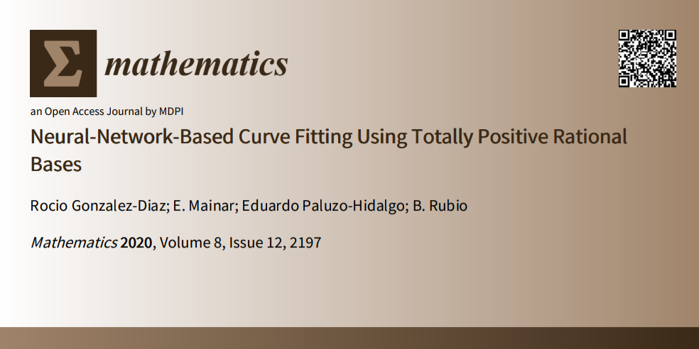

# Curve approximation based on Neural Networks for general classes of totally positive rational bases

In this repository, the code for the experimentation is provided. Different curves were approximated using a one-hidden-layer neural network that uses rational basis as activation functions. Different rational basis were used.

1. In [Experiments_table](https://github.com/Cimagroup/Curve-approximation-based-on-Neural-Networks-forgeneral-classes-of-totally-positive-rational-bases/tree/main/Experiments_table) the code for Table 1 is provided.
2. The architecture and training implementation is described in the [jupyter notebook](https://github.com/Cimagroup/Curve-approximation-based-on-Neural-Networks-forgeneral-classes-of-totally-positive-rational-bases/blob/main/Neural%20network%20implementation.ipynb). (Can be seen in markdown version [here](https://github.com/Cimagroup/Curve-approximation-based-on-Neural-Networks-forgeneral-classes-of-totally-positive-rational-bases/blob/main/Neural%20network%20implementation/Neural%20network%20implementation.md)).

The implementation uses Tensorflow 2.0.

